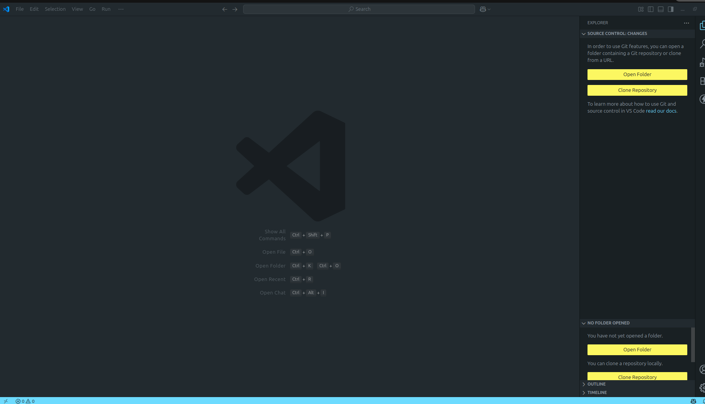
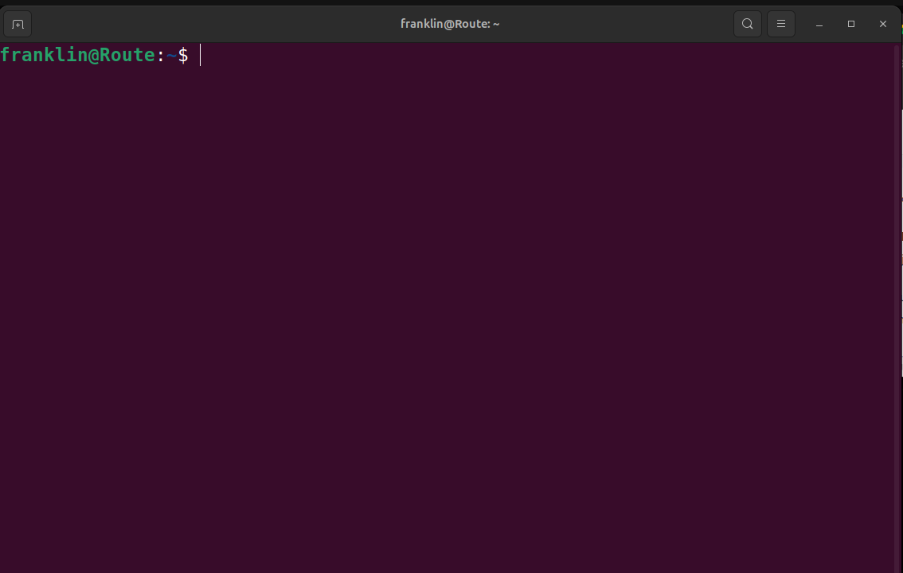
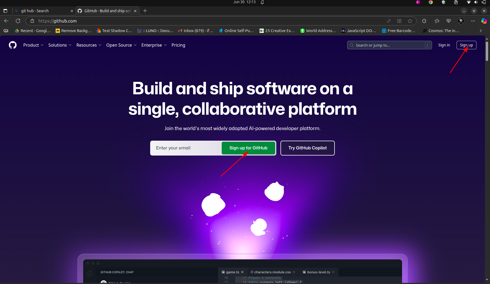
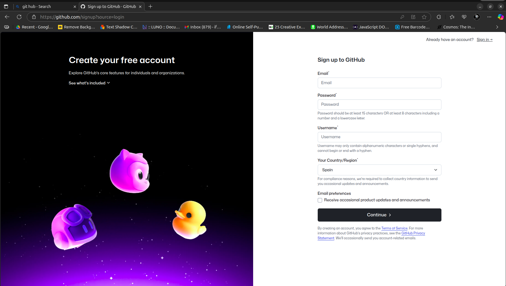
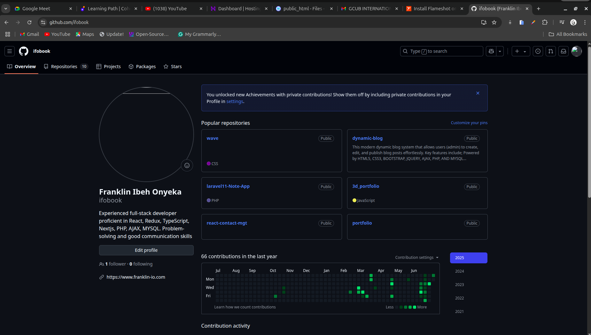
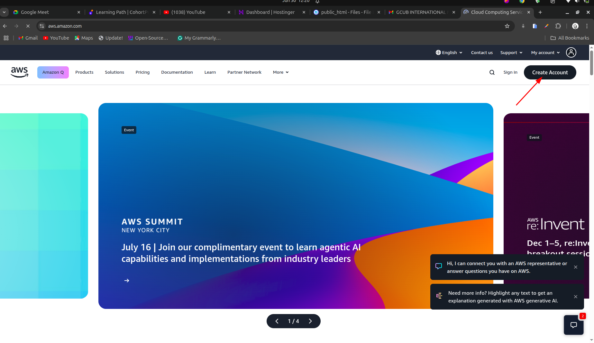
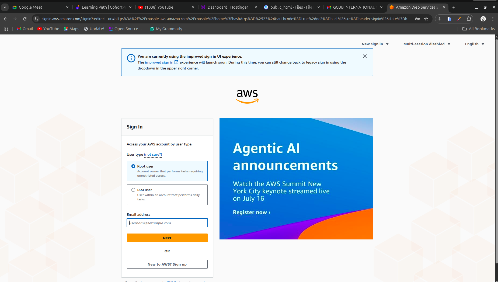
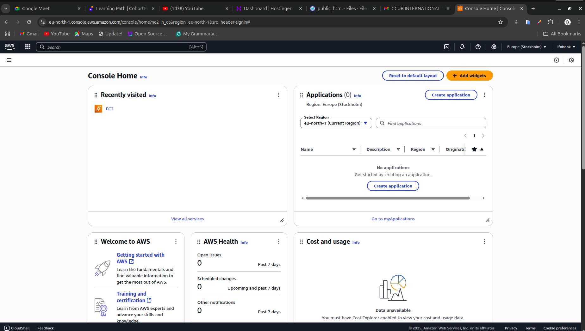

# Tech Environment Setup

# Introduction

The conprehensive installation of the essential software tools such as Git, Visual Studio Code (VScode). because I'm primarily running Linux Ubontu operating system on my laptop, I didn't need to install visual box

# Project Prerequisites
- Completion of Tech Environment Setup Course.
- **Internet Connection** Required for accessing cloud services, decumentation, and online repositories.
- **Computer** Adequate performance to run virtual machines and containers (minimum 8GB RAM) and 64 bit architecture that is recommended

# Tools I Installed
1. Visual studio code (VScode)
2. Git
3. I'm primarily runing Linux Ubuntu operating system which does not require me to install Vitual Box as the case may be if I'm using windows or intel chip macOS

# Accounts Created
1. Github account
2. Amazon Web Services (AWS) Account.

# Installing Software Tool
I completed the tech environmenttal setup videos, and set up my tools on my computer

## Visual Studio Code (VScode)
Visual Studio Code (VS Code) is a free, open-source code editor developed by Microsoft. It supports multiple programming languages, offers intelligent code completion (IntelliSense), debugging, and built-in Git integration. With a rich extension marketplace, VS Code is highly customizable, making it a popular choice for developers on Windows, macOS, and Linux.

## How to Install Visual Studio Code on Ubuntu

1. Open a terminal.
2. Update your package index:
   ```bash
   sudo apt update
   ```
3. Install the required dependencies:
   ```bash
   sudo apt install software-properties-common apt-transport-https wget -y
   ```
4. Import the Microsoft GPG key:
   ```bash
   wget -q https://packages.microsoft.com/keys/microsoft.asc -O- | sudo apt-key add -
   ```
5. Enable the VS Code repository:
   ```bash
   sudo add-apt-repository "deb [arch=amd64] https://packages.microsoft.com/repos/vscode stable main"
   ```
6. Install Visual Studio Code:
   ```bash
   sudo apt update
   sudo apt install code
   ```

7. Launch VS Code by typing:
   ```bash
   code
   ```
   

## How to Install Git on Ubuntu

1. Open a terminal.
2. Update your package index:
   ```bash
   sudo apt update
   ```
3. Install Git:
   ```bash
   sudo apt install git
   ```
4. Verify the installation:
   ```bash
   git --version
   ```

   

# Creating Github and AWS Account

# Github account

1. Go to [https://github.com](https://github.com)
2. Click **Sign up** in the top right corner.
   

3. Enter your email address and click **Continue**.
   
   
4. Create a password and choose a username.
5. Follow the prompts to verify your account (you may need to solve a puzzle or enter a code sent to your email).
6. Choose your preferences and complete the setup.

Your GitHub account is now ready!
   

# Amazon Web Service (AWS) Account

1. Go to [https://aws.amazon.com/](https://aws.amazon.com/) and click **Create an AWS Account**.
   

2. Enter your email address, choose a password, and enter an AWS account name. Click **Continue**.
3. Provide your contact information and select **Personal** or **Professional** account type.
4. Enter your payment information (credit/debit card required for verification).
5. Verify your identity by entering a code sent to your phone.
6. Choose an AWS Support plan (the Basic plan is free).
7. Once your account is created, sign in to the AWS Management Console using your email and password.

Your AWS account is now ready!
   
   


