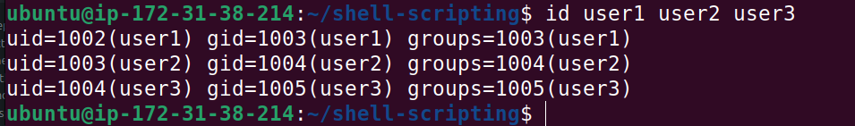

# Shell Scripting 
With the thousands of commands available to the command line user, how can we remember them all? The answer is, we don't. The real power of the computer is its ability to do the work for us. To get it to do that, we use the power of the shell to automate things. We write shell scripts.

## What is Shell Scripting
Imagine you're tasked with setting up new workstations and user accounts regularly at your job. Instead of manually creating each folder and user account, a simple shell script serves as your efficient digital helper. By automating the creation of muiltiple directories and user accounts with just a few lines of code, it saves you considerable time and effort, allowing you to concentrate on more critical aspects of your work.
Shell scripting is the processing of writing and executing a series of intructions in a shell to automate tasks. A shell script is essentially a script or program written in a shell language, such as **Bash, sh, zsh, or PowerShell**
Abasic shell script that will create muiltiple folders and create muiltiple users at once would look like this.

1. Create a folder on an ubuntu server and name it shell-scripting
   Using this command
   ```bash
   mkdir shell-scripting
   ```
   
2. Using the **vim** editor, create a file called **my_first_script.sh**
   ```bash
   vim my_first_script.sh
   ```
   
3. Put the shell script code above into the new file 
   
4. Save the file
5. Use **cd** command to change into the **shell-scripting** directory
   ```bash
   cd shell-scripting
   ```
   
6. Use `ls -latr` command to confirm that the file is indeed created
   
The permission of the newly created file is -rw-rw-r-- which means;
1. The owner of the file has read **(r)** and write **(w)** permissions.
2. Menbers of the file's group have read  **(r)** and write **(w)** permissions.
3. Others also have read **(r)** permission
However, no one has the execute **(x)** permission, hence the script cannot be executed

```bash
./my_first_shell_script.sh
```
   


- ./ This prefix to the file indicates that the command should look for the file in the current directory.
  - The dot **(.)** represents the current directory,
  - and the slash **(/)** is a directory separator
When you hit enter, you should get a response like
   
Noticed that we now have a **Permission denied** error which can easilly be resolved by giving the file the necessary permission it requires.
But, did you also notice the mention of **bash** at the beginning of the error message? it indicates that the error message is coming from the **Bash shell** itself.
**Bash** is the command interpreter or shell that you're using in the terminal to execute commands.

Task for you:
1. Add the execute permission for the **owner** to be able to execute the script
   ```bash
   chmod u+x my_first_shell_script.sh
   ```
   The command above will add execute to the permission of the owner.
   
2. Run the shell script.
   
   
3. Evalute and ensure that 3 folders are create Use **ls** to test that the folders created
   
4. Evaluate and ensure that 3 users are created on the linux server.
   
   
   ## What Is a Shebang (#!/bin/bash)?
   Notice that, at the beginning of the shell script, we have `#!/bin/bash` written there. This is what is called a **shebang**. It is a special notation used in unix-like operating systems like Linux, to specify the interpreter that should be used to execute the script. In this case, **#!/bin/bash** epecifically indicates that the **Bash** shell should be used to interpret and execute the script.
   You can explore the **/bin** folder and see the different programs in there. **bash** is one of them which is used as the interpreter in that script. If we wanted to use another shell like **sh**, the shebang would be updated to **#!/bin/sh** 
   **/bin/bash:** This is the absolute path to the Bash shell executable. It tells the  system to use the Bash interpreter located at /bin/bash to run the script.
   Without a shebang line, the system may not know how to interpret and execute the script, and you may need to explicitly specify thee interpreter when running the script
## Variable Declaration and Initialization:
   In programming generally, not just shell scripting, **Variable** are essential for creating dynamic and flexible programs.
   Variables can store data of various types such as numbers, strings, and arrays. You can assign values to variables using the **=** operator, and access their values using the variable name by a **$** sign

   Lets explore a few examples:
   
   From the example above **"John"** was assigned to the variable **"name"**.
   Now that the variable is assigned, you may ask, how then can I use it?
## Retrieving value from a variable
After assigning a value to a variable, as shown in the previous example where we assigned "John" to the variable name, you can utilize this variable in various ways in your script or program. One od the most straightforward methods to use or retrieve the value stored in a variable is by echoing it back to the console. This is done using the **echo** command in shell script.

This command intructs the shell to print the value of name to your screen, which, in our case, would output **John**

echo is a command used to print a text, variables or values. In this example, echo is used to print a variable which store a value.
