# advance Linux Commands

# File Permissions and Access Rights
Understanding File Permissions in Linux is crucial for maintaining security and proper access control. Each file and directory has associated permissions that determine who can read, write, or execute them.

In Linux, managing file permissions and ownership is essential for system security and user access control. The `chmod`, `chown`, and `chgrp` commands are used to modify permissions and ownership of files and directories.

# Numeric Representation of Permissions
Permissions can be represented numerically, where each permission is assigned a specific value:
- Read (r) = 4
- Write (w) = 2
- Execute (x) = 1
- No permission (-) = 0

These values are combined to represent the permissions for each class. For example:

## Permissions Represented by 7

- 4 (read) + 2 (write) + 1 (execute) = 7
- Symbolic: rwx
- Meaning: Read, Write, and Execute permissions are granted.
- Example Context: A script file that the owner needs to read, modify, and execute.
- 
## Permissions Represented by 5
- 4 (read) + 1 (execute) = 5
- Symbolic: r-x
- Meaning: Read and Execute permissions are granted, but Write permission is denied.
- Example Context: A directory where users can list files and execute programs but cannot modify the contents.
  
## Permissions Represented by 6
- 4 (read) + 2 (write) = 6
- Symbolic: rw-
- Meaning: Read and Write permissions are granted, but Execute permission is denied.
- Example Context: A configuration file that needs to be read and modified by the owner but not executed.
  
## Permissions Represented by 4
- 4 (read) = 4
- Symbolic: r--
- Meaning: Only Read permission is granted.
- Example Context: A log file that users can read but not modify or execute.    
  
## Permissions Represented by 0
- 0 (no permissions) = 0
- Symbolic: ---
- Meaning: No permissions are granted.
- Example Context: A sensitive file that should not be accessible to anyone.
## Permissions Represented by 1
- 1 (execute) = 1
- Symbolic: --x
- Meaning: Only Execute permission is granted.
- Example Context: A binary file that can be executed but not read or modified.     
## Permissions Represented by 2
- 2 (write) = 2
- Symbolic: -w-
- Meaning: Only Write permission is granted.
- Example Context: A temporary file that can be modified but not read or executed.  
## Permissions Represented by 3
- 3 (write + execute) = 3
- Symbolic: -wx
- Meaning: Write and Execute permissions are granted, but Read permission is denied.        
- Example Context: A script that can be modified and executed but not read by others.   

## Shorthand Representation of Permissions
In addition to the numeric representations, Linux also has a shorthand, or symbolic, method for representing file permissions.

## Understanding User Classes from a Permission Perspective
Linux file permissions are divided into three user classes:
- **Owner**: The user who owns the file.
- **Group**: The group that the file belongs to.
- **Others**: All other users on the system.
  
## The Role of Hyphens (-) in Permissions Representation
Hyphens (-) in the permissions representation indicate the absence of a specific permission. For example:
- `r--` means Read permission is granted, but Write and Execute permissions are denied.
- `-wx` means Write and Execute permissions are granted, but Read permission is denied. 

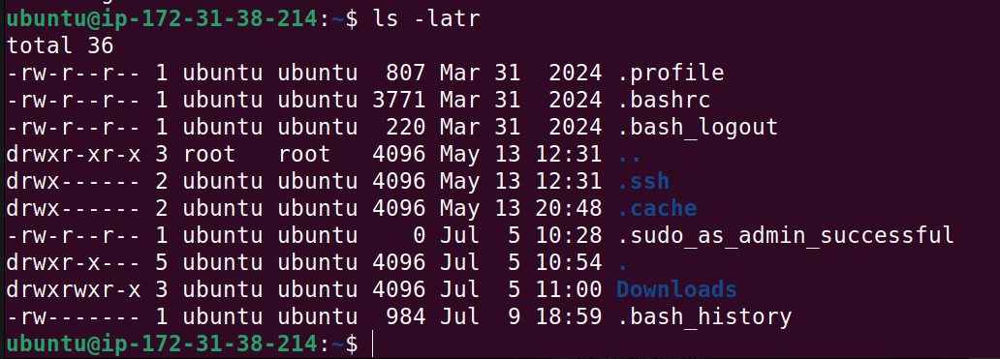

Let me break it down to explain what each part means:

- In the output above, you notice that some of the first characters can be `-` or `d`: `d` means that the file is a directory, while `-` means it is a regular file.
- The next three characters represent the permissions for the owner of the file. In this case, `rwx` means the owner has read, write, and execute permissions.
- The next three characters represent the permissions for the group associated with the file. In this case, `r-x` means the group has read and execute permissions, but not write permission.
- The last three characters represent the permissions for others (everyone else). In this case, `r--` means others have read permission only.
- The number `1` indicates the number of hard links to the file.
- The next part shows the owner of the file, which is `user1` in this case.
- The next part shows the group associated with the file, which is `group1`.
- The next part shows the size of the file in bytes, which is `4096` in this case.
- The next part shows the last modification date and time of the file, which is `Oct 1 12:34`.
- Finally, the last part shows the name of the file, which is `example.txt`.    
  
  The order the user is represented is as follows:
  - The first hyphen "-" is the **user** (owner)
  - The second hyphen "-" is the **group**
  - The third hyphen "-" is for **others** (everyone else)

# File Permissions Commands
To manage file permissions and ownership, Linux provides several commands:
## chmod command
The `chmod` command is used to change the permissions of a file or directory. It can be used in two ways: symbolic mode and numeric mode.

For example:
Create an empty file using the `touch` command:
```bash
touch example.txt
```
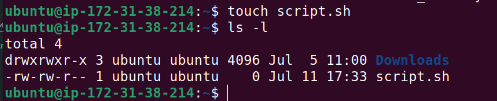

Let's check the permissions of the file using the `ls -l` command:
```bash
ls -l script.sh
```
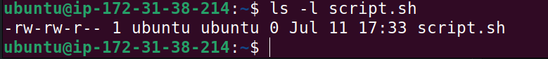

As you can see, the file has default permissions of `rw-rw-r--`, which means:
- The owner has read and write permissions. 
- The group has read and write permissions.
- Others have read permission only.

Now, let's change the permissions so that the user classes will have execute permissions as well. We can do this using the `chmod` command with the `+x` option:
```bash
chmod u+x script.sh
```
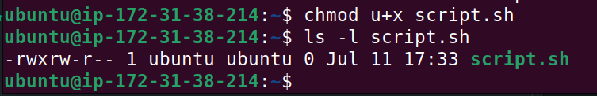
The above command uses the chmod command with the `u+x` option to add execute permission for the user (owner) of the file.

Now, let's check the permissions again using the `ls -l` command:
```bash
ls -l script.sh
```
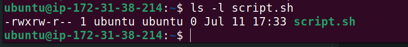

The same command can be used to achieve the same result using the numeric representation of permissions:
```bash
chmod 764 script.sh
```
To add execute permission for the group and others, you can use:
```bash
chmod go+x script.sh
```
- (4+2+1) = 7 for the owner (read, write, execute)
- (4+2+1) = 6 for the group (read, write, and execute)
- (4+1) = 5 for others (read, execute)

Let's consider another example where the owner of a file is currently the only one with full permissions to `note.txt`:
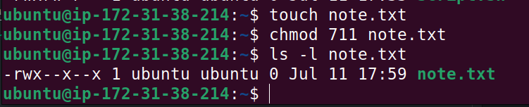

To allow group members and others to read, write, and execute the file, you can use the following command:
```bash
chmod 777 note.txt
```
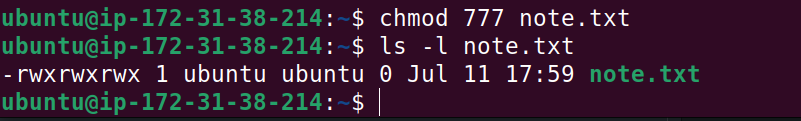

Now, notice that the permissions have changed to `rwxrwxrwx`, meaning:
- The owner has read, write, and execute permissions.
- The group has read, write, and execute permissions.
- Others have read, write, and execute permissions.

## chown command
The `chown` command is used to change the ownership of a file, directory, or symbolic link. It allows you to change the owner and/or group of a file.
Here's the basic format of the `chown` command:
```bash
chown [option] owner[:group] file(s)      
```
For example, let's assume there is a user on the server called "john", a group called "developers", and you want the owner of `filename.txt` changed from "Frank" to "john", and to also ensure that any user in the developers group has ownership of the file as well, you can use the following command:
```bash
chown john:developers filename.txt
```
The `ls -latr` command on this file will look like this:
```bash
ls -latr filename.txt
```

## Superuser Privileges
In Linux, it's often necessary to perform administrative tasks that require elevated privileges. The `sudo` command allows a permitted user to execute a command as the superuser or another user, as specified by the security policy.
To switch to the superuser (root) account, you can use:
```bash
sudo -i    
```
You can type `exit` to leave the shell and return to your normal user account.

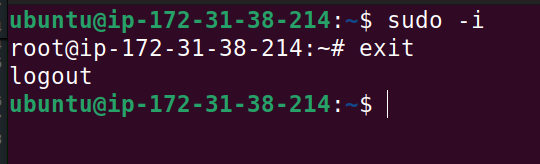
To run a command with superuser privileges, you can prefix the command with `sudo`. For example:
```bash
sudo chown john:developers filename.txt
```
This command changes the ownership of `filename.txt` to user `john` and group `developers`, using superuser privileges.

# User Management on Linux
As a DevOps engineer, you are also going to be doing systems administration, which involves managing different users on the servers. You should know how to create a new user or group, modify their permissions, update passwords, and perform similar tasks.

# Creating a New User
To create a new user in Linux, you can use the `useradd` command. The basic syntax is:
```
sudo useradd johndoe
```
Running this command will prompt you to enter and confirm a password for the new user. After that, a home directory will be automatically generated for the user, such as `/home/johndoe/`. You can use the `passwd` command to set or change the password for the user.

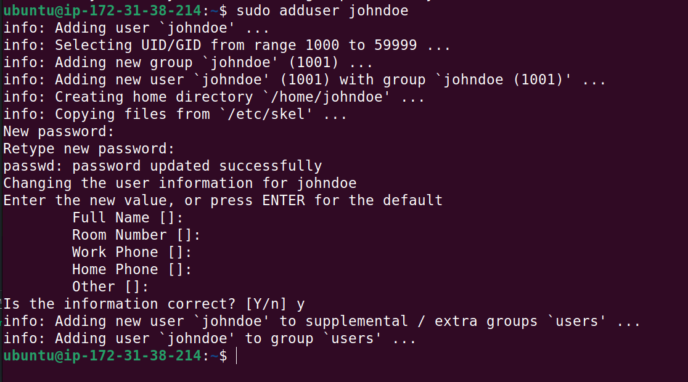

## Granting Administrative Privileges

By default, the new user will not have administrative privileges. To grant administrative privileges, you can add the user to the `sudo` group. This allows the user to execute commands with superuser privileges using `sudo`. Users in the `sudo` group can run commands as the superuser or another user, as specified by the security policy. To add the **johndoe** user to the `sudo` group, you can use the following command:
```
sudo usermod -aG sudo johndoe
```
- usermod: This command is used to modify user accounts.
- -aG: This option appends the user to the specified group without removing them from other groups.
- -a: Append the user to the group.
- -G: Specify the group to which the user should be added.
  
In the given command, `-aG sudo` is used to add the user `johndoe` to the `sudo` group, allowing them to execute commands with superuser privileges.

## Task 
- Log out and log back in as the new user `johndoe`.
- Navigate to the `/home/johndoe/` directory to explore what has been created for the user.

## Switching User Accounts

To switch to another user account, you can use the `su` command followed by the username. For example, to switch to the `johndoe` user, you can use:
```bash
su - johndoe
```
You will be prompted to enter the password for the `johndoe` user. After entering the correct password, you will be switched to the `johndoe` user account.
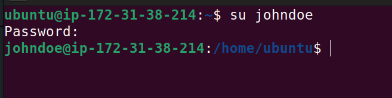

## Modifying User Accounts
**Changing User Password**
To change the password for a user, you can use the `passwd` command followed by the username. For example, to change the password for the `johndoe` user, you can use:
```bash
sudo passwd johndoe
```
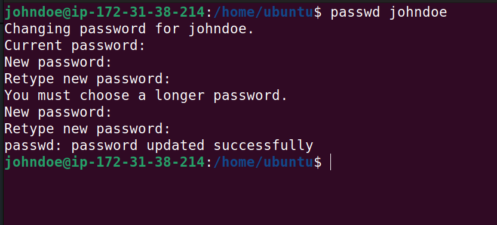

You will be prompted to enter the new password for the user. After entering the new password, you will need to confirm it by entering it again.

## Task 
- Test the updated password by logging on to the server, using the newly updated password.

# Creating a Group
To create a new group in Linux, you can use the `groupadd` command. The basic syntax is:
```bash
sudo groupadd developers
```


## Adding a User to a Group
To add a user to a group, you can use the `usermod` command with the `-aG` option. The basic syntax is:
```bash
sudo usermod -aG developers johndoe
```
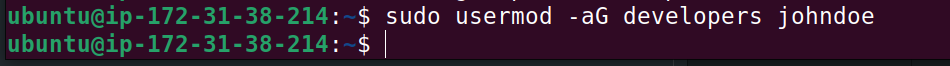

The `-aG` option appends the user to the specified group without removing them from other groups. In this case, it adds the user `johndoe` to the `developers` group.

## Verifying Group Memberships
To confirm the group memberships for a specific user, use the `id` command. For example, to check the group memberships for the `johndoe` user, you can use:
```bash
id johndoe
```
The command displays the user ID (UID), group ID (GID), and the groups to which the user belongs.

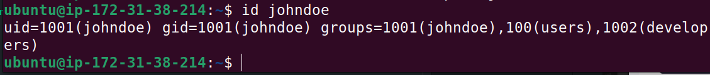
## Delete a User
To delete a user in Linux, you can use the `userdel` command. The basic syntax is:
```bash
sudo userdel johndoe
```
This command will remove the user `johndoe` from the system. However, it will not remove the user's home directory or files. If you want to remove the user's home directory and files as well, you can use the `-r` option:
```bash
sudo userdel -r johndoe
```
This command will delete the user `johndoe` along with their home directory and files.

## Ensuring Proper Group Permissions
When creating a new group, it's important to ensure that the group has the necessary permissions to access files and directories. You can use the `chgrp` command to change the group ownership of a file or directory. The basic syntax is:
```bash
sudo chgrp developers /path/to/file
```
This command changes the group ownership of the specified file or directory to the `developers` group.

And to grant read and write permissions to the group, you can use the `chmod` command:
```bash
sudo chmod g+rw /path/to/file
```