# Capstone Project: Enhanching a community library website (Demo Project)

## Description

This is a demo project for the Capstone Project: Enhanching a community library website (Demo Project). As part of a developement team tasked with enhancing a community library website, we aim to be more engaing and informative for its visitors. It currently includes basic sections: Home, About Us, Events, and Contact Us. My team decided to add a *"Book Reviews"* section and update the *"Events"* page to feature upcoming community events.

This is to simulate the roles of two contributors: *"Morgan"* and *"Jamie"*. Morgan will focus on adding the *"Book Reviews"* section, while Jamie will update the *"Events"* page with new community events.

## Objectives

- Practice cloning a working repository wth branches in Git.
- Gain experience in staging, committing, and pushing changes from both developers.
- Create pull requests and merge them after resolving any potential conflicts between the branches on review.

# Start the Project

## Setup


### Create a new repository

- Navigatge the the GitHub website and create a new repository named *"greenwood-library-website"*.

- Initialize with README.md file

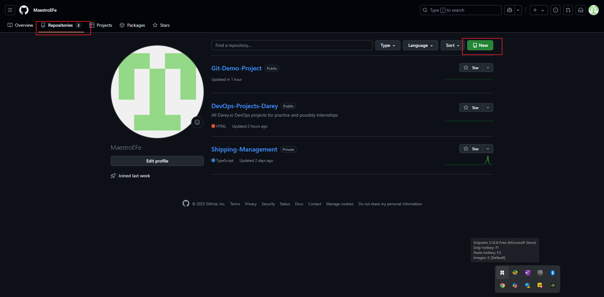

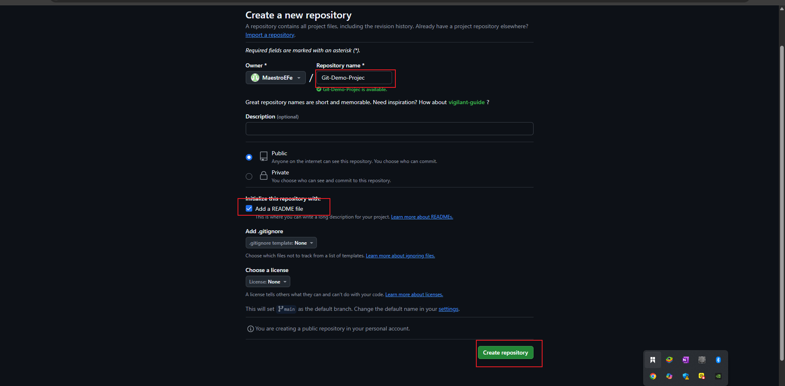

### Clone the repository

 Navigate to the directory where you want to clone the repository and run the following command:

```bash
$ git clone https://github.com/your-username/greenwood-library-website.git
```

## Tasks

1. In the main branch, using visual studo code editor ensure there are files for each of the web pages.
    - Home.html
    - About.html
    - Events.html
    - Contact.html

2. Add any random content into each of the files.

3. Stage, commit, and push the changes to the main branch. (This is a simulation of the team's existing codebase for the website.)

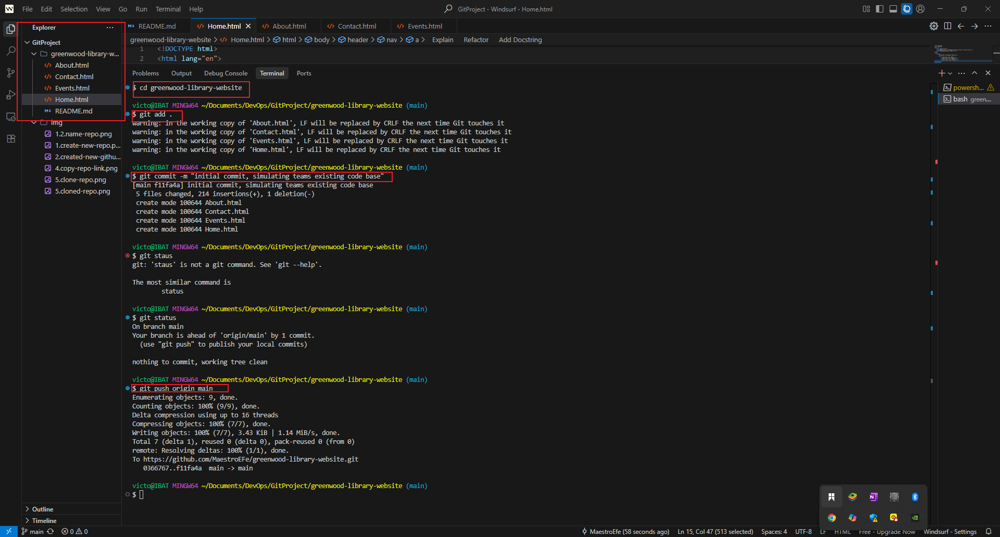

# Morgan's Work: Adding Book Reviews

1. Create a Branch for Morgan: Assuming morgan has cloned or pull the current main branch, he creates a new branch named *add-book-reviews*.

```bash
$ git branch add-book-reviews
```

2. Switch to a new branch named add-book-reviews.

```bash
$ git checkout add-book-reviews
```

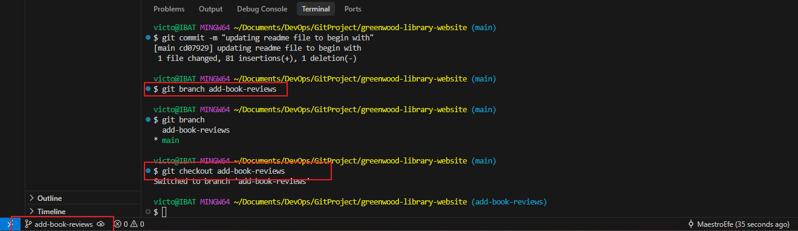

3. Add a new file named *"book-reviews.html"* to represent the Book Reviews section.

```bash
$ echo. > book-reviews.html
```

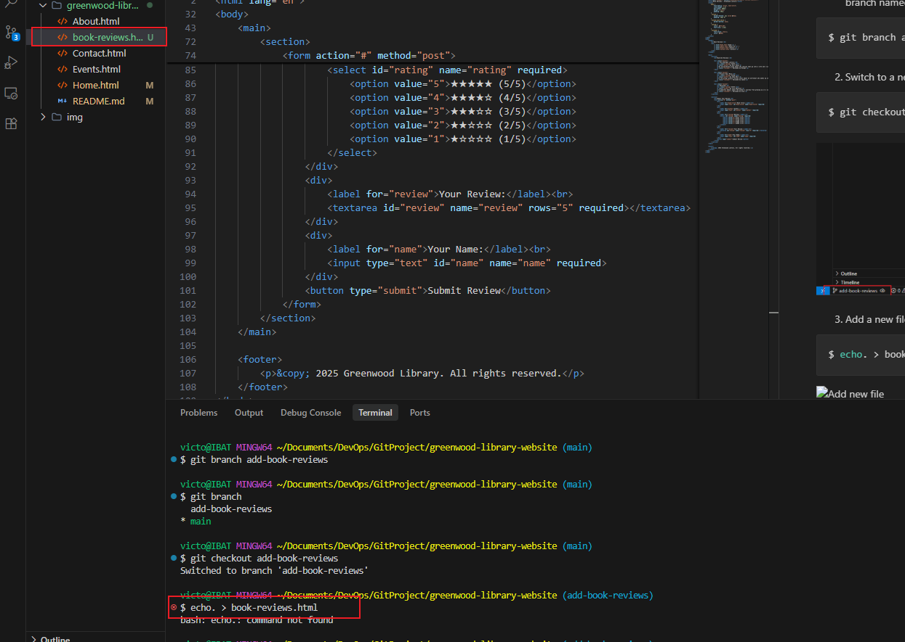

4. Add a random text content into the file.

5. Stage, commit the changes to the add-book-reviews branch.
```bash
$ git add book-reviews.html
```

```bash
$ git commit -m "Add book reviews section"
```
6. Push the *add-book-reviews* branch to the remote repository.
```bash
$ git push origin add-book-reviews
```

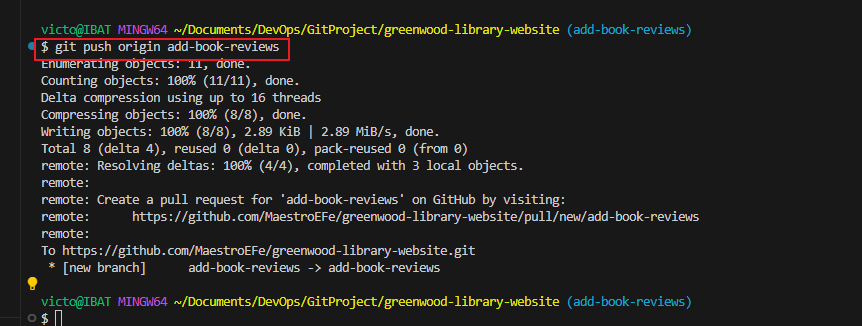

7. Raise a PR for Morgan's Work: Go to the GitHub website and raise a pull request for the *add-book-reviews* branch for Morgan work to be reviewed by a reviewer. Click on the *Compare & pull request* button where it will take you to the page where you can add a title and description for the pull request. you will see that the *add-book-reviews* branch is compared with the *main* branch. Then click on the *Create pull request* button.

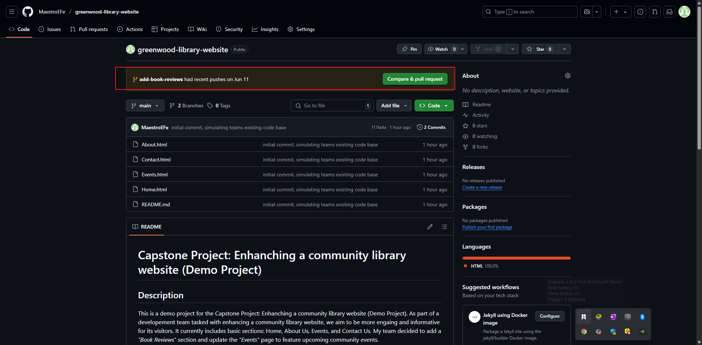


8. Review Morgan's Work: Go to the GitHub account of the reviewer and review the pull request made by Morgan. Approve it for it to be merged into the main branch. Durring the review process, you can add comments to the pull request. You can also reject the pull request if it is not up to the standard. You can also request changes to be made to the pull request. Then click on the *Merge pull request* button. Approve the pull request.


9. Merge Morgan's Work: Go to the GitHub account as Morgan and merge the approved pull request made by Morgan into the main branch. Click on the *Confirm merge* button after adding a title and description for the merge commit.

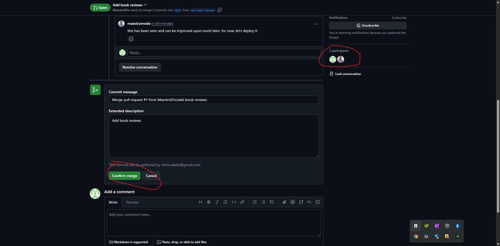

When the merger is succefful, you will get a merge commit message.

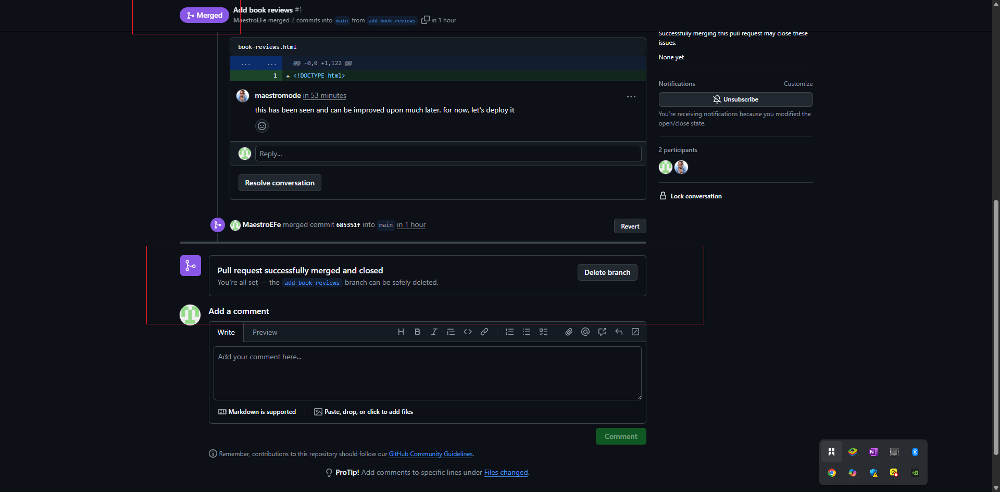

# Jamie's Work: Updating Events

Repeat the same work flow for Jamie's Work on Events Page. Ensure Jamie's work is in* update-events* branch.

1. Assuming Jamie wants to update the events page, he will first pull the latest changes from the main branch.

```bash
$ git pull origin main
```

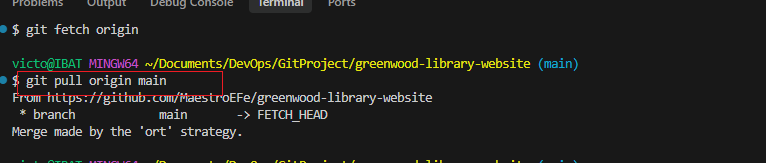

2. Then create a Branch for himself: Assuming Jamie has cloned or pull the current main branch, he creates a new branch named *update-events*.

```bash
$ git branch update-events
```

3. Switch to a new branch named update-events.

```bash
$ git checkout update-events
```

4. Go to the event page (Events.html file) and update it with new community events and make it more beautifull.

5. Stage, commit the changes to the update-events branch.
```bash
$ git add Events.html
```

```bash
$ git commit -m "Update events page"
```

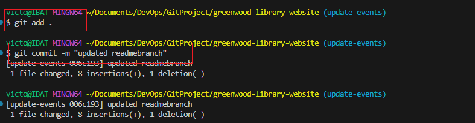
Note that the command *git add Events.html* is also equivalent to *git add .* and *git add -A*. Also, the command *git commit -m "Update events page"* was not used in the image as a matter of typo. instead of event page, I used readme file. which is as a result of my continuous typing on the readme file. but it essentialy does commit the changes to the update-events branch.

6. Push Jamie's *update-events* branch to the remote repository.
```bash
$ git push origin update-events
```

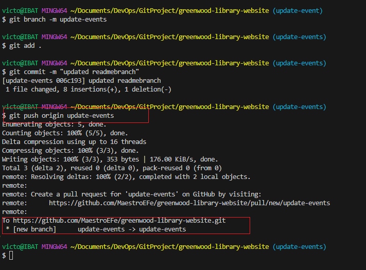

7. Raise a PR for Jamie's Work similar to Morgan's Work when adding book reviews: Go to the GitHub website and raise a pull request for the *update-events* branch for Jamie work to be reviewed by a reviewer. Click on the *Compare & pull request* button where it will take you to the page where you can add a title and description for the pull request. you will see that the *update-events* branch is compared with the *main* branch. Then click on the *Create pull request* button.


8. Reveiw Jamie's work just like that of Morgan, approve it for it to be merged into the main branch. 


9. After the merger of Jamie's work and Morgan's work, you can then delete the branches that have been merged into the main branch. Note that it is important to ensure that the before Jamie work is merged into the main branch, Morgan's work is merged into the main branch. This is a very important step as shown above.

Summary:
- Morgan added a new section called *"Book Reviews"* to the library website.
- Jamie updated the *"Events"* page with new community events.
- Morgan and Jamie both raised pull requests for their respective branches.
- The pull requests were approved and merged into the main branch.
- The branches were deleted after the merger.
