# Basic Git Commands

## Hands-on Git Project: Collaborative Website Development with Git and GitHub

In this mini project, we'll create a step by step project to simulate the workflow of Tom and Jerry using Git and Github. This hands-on project will include installation of Git setting up a GitHub repository, creating branches, making and merging those changes back into the main branch.

## part 1: Setup and Initial Configuration
1. **Install Git**: Download and install Git from [git-scm.com](https://git-scm.com/).
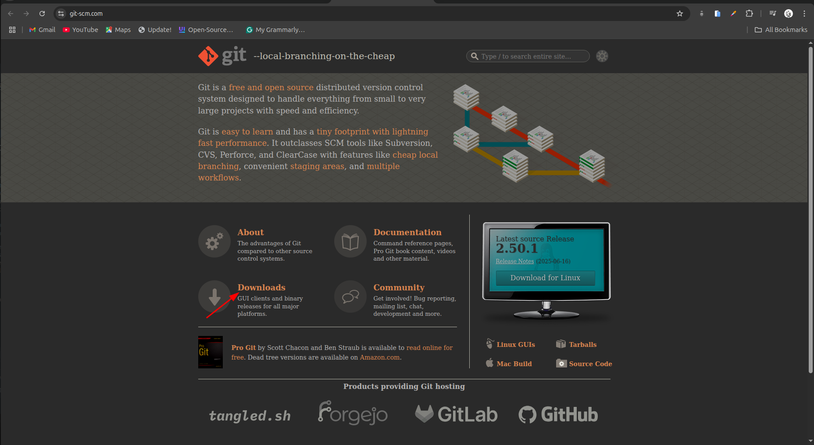
2. Create a GitHub repository:
    - Sign up or log in to **GitHub**.
    - Click on the **New** button to create a new repository.
  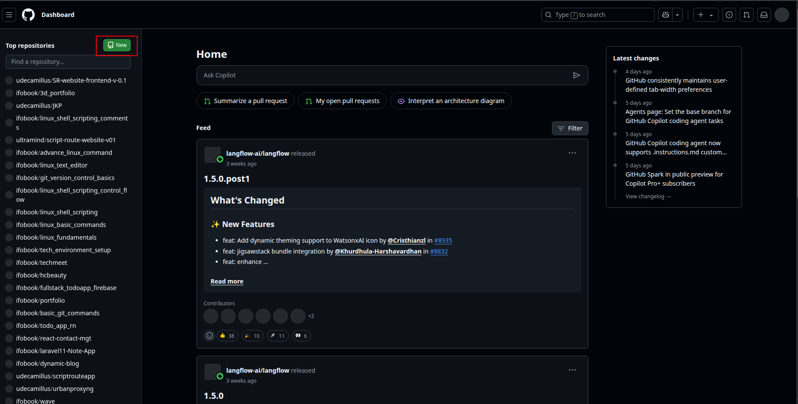
    - Name  your repository (e.g., `tom-and-jerry-website`) and initialize it with a README file.
    - Click on **Create repository**.
  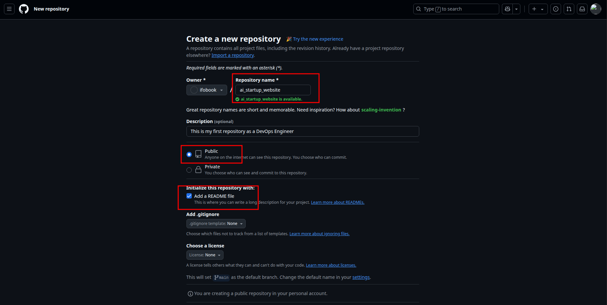 
3. **Clone the repository**
   - Open your repository on GitHub.
   - Click on the **Code** button and copy the HTPPS URL.
  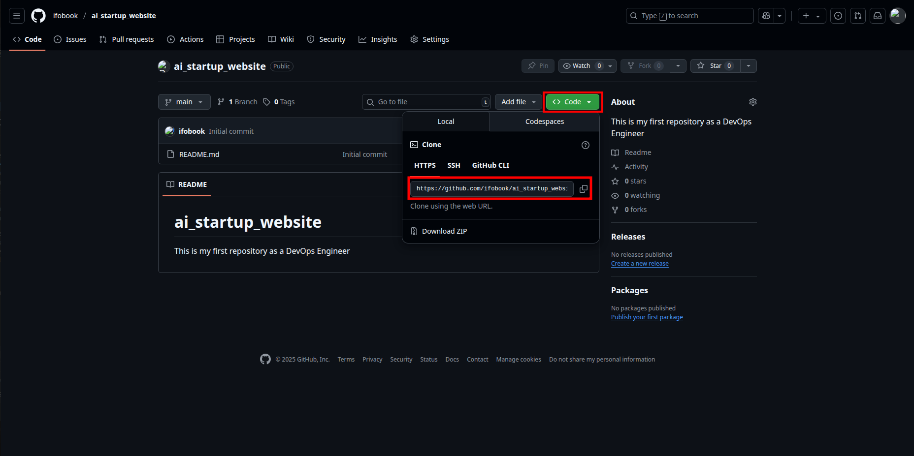
    - Open your terminal or command prompt - Create a folder named **git-project** in the folder where you are storing all **DAREY.IO** realted work. For example in the Desktop folder on your laptop, you may create called **darey-training**
  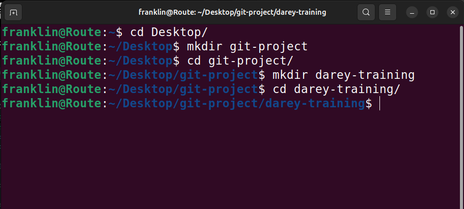
    - clone (Download) the repository from GitHub using the command:
      ```bash
      git clone https://github.com/ifobook/ai_startup_website.git
        ```
    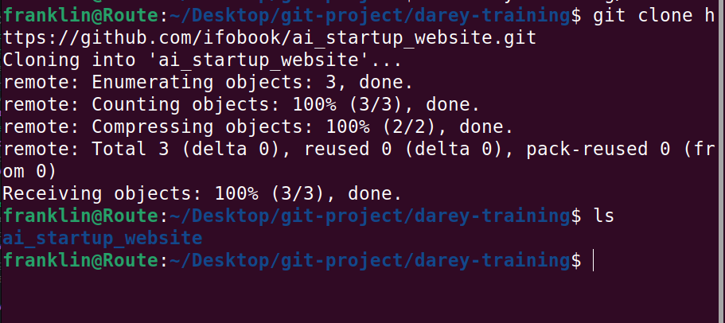
    - Navigate into the repository you cloned:
      ```bashd
      cd ai_startup_website
      ```
      - Create an empty file **"index.html"** in the repository folder:
      ```bash
      vim index.html
      ```
        - Add the following content to the file: "This is the Admin creating an index.html file for Tom and Jerry."
  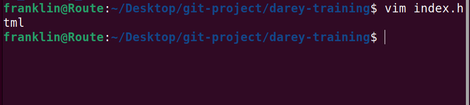
  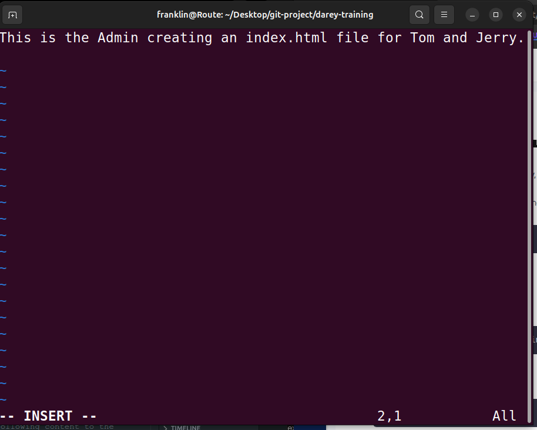

     - Check changes has not been staged yet:
    ```bash
    git status
    ```
     - Stage the changes:
    ```bash
    git add index.html
    ```
    - Check the status again to confirm the changes are staged:
    ```bash
    git status
    ```
  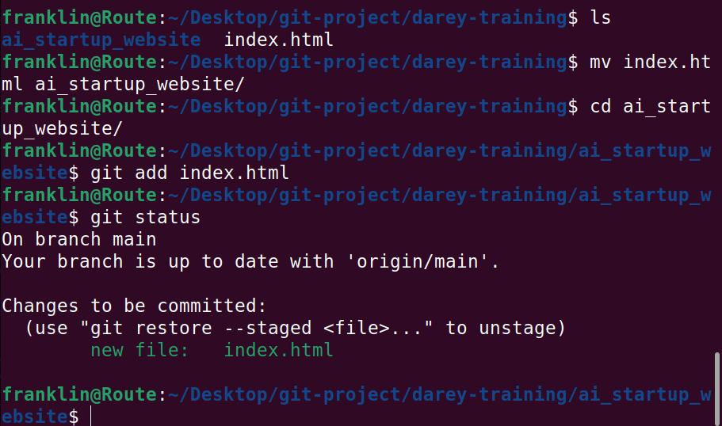
    - Commit the changes with a message:
    ```bash
    git commit -m "Add index.html file"
    ```
    - Push the changes to GitHub:
    ```bash
    git push origin main
    ```
    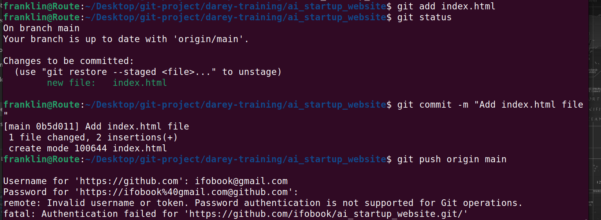
    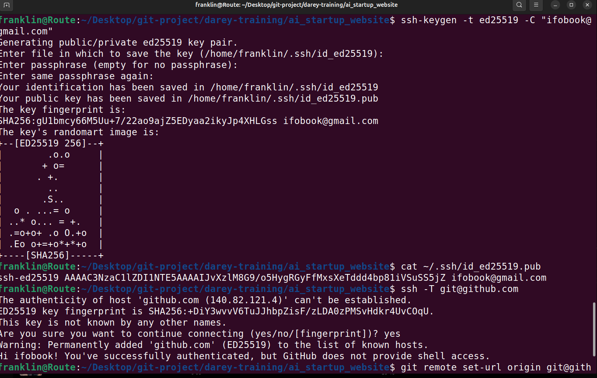

  This sends commits from your man branch on your laptop to GitHub (remote repository).


  ## Part2: Simulating Tom and Jerry's Work 
  To simulate both Tom and Jerry working on the same laptop, you'll switch between two branches, making changes as each character.
  1. Tom's work:
   - Navigate to the project directory you just cloned.
```bash
  cd ai_startup_website
  ```
  This moves you into the folder containing the cloned GitHub repository on your local machine. It's like stepping into the project's workspace.
  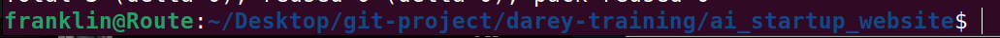
  - Check the current branch: THis shows you a list of all branches in the repository, with an asterisk (*) next to the current branch.
```bash
  git branch
```
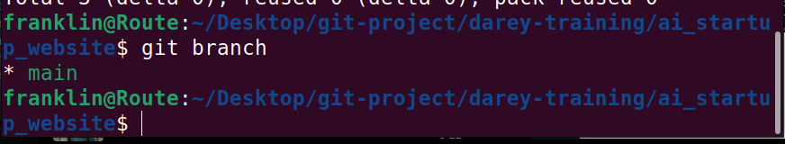

    - Create a new branch for Tom's work:
```bash
    git checkout -b update-navigation
``` 
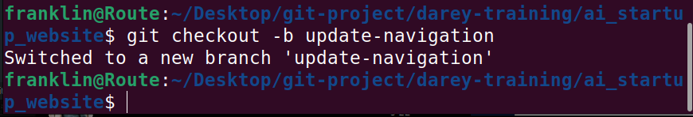
  This command creates a new branch called `update-navigation` and switches to it. 
  
  - Check the branch again to confirm you are on the new branch:
```bash
    git branch
```
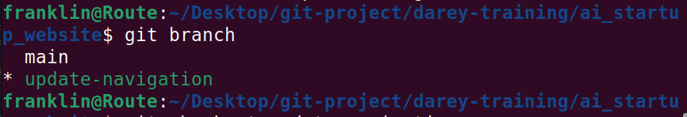
Running git branch again shows that you are now on the `update-navigation` branch, indicated by the asterisk (*).

Add content to the `index.html` file:
```bash
    vim index.html
```
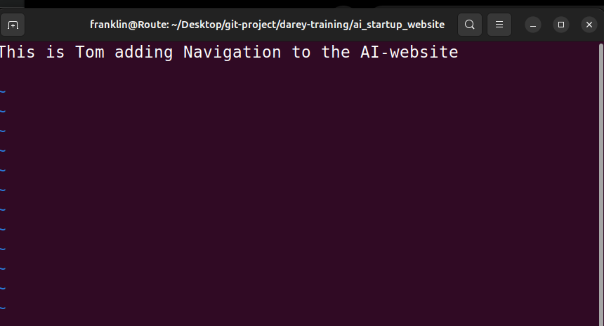
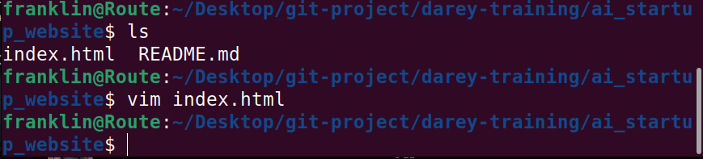
This simulates Tom's contribution to the project. This text represents the work he's doing on the navigation bar. In the real world, this will be an actual software code.
- Check changes has not been staged yet:
```bash
    git status
```
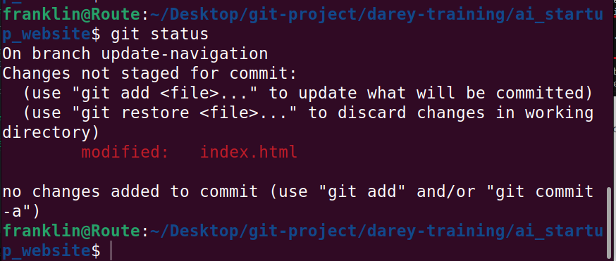
At this point, Git informs you that the `index.html` file has been modified but not yet staged for commit.
- Stage the changes:
```bash
    git add index.html
```
This tells Git to prepare the changes in `index.html` for committing. It's like saying, "I'm ready to save my work."

- Check the status again to confirm the changes are staged:
```bash
    git status
```
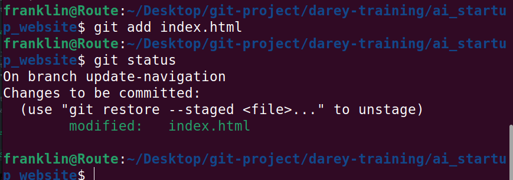

- Commit the changes with a message:
```bash
    git commit -m "Tom: Update navigation bar"
```

Now, after staging changes and records them in the repository's history with a message describing what was done. This commit is a milestone, making a specific point in the project's development.
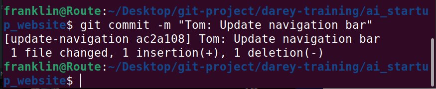

- Push the changes to GitHub:
```bash
    git push origin update-navigation
```
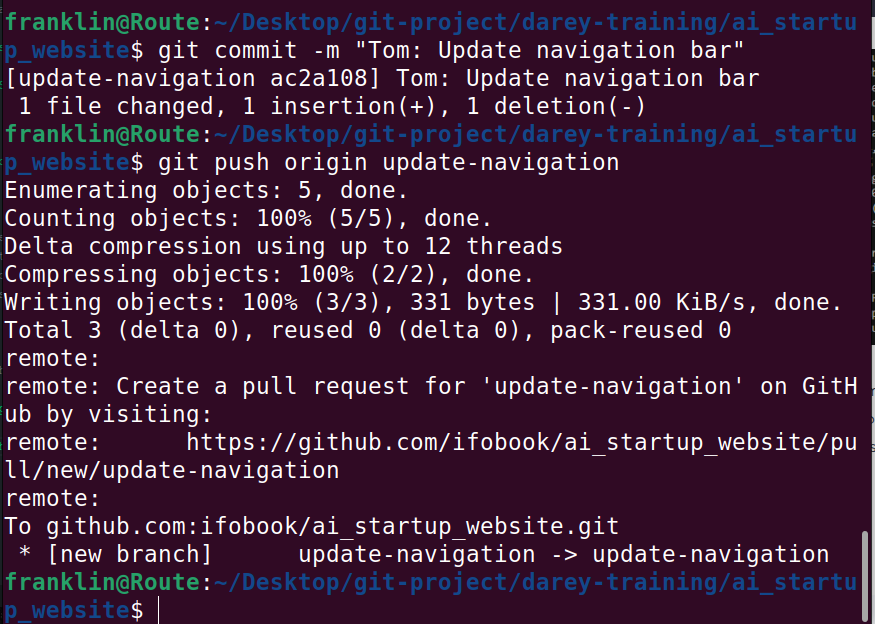
This sends Tom's changes from the `update-navigation` branch on your laptop to the remote repository on GitHub. It's like sending a letter to the project's central hub, where everyone can see it.
After completing Tom's work, you can switch back to the main branch:
- switch back to the main branch,
- Create a new branch for Jerry's work,
- make changes, and then 
- Stage, commit, and push those changes.
```bash
    git checkout main
```
This command switches you back to the main branch, where you can start Jerry's work.
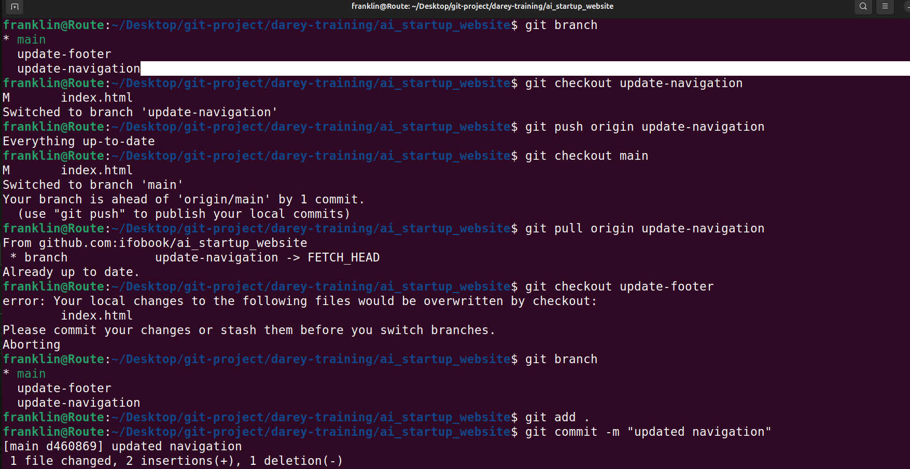

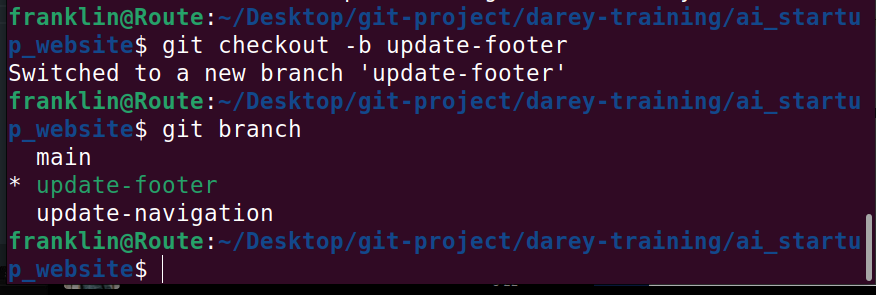

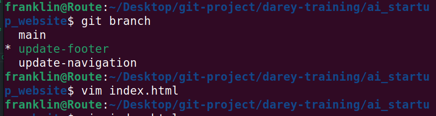

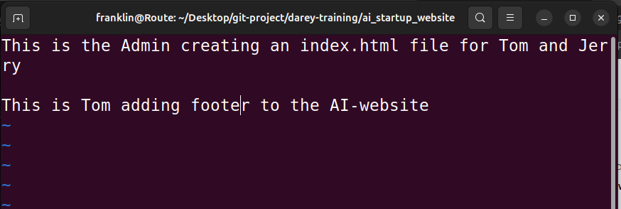

Open the `index.html` file in your text editor:
```bash
    vim index.html
```
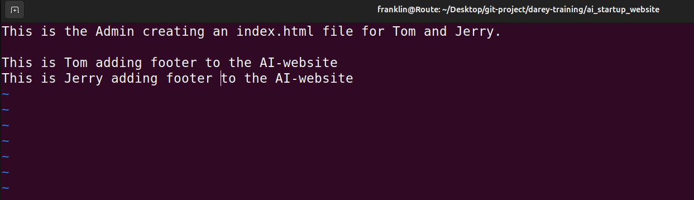
stage Jerry's changes:
```bash
    git add index.html
```
Commit Jerry's changes with a message:
```bash
    git commit -m "Jerry: Add footer section"
```
Push Jerry's changes to GitHub:
```bash
    git push origin update-footer
```
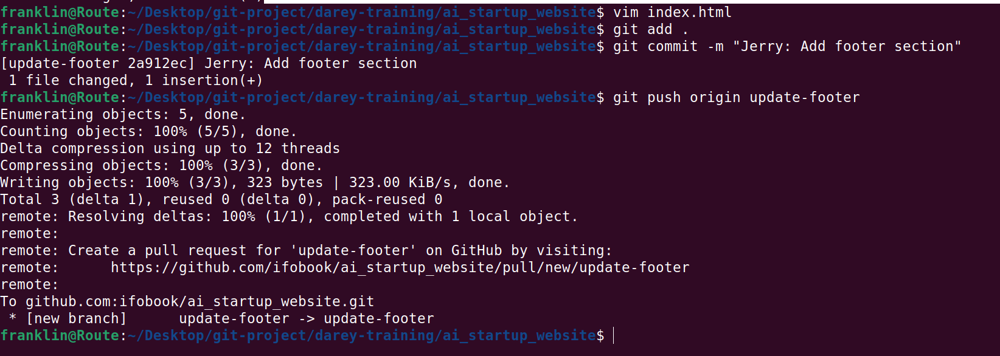
This command sends Jerry's changes from the `update-footer` branch on your laptop to the remote repository on GitHub. It's like sending a letter to the project's central hub, where everyone can see it.
