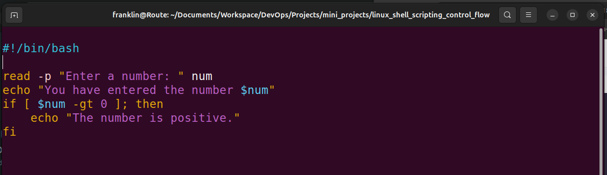

# Linux Shell Scripting (Control Flows)
## Control Flow in Shell Scripting
Control flow statements are the backbone of making decisions in programming, I =n scripting, these statements let your scripts decide what to do or how to proceed based on conditions, loops, or user inputs.
Bash and other shell interpreters provides control flow statements like
- **if-else**
- **for** loops
- **while loops** and
- **case** statements to control the flow of excution in your scripts.
Most likely you will get to use **if-else** and **for** loops more than the others. Therefore, at this level we will focus only on those two control flows.
Let's examine an **if-else** statement in bash to understand how it makes decisions based on user input.
**The Task**
Our script asks for a number and then tells us if that number is positive, negative, or zero.
**The entire script is:**
```bash
#!/bin/bash

read -p "Enter a number: " num

if [ $num -gt 0 ]; then
    echo "The number is positive."
elif [ $num -lt 0 ]; then
    echo "The number is negative."
else
    echo "The number is zero."
fi
```
But lets start gradually and understand the entire code from start to finish.
1. Create a file and name it "control_flow.sh"
2. Put the code below, and execute the script to experience what happens.
   
```bash
    read -p "Enter a number: " num 
```
## The Script Breakdown:
- **#!/bin/bash**: This line is the shebang; it tells the system this script should be run with **Bash** interpreter
- **read -p "Enter a number"**: This command asks you, the user, to enter a number. The **-p** option allows us to display a prompt message on the screen when you execute the script.
3. Execute the script.
   
When i execute the script, it just ask me to **Enter a number:**. Even when I type a number and hit enter, it takes the number, but you can't visivly see what it does with the number. That is because the **read** command in the script has its own way of taking inputs from the user, and storing the value into a variable passed to the **read** command.
The **read** command is used to capture user input and store it in a variable. When you see **read** followed by a variable name (in the case of our script, **num**), Bash waits for the user to enter something into the command line **(stdin)**. Once the user presses enter, **read** assigns the input to the variable. Now, lets make more sense of the script. Update the code to the below and execute
```bash
#!/bin/bash
read -p "Enter a number: " numecho "You have entered the number $num"
```
   

   
Notice how we have now used **echo** to return back to the screen **(stdout)** the value stored in the **$num** variable.
Since we now have something stored in the **$num** variable, we can use control flow to determine what the script executes next.

## if statement
The if statement in Bash scripts allows you to execute commands based on conditions. The basic syntax is:
```bash
if [ condition ]; then
    commands
fi
```
- **if**: This keyword starts the conditions statement.
- **[condition]**: The condition to evaluate. Brackets [] are used to enclose the condition being tested.
- **then**: if the condition is true, execute the commands that follow this keyword.
- **fi**: Ends the if statement. It's basically **if** spelled backward, indicating the conclusion of the conditional block.
Now lets bring it into our code.
```bash
if [ $num -gt 0 ]; then
    echo "The number is positive."
fi
```
   
   
The part above tests if the value in **$num** is greater than 0, then mostly likely you have entered a positive number. Now update your code to the below
```bash
#!/bin/bash
read -p "Enter a number: " num
echo "You have entered the number $num"
if [ $num -gt 0 ]; then
    echo "The number is positive."
fi
```
   
Notice the keyword **-gt** in the condition. These are called **operators** that are used within the condition block to perform numeric comparisons between values.
Run the code and experience the output
   
**Tip** Always read your shell script line by line to get a sense of what it is doing.
**elif statement**
After understanding the **if** statement, we move on to the **elif** part of control flow in Bash scripts. elif stands for "else if" allowing you to test additional conditions if the previous **if** conditions were not met. It helps you add more layers of decision-making to your script. the basic syntax for using elif is as follows:
```bash
if [ condition1 ]; then
    commands1
elif [ condition2 ]; then
    commands2
fi
```
- **elif**: This keyword is used right after an **if** or another **elif** block. It allows you to specify an alternative condition to test if the previous conditions were false.
- **[condition2]**: The new condition you want to evaluate. Likethe if statement, this condition iss enclosed in square brackets **[]**.
- **then**: if the **elif** condition is true, execute the commands that follows this keyword.
Now, let's applt elif to our script to handle a scenario where the entered number might be negative:
```bash
#!/bin/bash
read -p "Enter a number: " num
echo "You have entered the number $num"
if [ $num -gt 0 ]; then
    echo "The number is positive."
elif [ $num -lt 0 ]; then
    echo "The number is negative."
fi
```
   
   
### In this updated version of the script
- The **if[$num -gt 0]; then** part checks if **num** is greater than 0 and prints **"The number is positive"** if true.
- if the first condition isn't met (i.e, the number is not greater than 0), the **elif [$num -lt 0]; then** checks if num is less than 0. If this condition is true, it prints **"The number is negative."**
- This way, the script can differentiate between positive and negative numbers, providing specific feedback based on the value of **num**
Notice the **-lt** "less than" operator in the elif section.

## Loops
Moving forward in our journey through Bash scripting, we encounter loops. Loops are fundamental in constructs that allow us to repeat a set of command muiltiple times.
Loops empower us to automate and repeat tasks without writing the same code over and over again. Imagine having to perform a task, like sending a greeting message to each of your friends by name. Without loops, you'd have to write a seperate command for each friend, which is not only tedious but also inefficient.
Looks streamline this process by allowing you to write a single set of instructions that can be executed as many times as needed, making your script both cleaner and more powerful.

Some real world scenarios where loops are inevitable are;
**Batch Proccessing**: Suppose you have a folder full of photos you want to resize or edit in some way. Instead of editing each photo individually, a loop can automate this task, applying the same code to each photo in the folder.
**Data Analysis**: If you're analyzing data, you might need to perform the same calculations on numerous data sets. A loop can iterate through each data set, apply the same code to do calculations, and collect the results.
**Automated Testing**: In software development, loops are invaluable for running through numerous test cases. You can use a loop to automatically test different inputs for your program and verify that it behaves as expected using the same code.
In Bash scripting, there are three primary types of loops that are commonly used to repeat a set of commands muiltiple times based on certain conditions.
1. For
2. While &
3. Until

Let's go through each with examples.
## For Loop
The for loop is used to iterate over a list of values or a range of numbers. It is particularly useful when you know in advance how many times you need to execute the loop body.
The **for** loop has two main forms:
1. **List Form**: iterate over a list of itemms
Here is a basic syntax;

```bash
for item in item1 item2 item3; do
    echo $item
done
```
- **for**: This keyword initiates the loop, signaling the start of a block of code that will repeat.
- **item**: This is a variable that temporarily holds the value of each item in the list as the loop iterates. For each iteration of the loop, **item** takes on the value of the next item in the list, allowing the commands inside the loop to act on this value. (if this confusing, don't worry. You will see it in action soon)
- **in**: The in keyword is followed by a list of items that the loop will iterate over. This list can be a series of values, an array, or the output of a command. The loop executes once for each item in this list.
- **;**: A semicolon is used here to seperate the list of items from the do keyword that follows. If you place the do keyword on the next line, the semicolon is optional.
- **do**: This keyword precedes the block of commands that will be executed for each item in the list. The block can contain one or muiltiple commands, and it can perform a wide range of actions, from simple echoes to complex logic.
- **done**: This keyword marks the end of the loop. It signifies that all commands in the loop have been executed for each item in the list, and the loop is complete.
Lets examine a real example:
```bash
#!/bin/bash

for i in 1 2 3 4 5
do
    echo "Hello, World! This is message $i"
done
```
In this example:
- The loop start with **for i in 1 2 3 4 5**, meaning the variable **i** will take each value in the list (1,2,3,4,5) in turn.
- For each value of **i**, the loop executes the commands between do and done.
- The command **echo "Hello, World! This is message $i**
The same code can also be re-written using a range syntax

```bash
for i in {"1..5"}
do
    echo "Counting... $i"
done
```
## Task for you
1. Create a shell script for each types of the for loop
2. Insert the code in the file
3. Set the correct permission for the scripts
4. Execute the script and evaluate your experience.


5. **C-style Form**: This style allows you to specify an initializer, condition, and increment/decrement expression. It is based on the same syntax used in doing a **for** loop in C Programming. Like this;
   
```bash
for (( i=0; i<5; i++ )); do
    echo "Number $i"
done
```

lets break down the syntax
```bash
- "for (( ... ));": This is the syntax that starts a C-style for loop in Bash. It's distinguished from the list form by the double parentheses "(( ... ))", which enclose the three parts of the loop: "initialization, condition, and increment/decrement".

- "i=0": This is the initialization part. Before the loop starts, "i" is set to "0". This typically sets up a counter variable to start from a certain value. In this case, i starts from 0.

- "i<5": This is the condition for the loop to continue running. After each iteration of the loop, Bash checks this condition. If it's true, the loop continues; if it's false, the loop ends. Here, the loop will continue as long as **i** is less than "5".

- "i++": This is the increment expression. It's executed at the end of each loop iteration. i++ is shorthand for incrementing i by 1 (i = i + 1). This step ensures that the loop will eventually end by changing the value of i so that the condition i<5 will not always be true.

- "do ... done": Encloses the commands to be executed in each iteration of the loop. Here, the command inside the loop is **echo "Number $i"**, which prints the current value of "i" to the console.
```

## How it Works
```bash
- Initialization: Before the first iteration, "i" is set to "0".
- Condition Check: Before each iteration, including the first, Bash checks if i is less than 5.
    - If the condition is true, Bash executes the commands inside the loop.
    - If the condition is false, Bash exits the loop.

- Execute Commands: The command(s) inside the "do ... done" block are executed. In this case, it prints the current value of "i".
- "Increment:" After executing the commands, "i" is incremented by "1" using the syntax "(i++)".
- **Repeat:** Steps 2 through 4 are repeated until the condition in step 2 is false.

**Lets take a Walkthrough to further expand on your understanding**

- "First Iteration:" i=0, condition 0<5 is true, prints "Number 0", increments i to 1.
- "Second Iteration:" i=1, condition 1<5 is true, prints "Number 1", increments i to 2.
- "Continues iteration" ...
- "Fifth Iteration:" i=4, condition 4<5 is true, prints "Number 4", increments i to 5.
- "Sixth Check:" i=5, condition 5<5 is false, loop ends.
```


   

