# Linux Shell Scripting

## Shell Scripting

With the thousands of commands available in Linux, it can be time-consuming to remember and execute each command manually. Shell scripts provide a way to automate and streamline these tasks, making it easier to perform repetitive or complex operations. The real power of the computer is in its ability to perform tasks automatically and efficiently for us. To get it to do that, we use the power of the shell to automate things. We write shell scripts to perform tasks automatically.

### What is a Shell Script?

Imagine you are tasked with setting up new workstations and user accounts regularly at your job. Instead of manually creating each user account and setting up their environment, you can create a shell script to automate this process. A shell script is a file containing a series of Linux commands that can be executed as a single unit. This can save time and reduce the risk of errors. 

Shecll script is athe process of writing a script that can be executed by a shell. . A shell script is essentially a script or program written in a shell language, such as **Bash**, **sh**, **zsh**, **fish** or **PowerShell**

A basic shell script that will create multiple folders and create multiple linux users at once would look like this:

```bash
#!/bin/bash

# Create multiple folders
mkdir testfolder1 testfolder2 testfolder3

# Create multiple users
sudo useradd user1
sudo useradd user2
sudo useradd user3

# Set password for users
sudo passwd user1
sudo passwd user2
sudo passwd user3
```
# TASKS 1

1. Create a folder on an ubuntu server and name it shell scripting. Logining into my aws ec2 instance using the ssh command

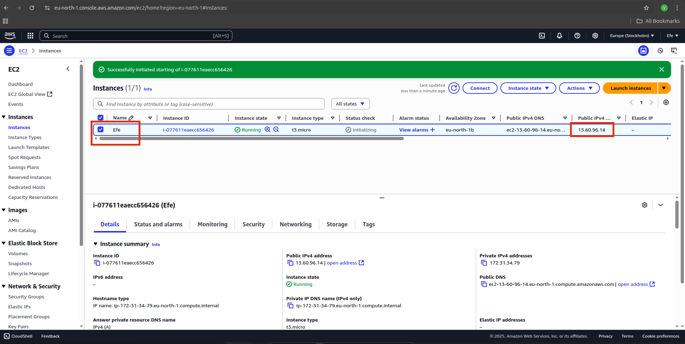

```bash
ssh -i "efe-key-instance.pem" ubuntu@ec2-113.60.96.14.compute-1.amazonaws.com
```

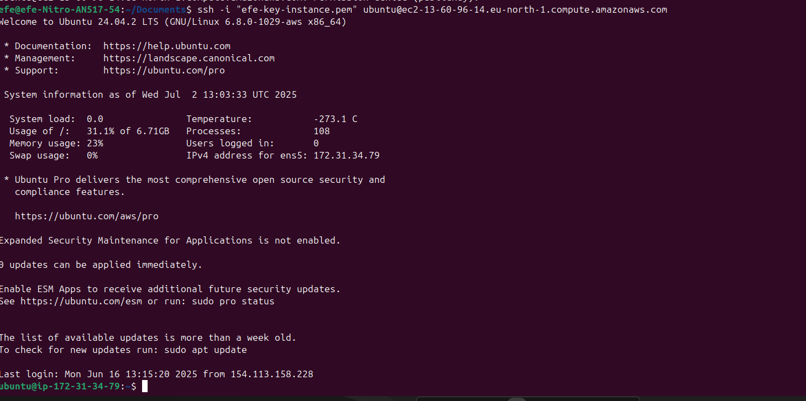

```bash
mkdir shell-scripting
```

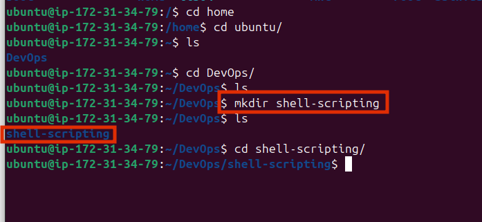

2. Using the vim editor, create a file called **my_first_shell_script.sh**

```bash
vim my_first_shell_script.sh
```

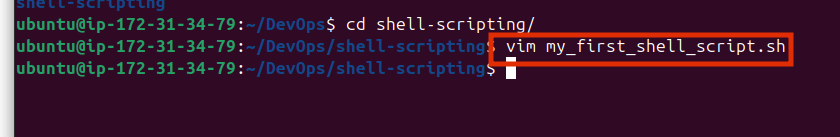


3. Put the shell script code above into the new file

```bash
#!/bin/bash

# Create multiple folders
mkdir testfolder1 testfolder2 testfolder3

# Create multiple users
sudo useradd user1 
sudo useradd user2 
sudo useradd user3

# Set password for users
sudo passwd user1
sudo passwd user2
sudo passwd user3
```
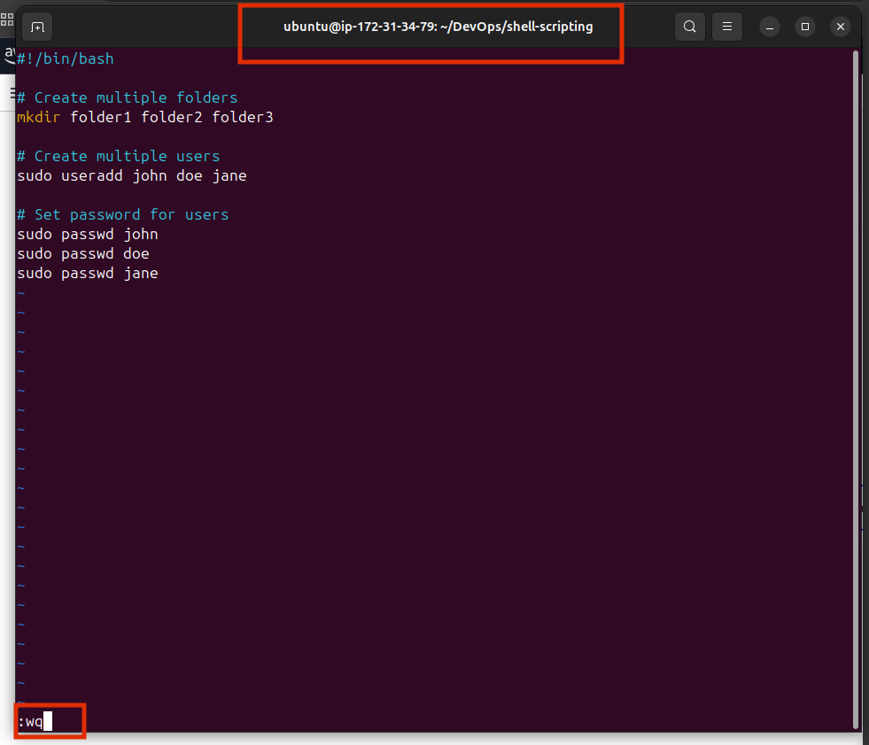

4. Save the file using `Esc` key and then `:wq` to save and quit


5. use `cd` command to change into the **shell-scripting** directory

```bash
cd shell-scripting
```


6. Use the `ls -latr` command to confirm that the file is indeed created


You should have something like this:

```bash
total 12
drwxrwxr-x 3 ubuntu ubuntu 4096 Jul  2 13:12 ..
-rw-rw-r-- 1 ubuntu ubuntu  197 Jul  2 13:22 my_first_shell_script.sh
drwxrwxr-x 2 ubuntu ubuntu 4096 Jul  2 13:22 .
```
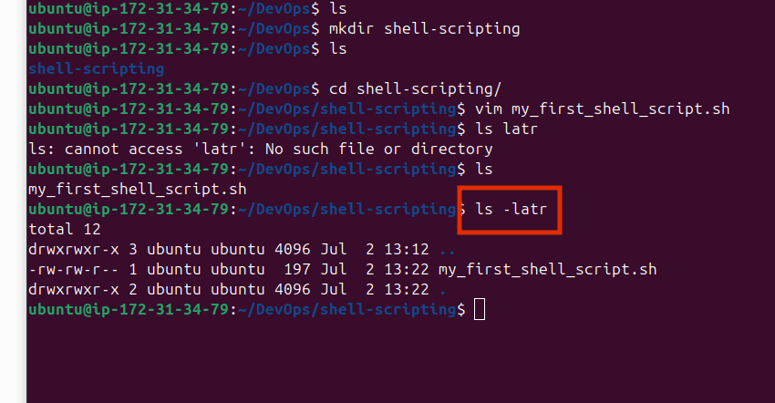

Something you should note about the permission of the newly created file is this `-rw-rw--r--` which means:

1. the owner has read (r) and write (w) permissions (6)
2. the group has read (rw) permissions (6)
3. the others have read (r) permissions (4)

__note: the file value is 644__

Howerver, no one has the execute (x) permission, hence the script cannot be executed.

to execute the script, you would typically do something like this:

```bash
./my_first_shell_script.sh
```

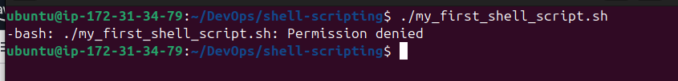

./ This prefix to the file indicates that the command should look for the file in the current directory.

- The dot **(.)** represents the current directory.

- The double dot **(..)** represents the parent directory.

- The triple dot **(...)** represents the grandparent directory. and so on

- and the slash **(/)** is a directory separator

When you hit enter, you will get a response like this:

```bash
/bin/bash: ./my_first_shell_script.sh: Permission denied
```


Notice that we now have a **permission denied** error. This is because the file does not have the execute permission. To fix this, we need to add the execute permission to the file.

But did you notice the **bash** at the begining of the error message? This shows that the error is comming from the **bash shell** interpreter itself.

Also, did you also notice the **/bin/bash** at the start of the script? This is the shebang line. It tells the system which interpreter to use to execute the script. In this case, it is using the bash interpreter.

# TASKS 2

1. Add the execute permission to the file `owner` to be able to execute the shell script

```bash
chmod +x my_first_shell_script.sh
```

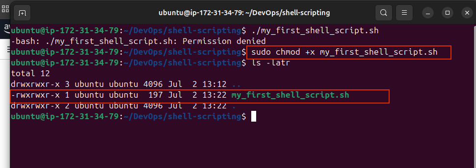

2. Run the shell script

```bash
./my_first_shell_script.sh
```

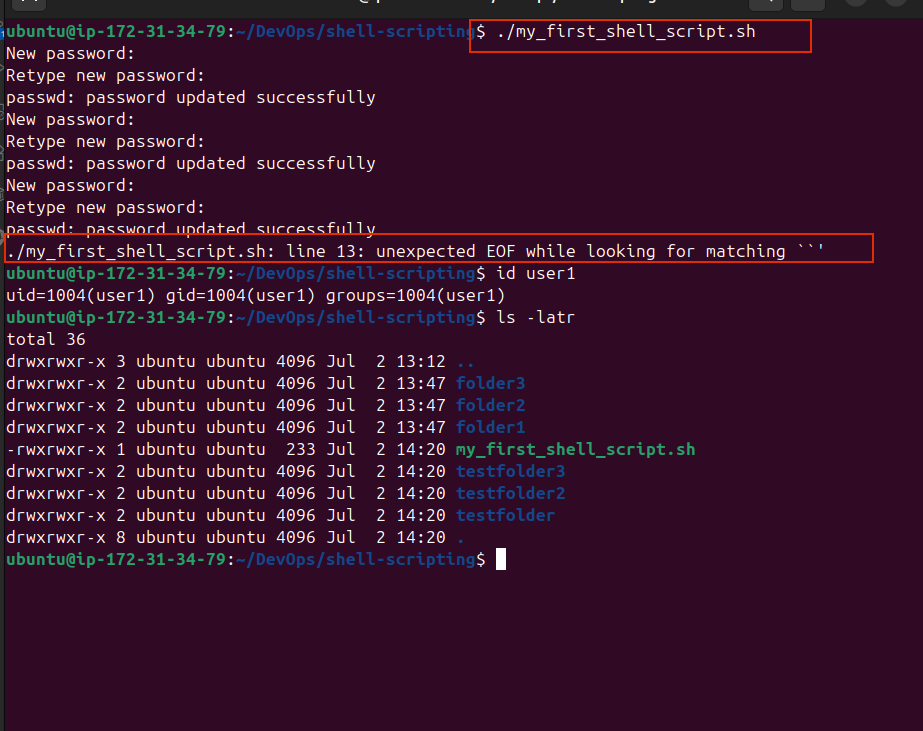

3. Evaluate and ensure that 3 folders have been created

```bash
ls -la
```

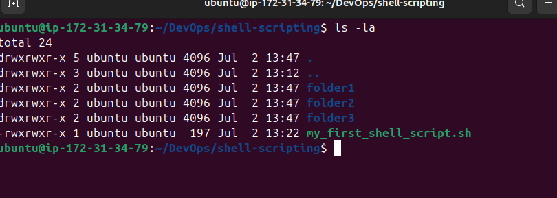


4. Evaluate and ensure that 3 users have been created

```bash
id john
```

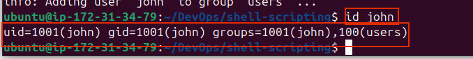


5. Evaluate and ensure that 3 users have been created
cat /etc/passwd


## What is a shebang (#!/bin/bash)?

The shebang line is the first line of a shell script that tells the system which interpreter to use to execute the script. In this case, it is using the bash interpreter. It is a special notation that is used in Unix-like operating systems to specify the interpreter to be used to execute the script. As indicated earlier in this case, #!/bin/bash is the shebang line indicating that **Bash** is the interpreter to be used to execute the script.

You can explore the **/bin** directory to see the different programs in there. **bash** is one of the programs in the **/bin** directory. And it is used as the interpreter in the above script. If we wanted to use another shell like **zsh** or **fish** or **PowerShell**, the shebang line would be different.  For instance, **sh** would be **#!/bin/sh**

**/bin/bash** is the path to the bash interpreter. It tells the system where to find the bash interpreter to run the script.

Without a shebang line, the system may not know how to interptet and execute the scrip, and you may need to explicitly specify the interpreter to use to execute the script. For example, you may need to use `bash my_first_shell_script.sh` to execute the script.

## Variable Declaration and Initialization:

In programming generally, not just shell scriptin, variables are essential for creating dynamic and flexible programs.

Variables can store data of various types such as numbers, strings, arrays, and more. You can assign a value using the assignment operator (**=**). And access thier values using the variable name prefix with a dollar sign (**$**).

let's create a variable and assign a value to it

```bash
#Example of a variable
name="Efe"
```

From the example above, `Efe` is the value of the variable `name`

Now that the variable is assigned, you may ask, how then can I use it?

## Retrieving Variable Values:

To retrieve the value of a variable, you can use the variable name prefix with a dollar sign (**$**). Tge echo command is used to print the value of the variable on console.

```bash
#Example of retrieving a variable
name="Efe"
echo $name
```

This comman instructs the shell to print the value of the name to the console, which in our case, is `Efe`.

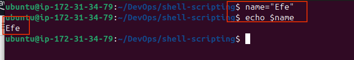

In the next shell script project, we will see how powerful we can automate tasks using controle flows, functions, and more.
