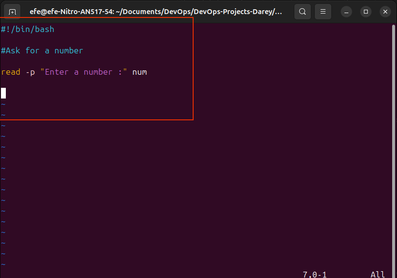
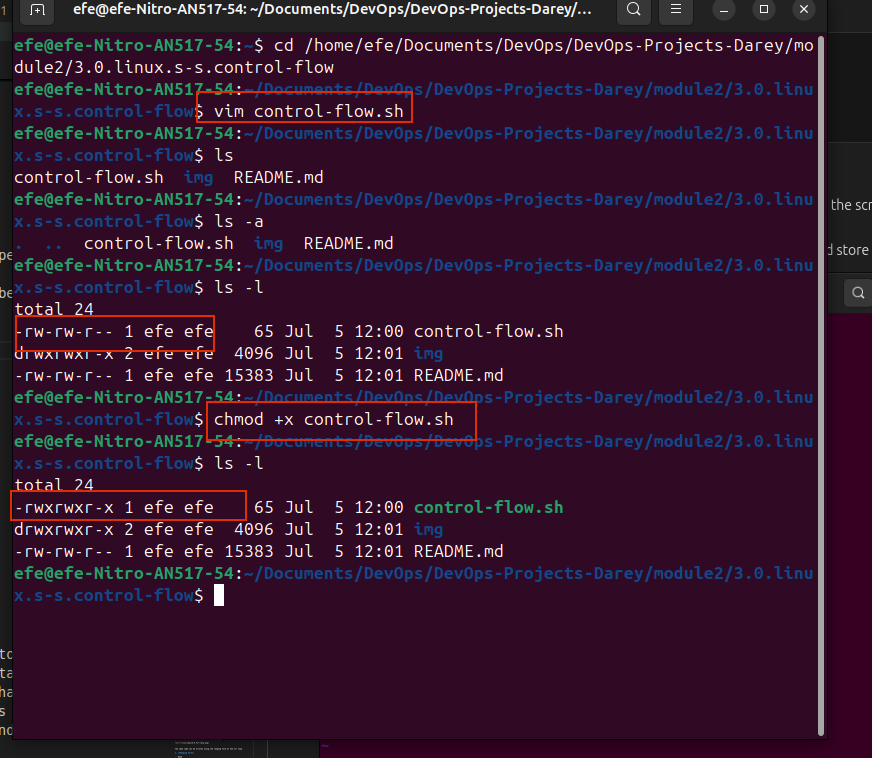
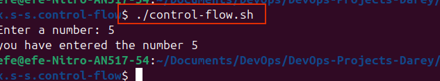
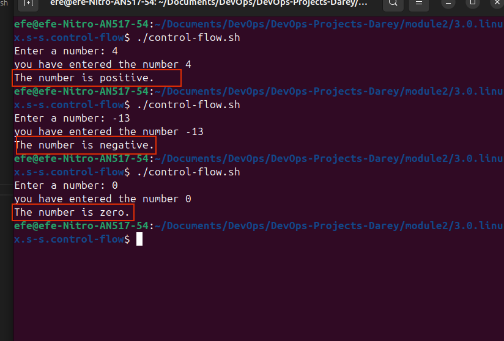
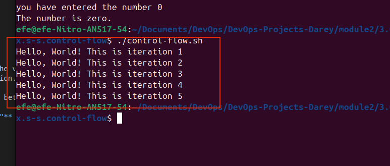
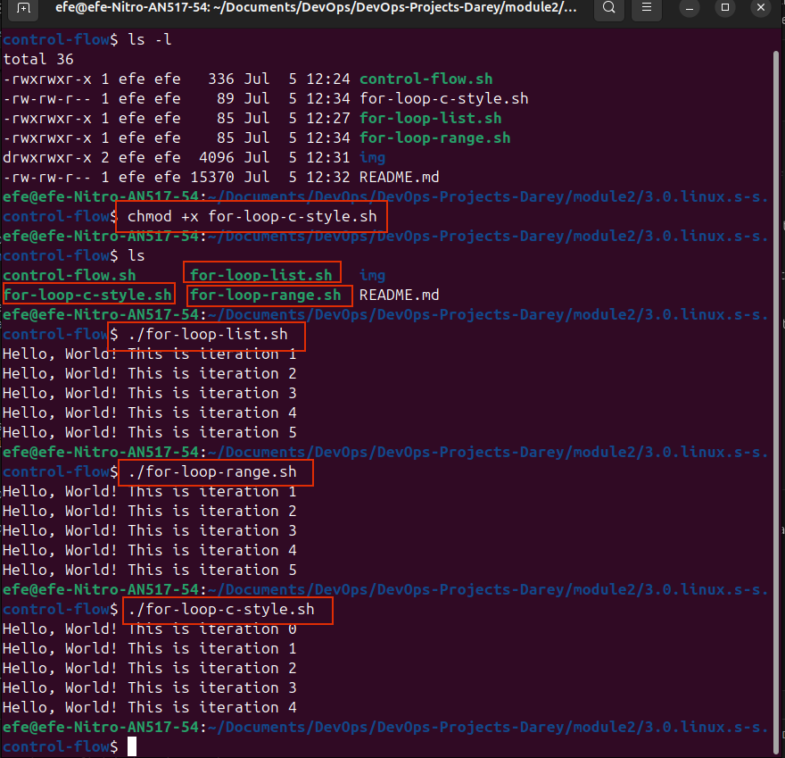

# Linux Shell Scripting Control Flow

# Control Flow in Shell Scripting

Control flow statements are the back backbone of making decisions in programming.  In shell scripting, these statements let your scripts decide what to do based on conditions, loops, user inputs, functions, and other factors.

Bash and other shell scripting interpreters provide several control flow statements, including:

- if-else statements

- for loops

- while loops

- until loops

- case statements

- functions

- subroutines

- exit

- break

- continue

Most likely you will get to use if-else and for loops the most. Therefore, at this level we will focus only on those two control flow statements.

## What is a control flow statement?

In simple terms, a control flow statement is a statement that controls the flow of execution in a program. It determines the order in which statements are executed and can change the flow of execution based on certain conditions. Its like the road map of your script.

## If-else statements

If-else statements are used to make decisions in shell scripts based on conditions. They allow scripts to execute different blocks of code based on whether a condition is true or false.

```bash
if [ condition ]; then
    # code to execute if condition is true
else
    # code to execute if condition is false
fi
```

### Task 1

Our script asks for a number and then tells us if that number is positive, negative or zero.

the entire script is as follows:

```bash
#!/bin/bash

# Ask for a number
read -p "Enter a number: " num

# Check if the number is positive, negative, or zero
if [ $num -gt 0 ]; then
    echo "The number is positive."
elif [ $num -lt 0 ]; then
    echo "The number is negative."
else
    echo "The number is zero."
fi
```


But lets start gradually and understand the script line by line.

1. create a file called `control-flow.sh`

```bash
vim control-flow.sh
```

2. Put the code below, and execute the script to experience the output.

```bash
#!/bin/bash

# Ask for a number
read -p "Enter a number: " num
```

**The script breakdown**

- The **#!/bin/bash** is called a shebang. It is used to specify the interpreter for the script. In this case, it is bash. the 
- **read** is a command that is used to read a number from the user and store it in the variable num.
- **-p** is an option for the read command that is used to print a prompt message to the user. 
- **num** is a variable that is used to store the number entered by the user.



3. Make the script executable

```bash
chmod +x control-flow.sh
```



4. Run the script

```bash
./control-flow.sh
```

Notice that when you execute the script, it just asks you to *Enter a number:*.  Even when you type a number and hit enter, it  takes the number, but you can't visibly see what it does with the number.  That is because the read command in the script has its own way of taking inputs from the user, and stores it in the variable num passed to the read command.

The read command is used to capture user input and store it in a variable. In this case, it is used to capture the user input and store it in the variable num. When you use read followed by a variable name (in this case num), Bash waits for the user to enter a value **(stdin)**. Once the user hits enter, **read** assigns the value entered by the user to the variable num. Now let's make more sense of this. Update the above code to the following:

```bash
#!/bin/bash

# Ask for a number
read -p "Enter a number: " num

# Print the number
echo "you have entered the number" $num
```

Notice how we used the echo command to print the value **(stdout)** of the variable num  to the screen?



Since we now have something store in the $num variable, we can use controle flow to deternine what the script executes next.

### if statement

The if statement is used to execute a block of code if a condition is true. It is the most basic control flow statement in shell scripting.

```bash
if [ condition ]; then
    # code to execute if condition is true
fi
```
- **if:** is a keyword that marks the start of the if statement.

- **[ condition ]:** is the condition that is evaluated. It is enclosed in square brackets and is followed by a semicolon.

- **then:** marks the start of the code block to be executed if the condition is true.

- **fi:** marks the end of the if statement.

Now let's bring it into our code

```bash
if [ $num -gt 0 ]; then
    echo "The number is positive."
fi
```

The part above tests if the value in **$num** is greater than 0. If it is, the script will print "The number is positive." Now update the script to the following:

```bash
#!/bin/bash

# Ask for a number
read -p "Enter a number: " num

# Print the number
echo "you have entered the number" $num

# Check if the number is positive, negative, or zero
if [ $num -gt 0 ]; then
    echo "The number is positive."
elif [ $num -lt 0 ]; then
    echo "The number is negative."
else
    echo "The number is zero."
fi
```


Notice the keyword **-gt**. These are called **operators**. It is used within conditional blocks to compare two values. In this case, it is used to compare the value in **$num** with 0. **-gt** means "greater than". 

Run the code and experience the output. Try different numbers and see what happens. 




**Tips:** Always read you shell script line by line to get a sense of what it is doing.

### elif statement

After understanding the if statement, let's understand the elif statement. The elif statement is used to execute a block of code if a condition is true. It is the most basic control flow statement in shell scripting.

```bash
id [condition]; then
    # code to execute if condition is true
elif [condition2]; then
    # code to execute if condition is true
else
    # code to execute if condition is false
fi
```

- **elif:** This keyword is used right after an if or another elif block or statement. It allows you to specify an alternative condition to test if the previous conditions are not met.
- **[condition2]:** This is the condition that is evaluated. It is enclosed in square brackets and is followed by a semicolon.
- **then:** This keyword marks the start of the code block to be executed if the condition is true.
- **fi:** This keyword marks the end of the if statement.

No, let's apply elif to our script to handle a scenerio where the nentered number might be negative.

```bash
#!/bin/bash

# Ask for a number
read -p "Enter a number: " num

# Print the number
echo "you have entered the number" $num

# Check if the number is positive, negative, or zero
if [ $num -gt 0 ]; then
    echo "The number is positive."
elif [ $num -lt 0 ]; then
    echo "The number is negative."
else
    echo "The number is zero."
fi
```

**in this updated version of the script:**

- The **if[$num -gt 0]:then** part checks if **num** is greatere than 0 and prints **"the number is positive"** if it is true.
- If the first condition is not met, the **elif[$num -lt 0]:then** part checks if **num** is less than 0 and prints **"the number is negative"** if it is true.
- If none of the conditions are met, the **else** part prints **"the number is zero"**.
- The **fi** keyword marks the end of the if statement.


## Loops

Moving forward in our journey through Bash scripting, we will be learning about loops. Loops are used to repeat a block of code multiple times. 

Loops empower us to automate and repeate tasks without writing the same code over and over again. Imagine having to perform a tasks, like sending a greeting message to each of your friend by name. Without loops, you'd have to write a separate code for each friend.  Loops streamline this process by allowing you to write a single set of code instructions that can be executed multiple times, making your script both cleaner and more powerful.

Some real world scenarios where loops are inevitable are:

**Batch Processing:** Suppose you have a folder full of photos you want to resize or edit in some way, instead of editing each photo individually, a loop can automate this task, applying the same code to each photo in the folder.

**Data Processing:**  In software development, loops are used to process data in batches, such as processing a list of names and generating a greeting message for each name. 

**Data Analysis:** Loops are used to analyze data, such as analyzing a list of names and generating a report for each name. It can be used to perform calculations on numerous data sets.

**Automation:** Loops are used to automate tasks, such as sending a greeting message to each of your friend by name. Without loops, you'd have to write a separate code for each friend.  Loops streamline this process by allowing you to write a single set of code instructions that can be executed multiple times, making your script both cleaner and more powerful.

**Automated Testing:** In software development, loops are invaluable for running through numerous test cases. You can use a loop to automatically test different inputs for your program and verify that it behaves as expected using the same code.

In Bash scripting, there are three primary types of loops that are commonly used to repeat a set of commands multiple times based on certain conditions. These are:

1. for loop
2. while loop
3. until loop

Let's go through each of these loops and understand how they work.

### for loop

The for loop is used to iterate over a list of values or a range of numbers. It is particularly useful when you know in advance how many times you need to execute the loop body.

The **for** loop has two main forms:

1. **List Form:** Iterates over a list of items

```bash
list = ("item1", "item2", "item3")
for item in list; do
    # code to execute for each item
done
```

- **for:** This keyword marks the start of the for loop.

- **item:** This is the variable that will hold the current item in the list temporarily. For each iteration, the value of the current item is assigned to the variable.

- **in:** This keyword is used to specify the list of items to iterate over.

- **list:** This is the list of items to iterate over. It can be a string, an array, or a range of numbers.

- **;:** A semicolon is used to separate the list of items from the do keyword that follows. If you place a do keyword on the next line, the semicolon is optional.

- **do:** This keyword marks the start of the loop body.

- **done:** This keyword marks the end of the loop body.

Let's examin a real example:

```bash
for i in 1 2 3 4 5; do
    echo "Number: $i"
done
```
alternatively, if you put the do keyword on the next line, the semicolon is optional.
```bash
for i in 1 2 3 4 5
do
    echo "Hello, World! This is iteration $i"
done
```

In this example:

- The loop starts with **for i in 1 2 3 4 5**, meaning the variable **i** will take on the values 1, 2, 3, 4, and 5 in each iteration.

- For each value of **i**, the loop executes the command between do and done.

- The command **echo "Hello, World! This is iteration $i"** prints the value of **i** to the console along with the message.




The same code can be written using the ranging form of the for loop

2. **Ranging Form**

```bash
for i in {1..5}; do
    echo "Hello, World! This is iteration $i"
done
```


**TASk**

1. Create a script for each type of the for loop discussed above

2. Insert the code in the files

3. Make the scripts executable

4. Run the scripts and evaluate the experience

**Solution**

1. Create a script for each type of the for loop discussed above

```bash
vim for-loop.sh
```

2. Insert the code in the files

```bash
#!/bin/bash

for i in 1 2 3 4 5; do
    echo "Hello, World! This is iteration $i"
done
```

3. Make the scripts executable

```bash
chmod +x for-loop.sh
```

4. Run the scripts and evaluate the experience

```bash
./for-loop.sh
```

5. Repeate step 1 to 4 for a ranging form script

**List Form**


**Ranging Form**


3. **C-Style For Loop**: This is the most common form of the for loop. It is used to iterate over a range of numbers. This style allows you to specify and initializer, condition, and increment/decrement expression. It is based on the same syntax used in doing a for loop in C Programming Language. Like this:

```bash
for ((i=0; i<5; i++)); do
    echo "Hello, World! This is iteration $i"
done
```

Lets break the above syntax down:

- **for ((...))**: This is the syntax for the c-style for loop. It is used to iterate over a range of numbers. The syntax is **for ((initializer; condition; increment/decrement))**

- **i=0**: This is the initializer. It is used to initialize the loop variable. In this case, it is used to initialize the loop variable to 0.

- **i<5**: This is the condition. It is used to specify the condition for the loop. In this case, it is used to specify the condition for the loop to run as long as **i** is less than 5.

- **i++**: This is the increment/decrement expression. It is used to increment or decrement the loop variable. In this case, it is used to increment the loop variable by 1.

- **do**: This is the keyword that marks the start of the loop body.

- **done**: This is the keyword that marks the end of the loop body.


**How it works**

```
 - Initialization: Before the first iteration,"i" is set to 0.
 - Condition Check: Before each iteration, including the first, Bash checks if it is less than 5.
    - If the condition is true, the loop body is executed.
    - If the condition is false, the loop is terminated.
- Execute commands: The command(s) inside the "do ... done" block are executed. In this case, it prints the current value of "i" to the console.
- Increment/Decrement: After each iteration, the loop variable is incremented by 1.
- Repeat: The loop repeats until the condition is false.
```


**Let's Take a walkthrough to further expand on our understanding of the for loop**

- **First Iteration:**
    - The loop variable "i" is initialized to 0.
    - The condition is checked: 0 < 5 (true).
    - The command inside the loop body is executed: echo "Hello, World! This is iteration 0".
    - The loop variable is incremented: i = 0 + 1 = 1.
    - The loop repeats with the new value of i.

- **Second Iteration:**
    - The loop variable "i" is initialized to 1.
    - The condition is checked: 1 < 5 (true).
    - The command inside the loop body is executed: echo "Hello, World! This is iteration 1".
    - The loop variable is incremented: i = 1 + 1 = 2.
    - The loop repeats with the new value of i.

- **Continue Iteration:** ...

- **Fifth Iteration:** ...
    - The loop variable "i" is initialized to 4.
    - The condition is checked: 4 < 5 (true).
    - The command inside the loop body is executed: echo "Hello, World! This is iteration 4".
    - The loop variable is incremented: i = 4 + 1 = 5.
    - The loop repeats with the new value of i.

- **Sixth Iteration:** ...
    - The loop variable "i" is initialized to 5.
    - The condition is checked: 5 < 5 (false).
    - The loop is terminated.

This C-style for loop is powerful for numerical iterations, especially when you need precise controle over the start, end, and step size of the loop.
    