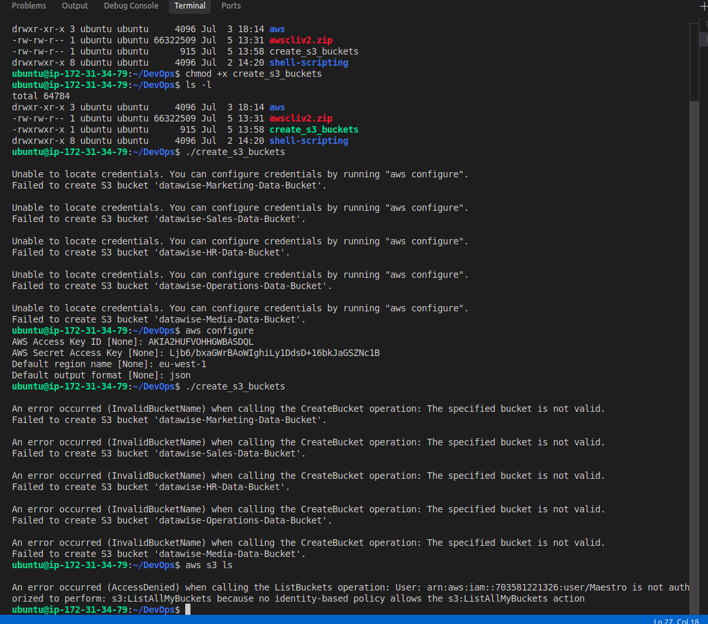
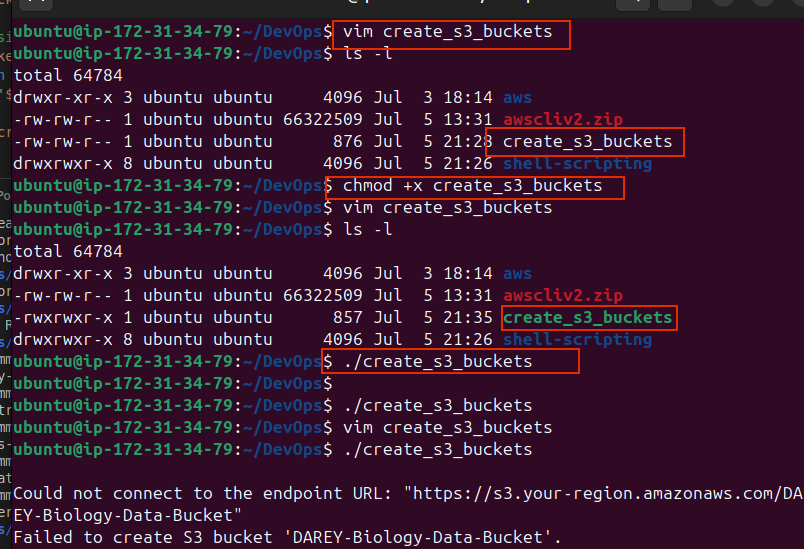
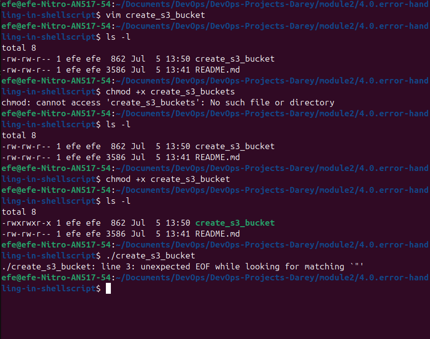

# Mini Project - Error Handling in Shell Scripting

Error handling is a crucial aspect of scripting that involves anticipating and managing errors that may occur during script execution. These errors could arise from various factors such as incorrect user input, unexpected system behavior, or resource unavailability. Proper error handling is essential for improving the reliability, robustness, and usability of shell scripts.

## Implementing Error Handling

When implementing error handling in shell scripting, it's essential to consider various scenarios and develop strategies to handle them effectively. Here are some key steps to think through and implement error handling:

- Identify Potential Errors: Begin by identifying potential sources of errors in your script, such as user input validation, command execution, or file operations. Anticipate scenarios where errors may occur and how they could impact script execution.
- Use Conditional Statements: Utilize conditional statements (if, elif, else) to check for error conditions and respond accordingly. Evaluate the exit status ($?) of commands to determine whether they executed successfully or encountered an error.

- Provide Informative Messages: When errors occur, provide descriptive error messages that clearly indicate what went wrong and how users can resolve the issue.

## Handling S3 Bucket Existence Error

In the context of our script to create S3 buckets, an error scenario could arise if the bucket already exists when attempting to create it. To handle this error, we can modify the script to check if the bucket exists before attempting to create it. If the bucket already exists, we can display a message indicating that the bucket is already present.

If you try to run your script more than once, you will end up creating more EC2 instances than required, and S3 bucket creation will fail because the bucket would already exist.

So, you can be as creative as you like, by thinking about the different errors that may occur during script execution and then handle each one carefully.

```bash
#!/bin/bash

# Function to create S3 buckets for different departments
create_s3_buckets() {
    company="datawise"
    departments=("Marketing" "Sales" "HR" "Operations" "Media")
    
    for department in "${departments[@]}"; do
        bucket_name="${company}-${department}-Data-Bucket"
        
        # Check if the bucket already exists
        if aws s3api head-bucket --bucket "$bucket_name" &>/dev/null; then
            echo "S3 bucket '$bucket_name' already exists."
        else
            # Create S3 bucket using AWS CLI
            aws s3api create-bucket --bucket "$bucket_name" --region your-region
            if [ $? -eq 0 ]; then
                echo "S3 bucket '$bucket_name' created successfully."
            else
                echo "Failed to create S3 bucket '$bucket_name'."
            fi
        fi
    done
}
```

In this updated version, before attempting to create each bucket, we use the aws s3api head-bucket command to check if the bucket already exists. If the bucket exists, a message is displayed indicating its presence. Otherwise, the script proceeds to create the bucket as before. This approach helps prevent errors and ensures that existing buckets are not recreated unnecessarily.

<!--  -->



<!--  -->


### Task
Summarise all your learning in this mini project into a paragraph and submit.

### Solution

Having error handling in shell scripts is important because it helps to prevent errors and ensures that the script runs smoothly. It also helps to make the script more reliable and robust. Shell scripting can be used to carry out lots of automation tasks, and error handling is a crucial aspect of shell scripting.


Error handling shown from terminal below

```terminal

This bundle contains a built executable of the AWS CLI v2.

## Installation

To install the AWS CLI v2, run the `install` script:
```
$ sudo ./install 
You can now run: /usr/local/bin/aws --version
```
This will install the AWS CLI v2 at `/usr/local/bin/aws`.  Assuming
`/usr/local/bin` is on your `PATH`, you can now run:
```
$ aws --version
```


### Installing without sudo

If you don't have ``sudo`` permissions or want to install the AWS
CLI v2 only for the current user, run the `install` script with the `-b`
and `-i` options:
```
$ ./install -i ~/.local/aws-cli -b ~/.local/bin
``` 
This will install the AWS CLI v2 in `~/.local/aws-cli` and create
symlinks for `aws` and `aws_completer` in `~/.local/bin`. For more
information about these options, run the `install` script with `-h`:
```
$ ./install -h
```

### Updating

If you run the `install` script and there is a previously installed version
of the AWS CLI v2, the script will error out. To update to the version included
in this bundle, run the `install` script with `--update`:
```
$ sudo ./install --update
```


### Removing the installation

To remove the AWS CLI v2, delete the its installation and symlinks:
```
$ sudo rm -rf /usr/local/aws-cli
$ sudo rm /usr/local/bin/aws
$ sudo rm /usr/local/bin/aws_completer
```
Note if you installed the AWS CLI v2 using the `-b` or `-i` options, you will
need to remove the installation and the symlinks in the directories you
specified.
ubuntu@ip-172-31-40-106:~/aws$ s
s: command not found
ubuntu@ip-172-31-40-106:~/aws$ ls
README.md  THIRD_PARTY_LICENSES  dist  install
ubuntu@ip-172-31-40-106:~/aws$ cd ..
ubuntu@ip-172-31-40-106:~$ aws configure
AWS Access Key ID [****************SDQL]: ******
ubuntu@ip-172-31-40-106:~$ aws configure
AWS Access Key ID [****************SDQL]: ******
AWS Secret Access Key [****************Nc1B]: ******
Default region name [us-east-1]: eu-west-1
Default output format [json]: 
ubuntu@ip-172-31-40-106:~$ vim create_s3_bucket.ssh 
ubuntu@ip-172-31-40-106:~$ 
 *  History restored 

efe@efe-Nitro-AN517-54:~/Documents$ ssh -i ~/Documents/efe-key-instance.pem ubuntu@13.48.59.23
ssh: connect to host 13.48.59.23 port 22: Network is unreachable
efe@efe-Nitro-AN517-54:~/Documents$ ssh -i ~/Documents/efe-key-instance.pem ubuntu@13.48.59.23
Welcome to Ubuntu 24.04.2 LTS (GNU/Linux 6.8.0-1029-aws x86_64)

 * Documentation:  https://help.ubuntu.com
 * Management:     https://landscape.canonical.com
 * Support:        https://ubuntu.com/pro

 System information as of Wed Jul  9 06:17:16 UTC 2025

  System load:  0.0               Temperature:           -273.1 C
  Usage of /:   39.1% of 6.71GB   Processes:             108
  Memory usage: 27%               Users logged in:       0
  Swap usage:   0%                IPv4 address for ens5: 172.31.40.106

 * Ubuntu Pro delivers the most comprehensive open source security and
   compliance features.

   https://ubuntu.com/aws/pro

Expanded Security Maintenance for Applications is not enabled.

65 updates can be applied immediately.
48 of these updates are standard security updates.
To see these additional updates run: apt list --upgradable

Enable ESM Apps to receive additional future security updates.
See https://ubuntu.com/esm or run: sudo pro status


Last login: Tue Jul  8 21:24:48 2025 from 154.113.158.228
ubuntu@ip-172-31-40-106:~$ 
 *  History restored 

efe@efe-Nitro-AN517-54:~/Documents$ ssh -i ~/Documents/efe-key-instance.pem ubuntu@13.48.59.23
Welcome to Ubuntu 24.04.2 LTS (GNU/Linux 6.8.0-1029-aws x86_64)

 * Documentation:  https://help.ubuntu.com
 * Management:     https://landscape.canonical.com
 * Support:        https://ubuntu.com/pro

 System information as of Wed Jul  9 06:17:16 UTC 2025

  System load:  0.0               Temperature:           -273.1 C
  Usage of /:   39.1% of 6.71GB   Processes:             108
  Memory usage: 27%               Users logged in:       0
  Swap usage:   0%                IPv4 address for ens5: 172.31.40.106

 * Ubuntu Pro delivers the most comprehensive open source security and
   compliance features.

   https://ubuntu.com/aws/pro

Expanded Security Maintenance for Applications is not enabled.

65 updates can be applied immediately.
48 of these updates are standard security updates.
To see these additional updates run: apt list --upgradable

Enable ESM Apps to receive additional future security updates.
See https://ubuntu.com/esm or run: sudo pro status


Last login: Wed Jul  9 06:17:17 2025 from 154.113.158.228
ubuntu@ip-172-31-40-106:~$ ls
Documents  aws  awscliv2.zip  create_s3_bucket.ssh
ubuntu@ip-172-31-40-106:~$ ./create_s3_bucket.ssh 

An error occurred (IllegalLocationConstraintException) when calling the CreateBucket operation: The unspecified location constraint is incompatible for the region specific endpoint this request was sent to.
Failed to create S3 bucket 'DAREY-Biology-Data-Bucket'.

An error occurred (IllegalLocationConstraintException) when calling the CreateBucket operation: The unspecified location constraint is incompatible for the region specific endpoint this request was sent to.
Failed to create S3 bucket 'DAREY-Chemistry-Data-Bucket'.

An error occurred (IllegalLocationConstraintException) when calling the CreateBucket operation: The unspecified location constraint is incompatible for the region specific endpoint this request was sent to.
Failed to create S3 bucket 'DAREY-Physics-Data-Bucket'.

An error occurred (IllegalLocationConstraintException) when calling the CreateBucket operation: The unspecified location constraint is incompatible for the region specific endpoint this request was sent to.
Failed to create S3 bucket 'DAREY-Mathematics-Data-Bucket'.

An error occurred (IllegalLocationConstraintException) when calling the CreateBucket operation: The unspecified location constraint is incompatible for the region specific endpoint this request was sent to.
Failed to create S3 bucket 'DAREY-Computer-Science-Data-Bucket'.
ubuntu@ip-172-31-40-106:~$ aws iam list-attached-user-policies --user-name maestro      
aws iam list-user-policies --user-name maestro
{
    "AttachedPolicies": [
        {
            "PolicyName": "IAMUserChangePassword",
            "PolicyArn": "arn:aws:iam::aws:policy/IAMUserChangePassword"
        }
    ]
}
{
    "PolicyNames": []
}
ubuntu@ip-172-31-40-106:~$ aws iam list-attached-user-policies --user-name maestro
{
    "AttachedPolicies": [
        {
            "PolicyName": "IAMUserChangePassword",
            "PolicyArn": "arn:aws:iam::aws:policy/IAMUserChangePassword"
        }
    ]
}
ubuntu@ip-172-31-40-106:~$ aws iam list-user-policies --user-name maestro
{
    "PolicyNames": []
}
ubuntu@ip-172-31-40-106:~$ aws iam list-groups-for-user --user-name maestro
{
    "Groups": [
        {
            "Path": "/",
            "GroupName": "Administrator",
            "GroupId": "AGPA2HUFVOHHKNLQ3ZXHR",
            "Arn": "arn:aws:iam::703581221326:group/Administrator",
            "CreateDate": "2025-07-05T14:09:07+00:00"
        }
    ]
}
ubuntu@ip-172-31-40-106:~$ aws iam list-attached-user-policies --user-name Administrator
aws iam list-user-policies --user-name Administrator

An error occurred (NoSuchEntity) when calling the ListAttachedUserPolicies operation: The user with name Administrator cannot be found.

An error occurred (NoSuchEntity) when calling the ListUserPolicies operation: The user with name Administrator cannot be found.
ubuntu@ip-172-31-40-106:~$ aws iam list-attached-group-policies --group-name Administrator
aws iam list-group-policies --group-name Administrator
{
    "AttachedPolicies": [
        {
            "PolicyName": "AmazonEC2FullAccess",
            "PolicyArn": "arn:aws:iam::aws:policy/AmazonEC2FullAccess"
        },
        {
            "PolicyName": "AdministratorAccess",
            "PolicyArn": "arn:aws:iam::aws:policy/AdministratorAccess"
        },
        {
            "PolicyName": "AmazonS3FullAccess",
            "PolicyArn": "arn:aws:iam::aws:policy/AmazonS3FullAccess"
        },
        {
            "PolicyName": "AdministratorAccess-AWSElasticBeanstalk",
            "PolicyArn": "arn:aws:iam::aws:policy/AdministratorAccess-AWSElasticBeanstalk"
        },
        {
            "PolicyName": "AdministratorAccess-Amplify",
            "PolicyArn": "arn:aws:iam::aws:policy/AdministratorAccess-Amplify"
        }
    ]
}
{
    "PolicyNames": []
}
ubuntu@ip-172-31-40-106:~$ aws sts get-caller-identity --query "Account" --output text
703581221326
ubuntu@ip-172-31-40-106:~$ ^C
ubuntu@ip-172-31-40-106:~$ aws iam simulate-principal-policy \
    --policy-source-arn arn:aws:iam::703581221326:user/maestro \
    --action-names s3:CreateBucket s3:ListAllMyBuckets
{
    "EvaluationResults": [
        {
            "EvalActionName": "s3:CreateBucket",
            "EvalResourceName": "*",
            "EvalDecision": "allowed",
            "MatchedStatements": [
                {
                    "SourcePolicyId": "AdministratorAccess-Amplify",
                    "SourcePolicyType": "IAM Policy",
                    "StartPosition": {
                        "Line": 333,
                        "Column": 4
                    },
                    "EndPosition": {
                        "Line": 361,
                        "Column": 4
                    }
                },
                {
                    "SourcePolicyId": "AdministratorAccess-Amplify",
                    "SourcePolicyType": "IAM Policy",
                    "StartPosition": {
                        "Line": 361,
                        "Column": 4
                    },
                    "EndPosition": {
                        "Line": 428,
                        "Column": 4
                    }
                },
                {
                    "SourcePolicyId": "AmazonS3FullAccess",
                    "SourcePolicyType": "IAM Policy",
                    "StartPosition": {
                        "Line": 3,
                        "Column": 17
                    },
                    "EndPosition": {
                        "Line": 8,
                        "Column": 6
                    }
                },
                {
                    "SourcePolicyId": "AdministratorAccess",
                    "SourcePolicyType": "IAM Policy",
                    "StartPosition": {
                        "Line": 3,
                        "Column": 17
                    },
                    "EndPosition": {
                        "Line": 8,
ubuntu@ip-172-31-40-106:~$ ./create_s3_bucket.ssh 

An error occurred (IllegalLocationConstraintException) when calling the CreateBucket operation: The unspecified location constraint is incompatible for the region specific endpoint this request was sent to.
Failed to create S3 bucket 'DAREY-Biology-Data-Bucket'.

An error occurred (IllegalLocationConstraintException) when calling the CreateBucket operation: The unspecified location constraint is incompatible for the region specific endpoint this request was sent to.
Failed to create S3 bucket 'DAREY-Chemistry-Data-Bucket'.

An error occurred (IllegalLocationConstraintException) when calling the CreateBucket operation: The unspecified location constraint is incompatible for the region specific endpoint this request was sent to.
Failed to create S3 bucket 'DAREY-Physics-Data-Bucket'.

An error occurred (IllegalLocationConstraintException) when calling the CreateBucket operation: The unspecified location constraint is incompatible for the region specific endpoint this request was sent to.
Failed to create S3 bucket 'DAREY-Mathematics-Data-Bucket'.

An error occurred (IllegalLocationConstraintException) when calling the CreateBucket operation: The unspecified location constraint is incompatible for the region specific endpoint this request was sent to.
Failed to create S3 bucket 'DAREY-Computer-Science-Data-Bucket'.
ubuntu@ip-172-31-40-106:~$ vim create_s3_bucket.ssh 
ubuntu@ip-172-31-40-106:~$ ./create_s3_bucket.ssh 

An error occurred (InvalidBucketName) when calling the CreateBucket operation: The specified bucket is not valid.
Failed to create S3 bucket 'DAREY-Biology-Data-Bucket'.

An error occurred (InvalidBucketName) when calling the CreateBucket operation: The specified bucket is not valid.
Failed to create S3 bucket 'DAREY-Chemistry-Data-Bucket'.

An error occurred (InvalidBucketName) when calling the CreateBucket operation: The specified bucket is not valid.
Failed to create S3 bucket 'DAREY-Physics-Data-Bucket'.

An error occurred (InvalidBucketName) when calling the CreateBucket operation: The specified bucket is not valid.
Failed to create S3 bucket 'DAREY-Mathematics-Data-Bucket'.

An error occurred (InvalidBucketName) when calling the CreateBucket operation: The specified bucket is not valid.
Failed to create S3 bucket 'DAREY-Computer-Science-Data-Bucket'.
ubuntu@ip-172-31-40-106:~$ less create_s3_bucket.ssh 
ubuntu@ip-172-31-40-106:~$ vim create_s3_bucket.ssh 
ubuntu@ip-172-31-40-106:~$ ./create_s3_bucket.ssh 

An error occurred (InvalidBucketName) when calling the CreateBucket operation: The specified bucket is not valid.
Failed to create S3 bucket 'darey-biology-Data-Bucket'.

An error occurred (InvalidBucketName) when calling the CreateBucket operation: The specified bucket is not valid.
Failed to create S3 bucket 'darey-chemistry-Data-Bucket'.

An error occurred (InvalidBucketName) when calling the CreateBucket operation: The specified bucket is not valid.
Failed to create S3 bucket 'darey-physics-Data-Bucket'.

An error occurred (InvalidBucketName) when calling the CreateBucket operation: The specified bucket is not valid.
Failed to create S3 bucket 'darey-mathematics-Data-Bucket'.

An error occurred (InvalidBucketName) when calling the CreateBucket operation: The specified bucket is not valid.
Failed to create S3 bucket 'darey-computer-science-Data-Bucket'.
ubuntu@ip-172-31-40-106:~$ vim create_s3_bucket.ssh 
ubuntu@ip-172-31-40-106:~$ ./create_s3_bucket.ssh 
{
    "Location": "http://darey-biology-data-bucket.s3.amazonaws.com/"
}
S3 bucket 'darey-biology-data-bucket' created successfully.
{
    "Location": "http://darey-chemistry-data-bucket.s3.amazonaws.com/"
}
S3 bucket 'darey-chemistry-data-bucket' created successfully.
{
    "Location": "http://darey-physics-data-bucket.s3.amazonaws.com/"
}
S3 bucket 'darey-physics-data-bucket' created successfully.
{
    "Location": "http://darey-mathematics-data-bucket.s3.amazonaws.com/"
}
S3 bucket 'darey-mathematics-data-bucket' created successfully.
{
    "Location": "http://darey-computer-science-data-bucket.s3.amazonaws.com/"
}
S3 bucket 'darey-computer-science-data-bucket' created successfully.
ubuntu@ip-172-31-40-106:~$ ls -l
total 64784
drwxrwxr-x 2 ubuntu ubuntu     4096 Jul  8 22:53 Documents
drwxr-xr-x 3 ubuntu ubuntu     4096 Jul  3 18:14 aws
-rw-rw-r-- 1 ubuntu ubuntu 66322509 Jul  8 21:35 awscliv2.zip
-rwxrwxr-x 1 ubuntu ubuntu      955 Jul  9 06:50 create_s3_bucket.ssh
ubuntu@ip-172-31-40-106:~$ vim create_s3_bucket.ssh 
ubuntu@ip-172-31-40-106:~$ 

```
