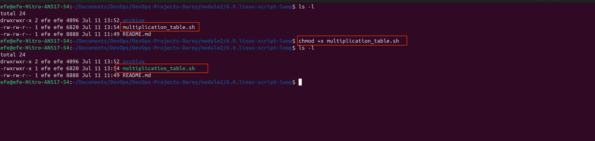
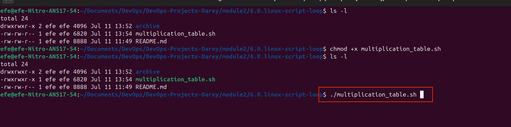
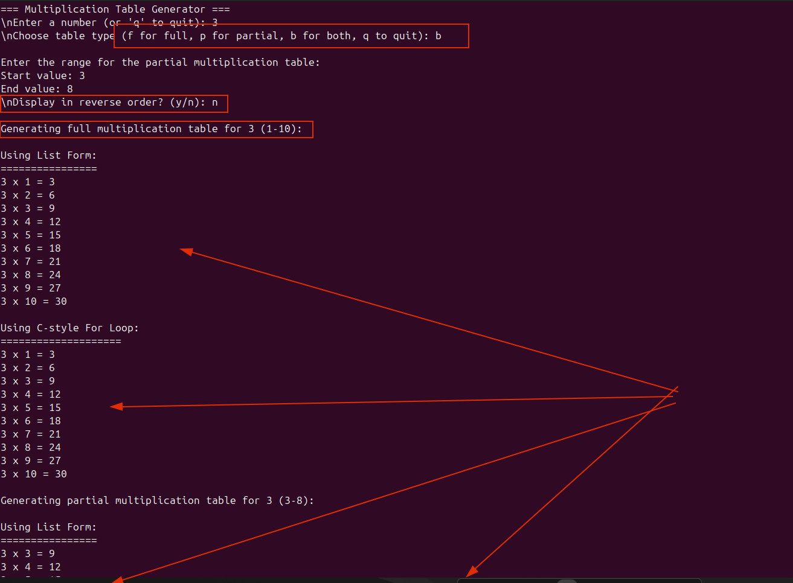
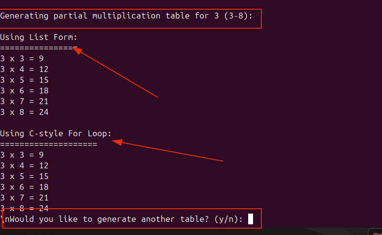
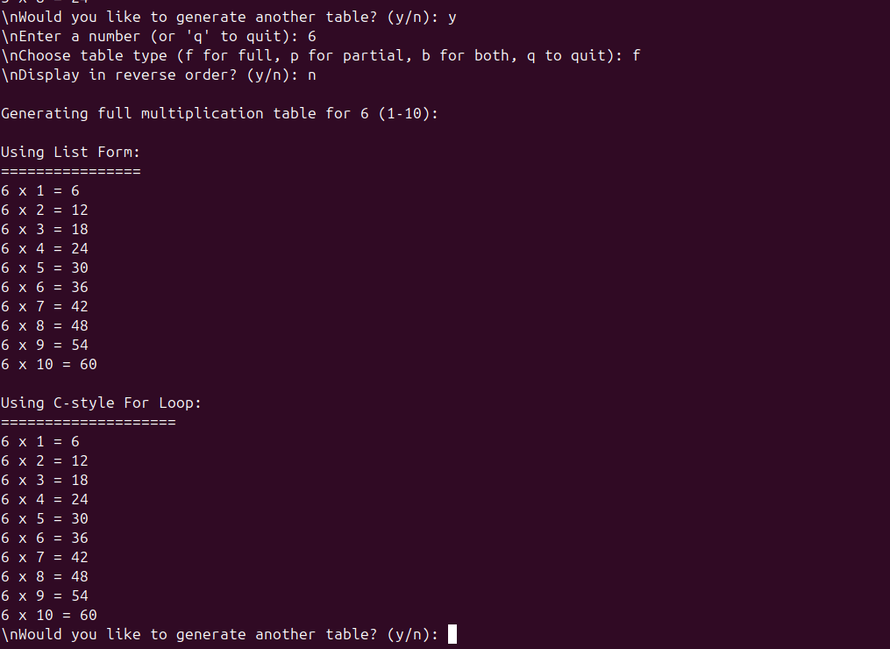
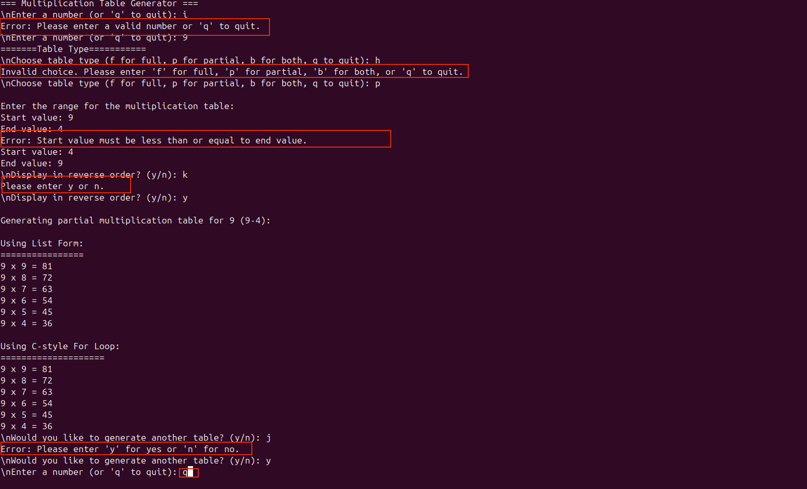
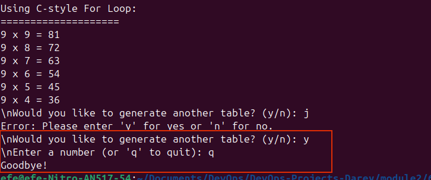

## Basic Script for Generating Multiplication Table

**Objective:** Create a Bash script that generates a multiplication table for a number entered by the user. This project will help us practice using loops, handling user inpute, and applying conditional logic in Bash scripts.

## Project Description

Your script should promt the users to enter a number and then ask if they prefere to see a full multiplication table from 1 to 10 or a partial table within a special range. Based on the user's choice, the script will display the corresponding multiplication table.

## Project Requirements

- **User Inpute for Number:** The script must first ask the user to inpute a number for which the multiplication table will be generated

- **Choice of Table Range:** The script must then ask the user to choose between a full table (1-10) or a partial table. If they choose partial, it prompts them to enter the start and end values for the range.

- **Use of Loops:** Implement the logic to generate the multiplication table using loops. You mmay use either the list form or C-style for loop based on what's appropriate.

- **Conditional Logic:** Use conditional logic to handle the user's choice of table range. If the user selects partial, prompt them to enter the start and end values for the range.

- **Inpute Validation:** Implement input validation to ensure that the user enters valid values for the number and range. Provide appropriate error messages for invalid input.

- **Output:** The script should display the multiplication table in a clear and readable format.

- **Error Handling:** Implement error handling to catch and display any errors that may occur during script execution.

- **Comments and Code Quality:** Your script should be well-commented, explaining the purpose of different sections and any important variables or logic used. Ensure the code is neatly formatted for easy readability.

## Example Script Flow

1. Promt the user to enter the number for which the multiplication table will be generated
2. Ask the user to choose between a full table (1-10) or a partial table. 
    - If they choose partial, prompt them to enter the start and end values for the range.
3. Implement the logic to generate the multiplication table using the list form and C-style for loop.
4. Use conditional logic to handle the user's choice of table range. If the user selects partial, prompt them to enter the start and end values for the range.
5. Implement input validation to ensure that the user enters valid values for the number and range. Provide appropriate error messages for invalid input.
6. Implement error handling to catch and display any errors that may occur during script execution.
7. Display the multiplication table in a clear and readable format.
8. Enhance User Interaction: Incoporate additional checks or features, like repeating the the program for another number without restarting the script.
8. Create Display Options: Offer different formatting styles for the table display and let the user choose their preferred style.
9. Document the script: Provide a README file that explains how to use the script, including any dependencies or requirements.

Bellow is an example output for the full multiplication table:

```
The full multiplication table for 3 is:

3 x 1 = 3
3 x 2 = 6
3 x 3 = 9
3 x 4 = 12
3 x 5 = 15
3 x 6 = 18
3 x 7 = 21
3 x 8 = 24
3 x 9 = 27
3 x 10 = 30
```

Bellow is an example output for the partial multiplication table:

```
Enter the number for which the multiplication table will be generated: 3

Do you want a full table or a partial table? (Enter 'f' for full, 'p' for partial): p
Enter the start value for the range: 5

Enter the end value for the range: 8

The partial multiplication table for 3 from 5 to 8 is:

3 x 5 = 15
3 x 6 = 18
3 x 7 = 21
3 x 8 = 24
```
## Handling invalid range values

If the user enters and invalid range:

```
Enter the number for which the multiplication table will be generated: 3

Do you want a full table or a partial table? (Enter 'f' for full, 'p' for partial): p
Enter the start value for the range: 5

Enter the end value for the range: 2

Error: The start value must be less than the end value.

Show full table instead:

The full multiplication table for 3 is:

3 x 1 = 3
3 x 2 = 6
3 x 3 = 9
3 x 4 = 12
3 x 5 = 15
3 x 6 = 18
3 x 7 = 21
3 x 8 = 24
3 x 9 = 27
3 x 10 = 30
```
## Assessment criteria:

In this project, your assessment will encompass both your proficiency in creating a Bash script and your ability to handle user input and errors from all what we have learned thus far and your ability to leverage Google for researching and implementing concepts that may have not been covered in your previous lessons.

Tiy project will be graded based on the following criterias

1. Correctness and functionality of the script: 20%

2. Implementation and use of the list form and C-style for loop: 20%

3. Code quality and Readability: 20%

4. Inpute Vaalidation and Error Handling: 20%

5. The interaction and presentation: 20%

This project is designed to be a practical application of bash scriptin functionals, focusing on the use of loops, conditionals, and user input or interaction. It also emphasizes the importance of code quality, readability, and error handling. By completing this tasks, you will gain valuable experience in automating tasks and creating interactive scripts and improve your script proficiency.

Objective: write a bashscript that generates a multiplication table for a given number. The script shoul promt the user to enter a number and then display the multiplication table for that number up to 10. Your tasks is to use both styles of loops to archieve this: the list form and the C-style for loop.

**Part 1: Using the List form of the for loop:** 

1. Promt the User: First the script should ask the user to inpute a number. Use the read command to capture this inpute into a variable.

2. Genetate Multiplication Table: Use a list form **for** loop to iterate through the numbers 1 to 10 and iterate through then numbers 1 to 10. In iteration, calculate the product of the user's number  and the iterator variable, then print the result in the format: "user's number x iterator = product"

Example of output for a number is 3:

```bash
3 x 1 = 3
3 x 2 = 6
3 x 3 = 9
...
3 x 10 = 30
```

**Part 2: Using the C-style for loop:** 

1. Repeat the promt: You don't need to ask the user again if this is going to be a single script. Just proceed with the C-style for loop

2. Genetate Multiplication Table: Use a C-style **for** loop to iterate through the numbers 1 to 10 and iterate through then numbers 1 to 10. In iteration, calculate the product of the user's number  and the iterator variable, then print the result in the format: "user's number x iterator = product"


## Guidlines:

- Make sure the output is user-friendly and clearly formatted.

- Comment your code to explian which part is using the list form and which part is using the c-style for loop

- Bonus: ASk the user if they want the table in ascending or descending order, and implement this feature using if-else statement combined with your loop choice.

## Learning Objectives:

- Understanding how to use variables to store user inputes and use them in calculations.

- Learn the syntax and use cases of both list form and c-style for loop.

- Practice using loops to automate repetitive tasks, such as generating multiplication tables.

- Enhance the script's interactivity and user-friendliness by incoprating user input and clear output formatting.

# Project Execution

## Prerequisites

- A Linux environment with Bash shell
- Basic knowledge of Bash scripting
- Familiarity with loops and conditional logic
- Understanding of variables and user input

## Project Execution

1. Open a terminal and navigate to the directory where you want to create the script.
2. Create a new file called `multiplication_table.sh` and open it in a text editor.
3. Write the code for the script into the text editor.

    ```bash
        #!/bin/bash

    # Function to display the multiplication table using list form
    function display_list_form() {
        local num=$1
        local start=$2
        local end=$3
        local reverse=$4
        
        echo -e "\nUsing List Form:"
        echo "================"
        if [ "$reverse" = "true" ]; then
            for i in $(seq $end -1 $start); do
                echo "$num x $i = $((num * i))"
            done
        else
            for i in $(seq $start $end); do
                echo "$num x $i = $((num * i))"
            done
        fi
    }

    # Function to display the multiplication table using C-style for loop
    function display_c_style() {
        local num=$1
        local start=$2
        local end=$3
        local reverse=$4
        
        echo -e "\nUsing C-style For Loop:"
        echo "===================="
        if [ "$reverse" = "true" ]; then
            for ((i=end; i>=start; i--)); do
                echo "$num x $i = $((num * i))"
            done
        else
            for ((i=start; i<=end; i++)); do
                echo "$num x $i = $((num * i))"
            done
        fi
    }

    # Function to get valid number input
    function get_number() {
        local prompt=$1
        local num
        while true; do
            read -p "$prompt" num
            if [[ $num == "q" ]]; then
                echo "q"
                return 0
            elif [[ $num =~ ^-?[0-9]+$ ]]; then
                echo $num
                return 0
            else
                echo "Error: Please enter a valid number or 'q' to quit." >&2
            fi
        done
    }

    # Function to get valid range
    function get_range() {
        local start_prompt=$1
        local end_prompt=$2
        local start
        local end
        
        while true; do
            # Get start value
            while true; do
                start=$(get_number "$start_prompt")
                if [[ $start == "q" ]]; then
                    echo "q"
                    return 1
                fi
                break
            done
            
            # Get end value
            while true; do
                end=$(get_number "$end_prompt")
                if [[ $end == "q" ]]; then
                    echo "q"
                    return 1
                fi
                break
            done
            
            if [ $start -le $end ]; then
                echo "$start $end"
                return 0
            else
                echo "Error: Start value must be less than or equal to end value." >&2
                # Clear the error message from the output
                continue
            fi
        done
    }

    # Main script
    clear #Clears the terminal
    echo "=== Multiplication Table Generator ==="

    #Main loop
    while true; do
        # Get the number for the multiplication table
        number=$(get_number "\nEnter a number (or 'q' to quit): ")
        
        # Check if user wants to quit
        if [[ $number == "q" ]]; then
            echo "Goodbye!"
            exit 0
        fi
        
        # Ask for table type
        echo "=======Table Type==========="
        while true; do
            read -p "\nChoose table type (f for full, p for partial, b for both, q to quit): " choice

            # Handle invalid input
            case $choice in
                [fF] )
                    # Full table (1-10)
                    while true; do
                        read -p "\nDisplay in reverse order? (y/n): " reverse
                        case $reverse in
                            [yY] )
                                echo -e "\nGenerating full multiplication table for $number (10-1):"
                                display_list_form $number 1 10 true
                                display_c_style $number 1 10 true
                                break
                                ;;
                            [nN] )
                                echo -e "\nGenerating full multiplication table for $number (1-10):"
                                display_list_form $number 1 10 false
                                display_c_style $number 1 10 false
                                break
                                ;;
                            * )
                                echo "Please enter y or n."
                                ;;
                        esac
                    done
                    break
                    ;;
                [pP] )
                    # Partial table with custom range
                    echo -e "\nEnter the range for the multiplication table:"
                    range_output=$(get_range "Start value: " "End value: ")
                    if [[ $? -ne 0 ]]; then
                        if [[ $range_output == "q" ]]; then
                            echo "Returning to main menu..."
                            break
                        fi
                        continue
                    fi
                    read -r start end <<< "$range_output"
                    while true; do
                        read -p "\nDisplay in reverse order? (y/n): " reverse
                        case $reverse in
                            [yY] )
                                echo -e "\nGenerating partial multiplication table for $number ($end-$start):"
                                display_list_form $number $start $end true
                                display_c_style $number $start $end true
                                break
                                ;;
                            [nN] )
                                echo -e "\nGenerating partial multiplication table for $number ($start-$end):"
                                display_list_form $number $start $end false
                                display_c_style $number $start $end false
                                break
                                ;;
                            * )
                                echo "Please enter y or n."
                                ;;
                        esac
                    done
                    break
                    ;;
                [bB] )
                    # Both full and partial tables
                    echo -e "\nEnter the range for the partial multiplication table:"
                    range_output=$(get_range "Start value: " "End value: ")
                    if [[ $? -ne 0 ]]; then
                        if [[ $range_output == "q" ]]; then
                            echo "Returning to main menu..."
                            break
                        fi
                        continue
                    fi
                    read -r start end <<< "$range_output"
                    while true; do
                        read -p "\nDisplay in reverse order? (y/n): " reverse
                        case $reverse in
                            [yY] )
                                echo -e "\nGenerating full multiplication table for $number (10-1):"
                                display_list_form $number 1 10 true
                                display_c_style $number 1 10 true
                                echo -e "\nGenerating partial multiplication table for $number ($end-$start):"
                                display_list_form $number $start $end true
                                display_c_style $number $start $end true
                                break
                                ;;
                            [nN] )
                                echo -e "\nGenerating full multiplication table for $number (1-10):"
                                display_list_form $number 1 10 false
                                display_c_style $number 1 10 false
                                echo -e "\nGenerating partial multiplication table for $number ($start-$end):"
                                display_list_form $number $start $end false
                                display_c_style $number $start $end false
                                break
                                ;;
                            * )
                                echo "Please enter y or n."
                                ;;
                        esac
                    done
                    break
                    ;;
                [qQ] )
                    echo "Goodbye!"
                    exit 0
                    ;;
                * )
                    echo "Invalid choice. Please enter 'f' for full, 'p' for partial, 'b' for both, or 'q' to quit."
                    ;;
            esac
        done
        
        # Ask if user wants to continue
        while true; do
            read -p "\nWould you like to generate another table? (y/n): " continue_choice
            case $continue_choice in
                [Yy] )
                    break
                    ;;
                [Nn] )
                    echo "Goodbye!"
                    exit 0
                    ;;
                * )
                    echo "Error: Please enter 'y' for yes or 'n' for no."
                    ;;
            esac
        done
    done

    exit 0
    ```


4. Save the file and make it executable by running the following command:
    ```bash
    chmod +x multiplication_table.sh
    ```

    

5. Run the script by typing the following command:
    ```bash
    ./multiplication_table.sh
    ```

    

6. Follow the on-screen instructions to generate the multiplication table.

    

7. The script will display the multiplication table in a clear and readable format.

    
     
    

8. Interact with the script to show other features as well, such as

- **the full table**,

 

- **partial table**, 

 

- **both full and partial tables**.

 

 

- **Show errors handling**

 

- **quit the script**.

 

- **ask the user if they want to generate another table**.

- **ask the user if they want the script in ascending or descending order**.

 


