# E-commerce Platform Deployment with Git, Linux and AWS

You have been assigned to develope and e-comerce website for a new online marketplace named "MarketPeak". This platform will feature product listings, a shopping cart, and a user authentication. Your Objective is to utilize Git for version control, develope the website in a Linux environment, and deploy it on an AWS EC2 instance. You can find a suitable website teplate [here](https://www.tooplate.com/) to kickstart your development.


# Tasks
## 1. Implementing Version controle with Git

### 1.1. Initializing Git Repository

- Creating the project directory for 

**"MarketPeak_Ecommerce"**
- Inside this directory, initialize a Git Repository to manage your version controle.

```bash
    mkdir MarketPeak_Ecommerce
    cd MarketPeak_Ecommerce
    git init
```
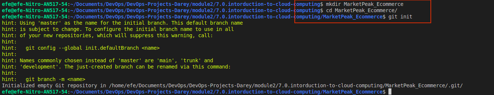

### 1.2. Obtaining an prepareing the E-comerce Template 

Instead of developing the website from scratch, you will use a pre-existing website templatge. This approach allows you focus on the deployment and operational aspects, rather than on web developement. The actual web Developement is done by web/software developers on the project.

- Download the template from [here](https://www.tooplate.com/zip-templates/2137_barista_cafe.zip)

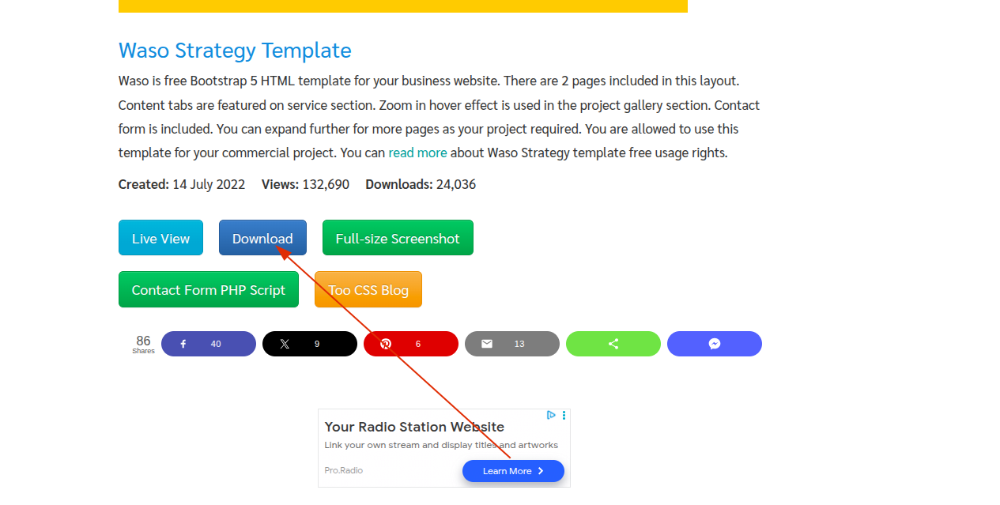

- Unzip the downloaded file and move the contents to the **ecomerce_website** directory.

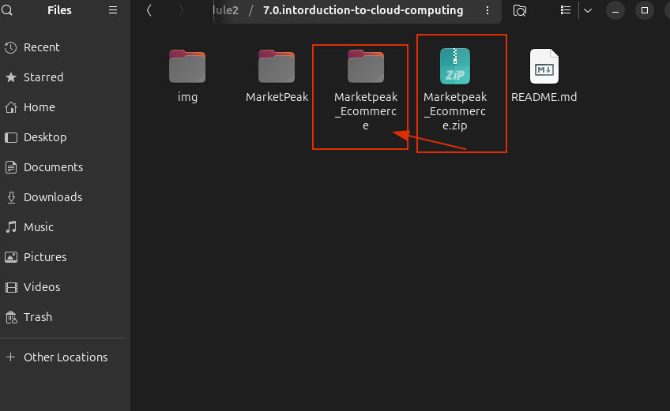

- Optionally customize the template to a desired color scheme and layout.

### 1.3. Adding the Template to the Git Repository

- Add the template files to the Git repository.

- set your Git global cnfiguration with your username and email

- commit the changes to the repository with a clear discriptive message.

```bash
    git add .
    git config --global user.name "Your Name"
    git config --global user.email "your.email@example.com"
    git commit -m "Add e-commerce template"
```

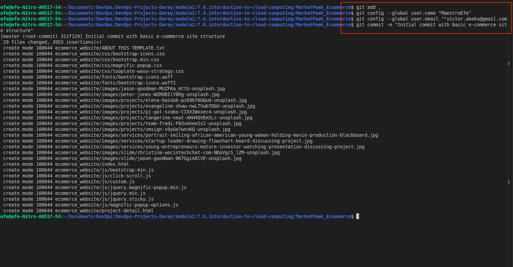


### 1.4. Pushing the Template to GitHub

After initializing yo0ur Git repository and adding your e-commerce template, you can push the changes to GitHub. This step is crucial for version control and collaboration with other team members.

- Create a GitHub repository for your e-commerce template. Name the repository **MarketPeak_Ecommerce**. Leave the repository empty without initializing it with a README file, gitignore file, or license file.

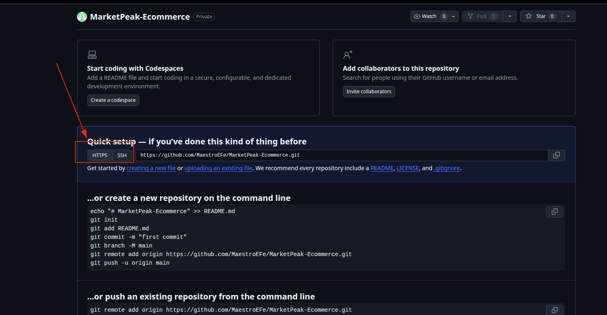

- Link your local repository to the remote repository on GitHub.

```bash
    git remote add origin https://github.com/your-username/MarketPeak_Ecommerce.git
```


    
Note: Make sure you replace your-username with your actual GitHub username.

- push the changes to the remote repository on GitHub.

```bash
    git push -u origin main
```

This command will push the changes to the remote repository on GitHub from your local machine, enabling you to store your project in the cloud and easily collaborate with other team members.

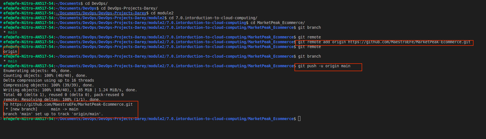

## 2. Implementing a Linux Environment; AWS EC2 Instance Deployment

To deploy the "MarketPeak_Ecommerce" website, you will need to set up an AWS EC2 instance. This will provide you with a Linux environment to host your website.

### 2.1. Setting up an AWS EC2 Instance

- Create an AWS account if you don't have one already.

- Login to the AWS Management Console.

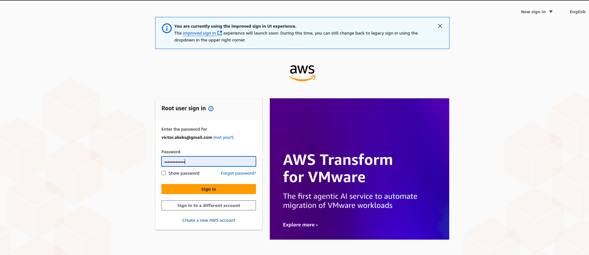

- Launch an EC2 instance using and Amazon Linux AMI.

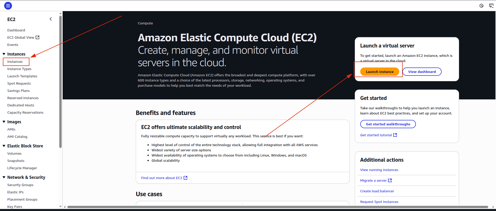

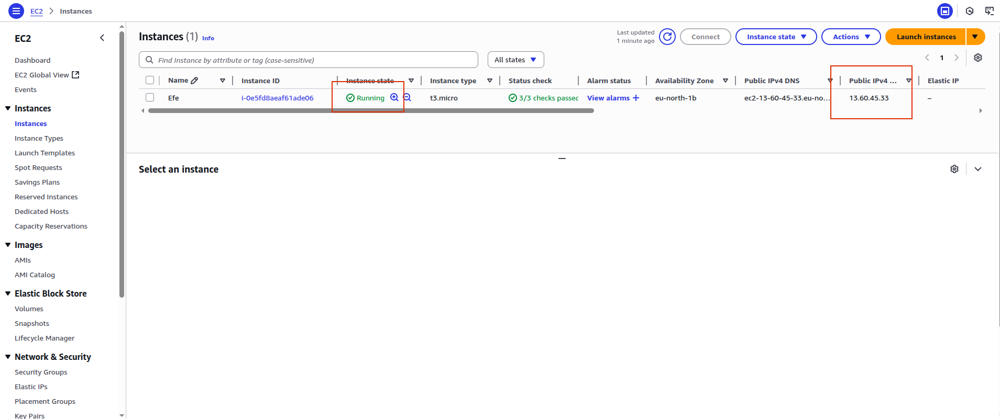

- Configure the security group to allow HTTP and SSH traffic.

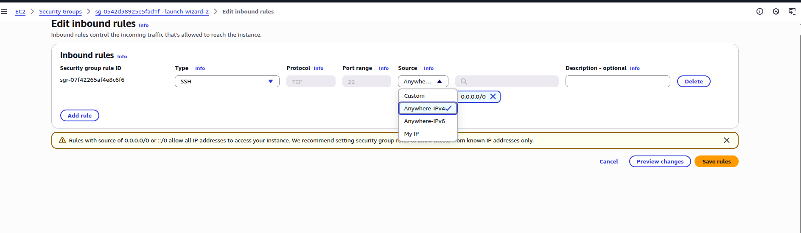

- Connect to the EC2 instance using SSH and the perm key generated in the previous projuect using the ssh command below.

```bash
    ssh -i ~/Documents/efe-key-instance.pem ubuntu@13.60.45.33
```

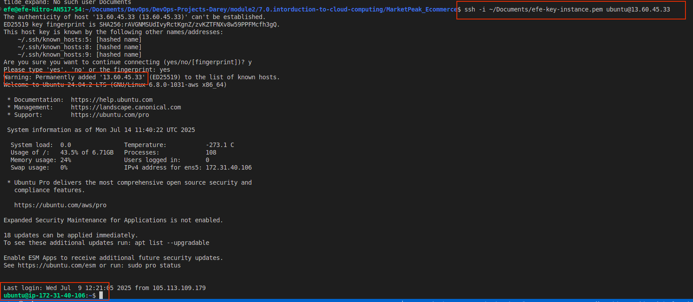


### 2.2. Clone the repository on the Linux instance

Before deploying your e-commerce website, you will need to clone the GitHub repository on the Linux instance. This process involves authenticating with GitHub and choosing between two primary method of cloning a repository: HTTPS and SSH. To see the ssh or http link to clone your repository, go to your GitHub repository and click on the Code button.

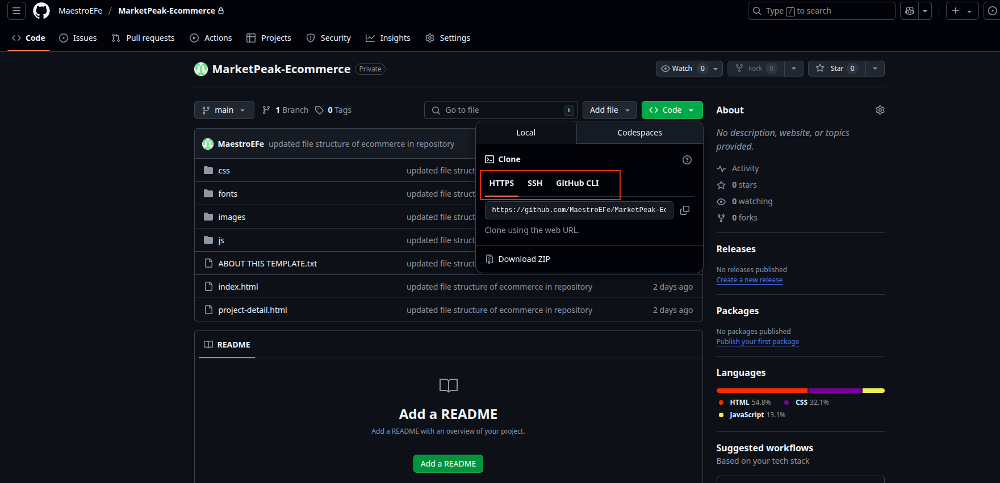


**SSH Method:**

- On  your EC2 instance, Generate an SSH key pair using ssh-keygen.

```bash
  ssh-keygen -t ed25519 -C "your_email@example.com"
```

- Display the public key using the cat command.

```bash
   cat ~/.ssh/id_ed25519.pub
```

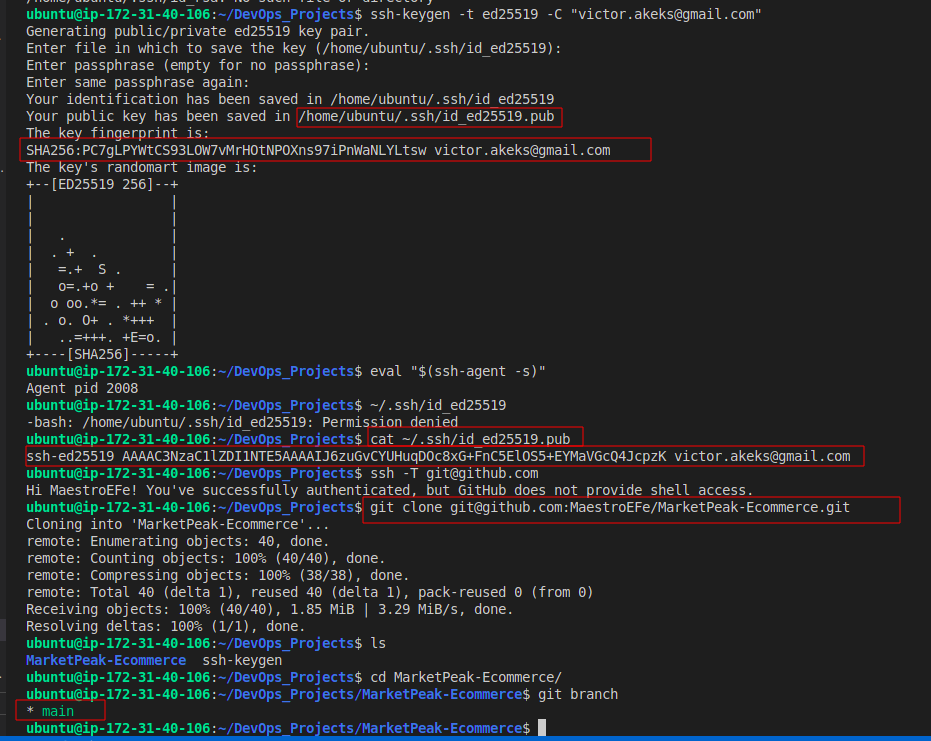

**Note:** Copy the public key to your clipboard. and yours will be different

- Copy the public key to your clipboard.

- Add the public key to your GitHub account. Do that by
   - Go to your GitHub account
   - Click on the profile icon in the top right corner
   - Click on Settings
   - Click on SSH and GPG keys
   - Click on New SSH key
   - Paste the public key into the key field
   - Click on Add SSH key

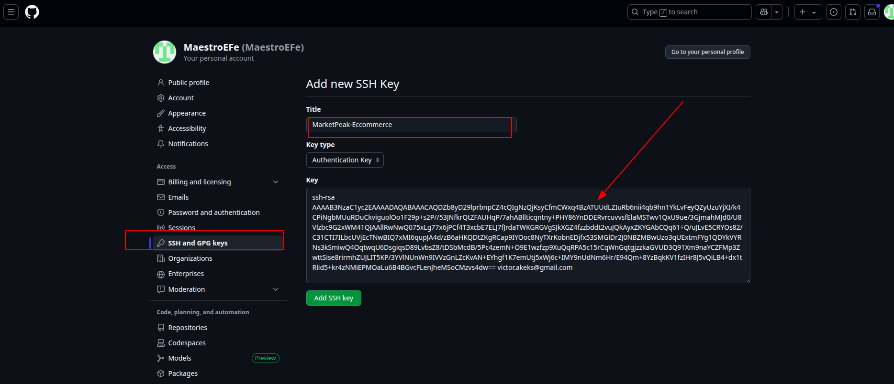

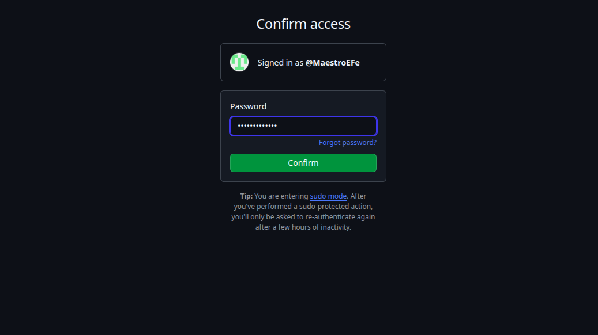

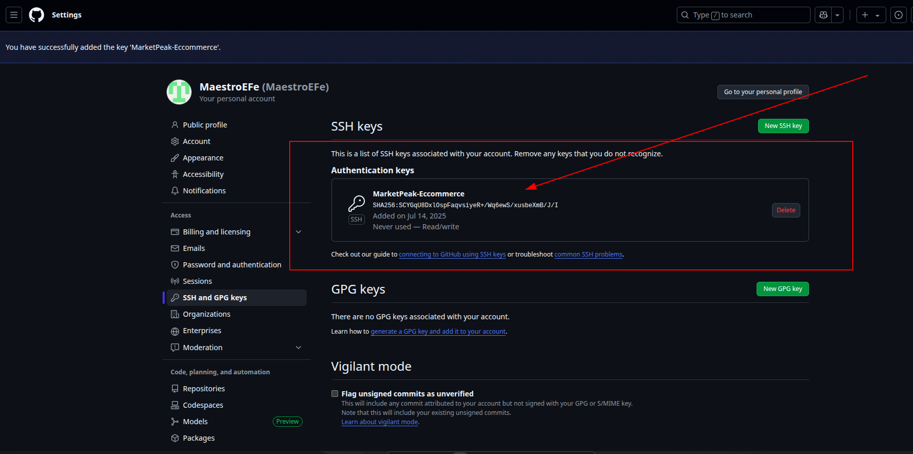


- Now you can use the SSH URL to clone the repository:

```bash
   git clone git@github.com:your-username/MarketPeak_Ecommerce.git

```


The above image also shows that the repository has been cloned to the EC2 instance successfully.


**HTTPS Method:**

For repository that you plan to clone without setting up SSH, use the HTTPS URL. GitHub will prompt you for your username and password.

```bash
   git clone https://github.com/your-username/MarketPeak_Ecommerce.git
```

**Note:** Make sure you replace your-username with your actual GitHub username. And git hub no longer allows you to use your password to clone a repository. Instead, it will prompt for your personal access token. you have to generate that and use it instead of your password.

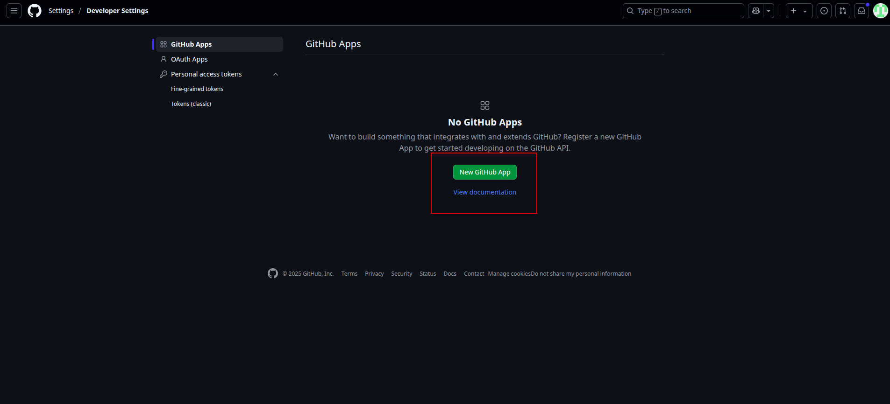

the you can run the command http command to clone the repository.

```bash
   git clone https://github.com/your-username/MarketPeak_Ecommerce.git
```

### 2.3. Install a web server on the Linux EC2 instance

[Apache HTTP Server(httpd)](https://httpd.apache.org/) is a widely used web server that serves HTML files and content to users. It is a popular choice for hosting websites and applications. Insalling it on Linux EC2 instance allows you to host the MarketPeak_Ecommerce website on the EC2 instance.

- Install Apache web server on the EC2 instance. Note that httpd is the software name for Apache on system using yum package manager and apache2 is the software name for Apache on system using apt package manager.


```bash
   sudo yum update -y
   sudo yum install httpd -y
   sudo systemctl start httpd
   sudo systemctl enable httpd
```
yum (Yellowdog Updater, Modified) is the default package manager for RPM-based Linux distributions like CentOS, RHEL, and Amazon Linux. It should be pre-installed on these systems.

Since you're using an Ubuntu system (as indicated by your terminal prompt ubuntu@ip-172-31-40-106), you should use apt instead of yum. Here's how to install and use it:

```bash
   sudo apt update 
   sudo apt install apache2 -y
   sudo systemctl start apache2
   sudo systemctl enable apache2
```

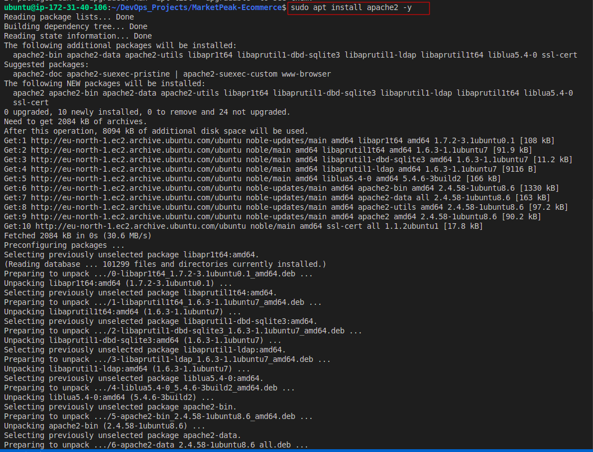 

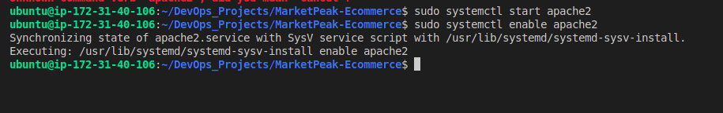 


- This first updates the linux server and then installs the httpd (Apache) web server, starts the web server, and ensure it automatically starts on server boot.

### 2.4. Configure the security group to allow HTTP and SSH traffic.
 To serve the website from the EC2 instance, configure httpd to point to the directory on the linux server where the website code files are stored. Usually this is the /var/www/html directory.

- **prepare the website directory:** Clear the default httpd web directory and copy MarketPeak_Ecommerce files to it.

```bash
   sudo rm -rf /var/www/html/* #rf means remove recursively and * means all files. the f in rf is for files. It is used to remove files and directories recursively.
   sudo cp -r MarketPeak_Ecommerce/* /var/www/html/ #-r means copy recursively also.
```


The directory /var/www/html is the standard directory structure on Linux system that host web content, particularlly for Apache HTTPD web server.

When you install Apache on a Linux system, the installation process automatically creates this directory and sets up the default web content. It's designated as the default document root in the Apache configuration, meaning that Apache is set up to serve web files (such as HTML, CSS, and JavaScript files) from this directory to visitors of your website.

- **Restart the web server:** Restart the apache2 web server to apply the changes.

```bash
   sudo systemctl restart apache2
```

### 2.5. Test the deployment (Access the website from a web browser)

- With httpd configured to serve the MarketPeak_Ecommerce website, you can now access it from a web browser at 

- http://<your ec2 instance DNS name> which is [http://ec2-16-16-25-204.eu-north-1.compute.amazonaws.com](http://ec2-16-16-25-204.eu-north-1.compute.amazonaws.com) in this case.


 or 

- http://<your ec2 instance public IP> which is [http://16.16.25.204](http://16.16.25.204) in this case.


**Note**: It is important to configure the security group to allow HTTP and HTTPS traffic at port 80 and 443 respectively in your AWS EC2 instance. Also note that if you make use of https, you will need to configure a certificate for it otherwise you will get error message in your browser.

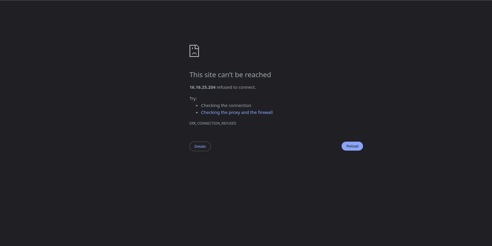

## 3. Continuous Integration and Deployment Workflow (CI/CD)

To ensure a smooth workflow for developing, testing, and deploying your e-commerce platform, follow this structured approach. It covers marking changes in a development environment, utilizing version controle with Git, and deploying updates to your production server on AWS EC2 instance.

**Step 1:** Deploying new features on fixes

- Create a *Development* branch for the feature or fix you want to implement. This isolate new features and bug fixes from the stable version on your website.

```bash
   git checkout -b development
```


- Implement Changes: On the developement branch, implement the new feature or fix you want to implement. This might include updating web pages, adding new products, or fixing known issues.

**Step 2:** Version Controle with Git

- Add the changes to the staging area.

```bash
   git add .
```

- Commit the changes to the repository.

```bash
   git commit -m "Add new feature or fix"
```

- Push the changes to the remote repository on GitHub.

```bash
   git push origin development
```
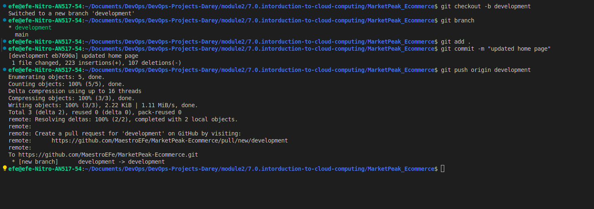

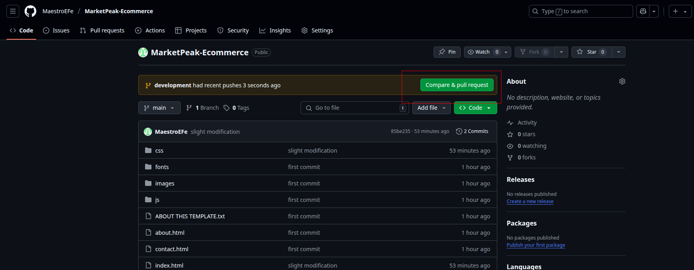


**Step 3:** Pull Request and Merge to Main Branch on GitHub

- Create a pull request to merge the development branch into the main branch. This process is called a *Pull Request* (PR) and is crucial for collaboration and code review. Go to your github and do it.

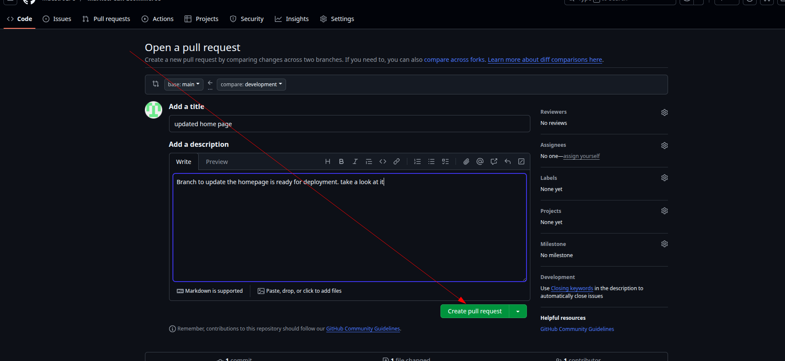


- Review and Merge the PR: Review the changes for any potential issues. Once satisfied, merge the PR into the main branch, incorporating the new feature or fix into the main codebase for production.

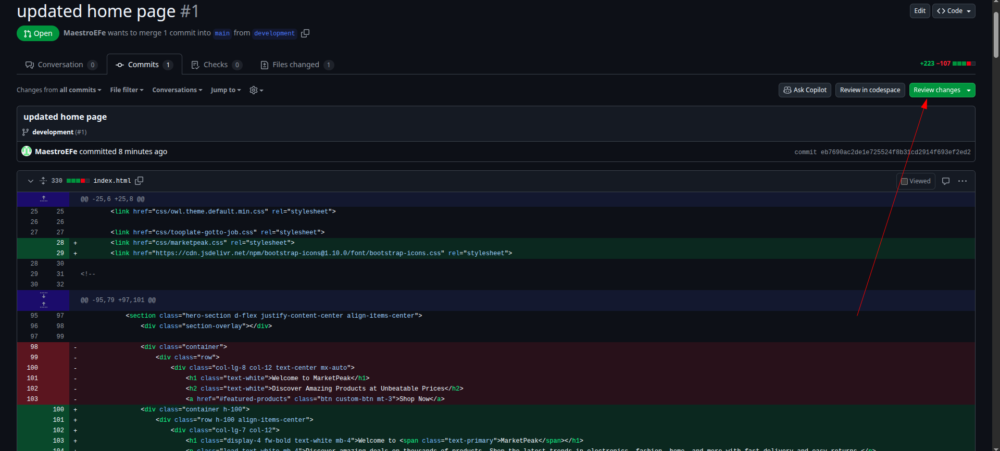

There are two ways to merge; either on github or on the local machine.

**On github:**

- Go to your github repository and click on the merge button.

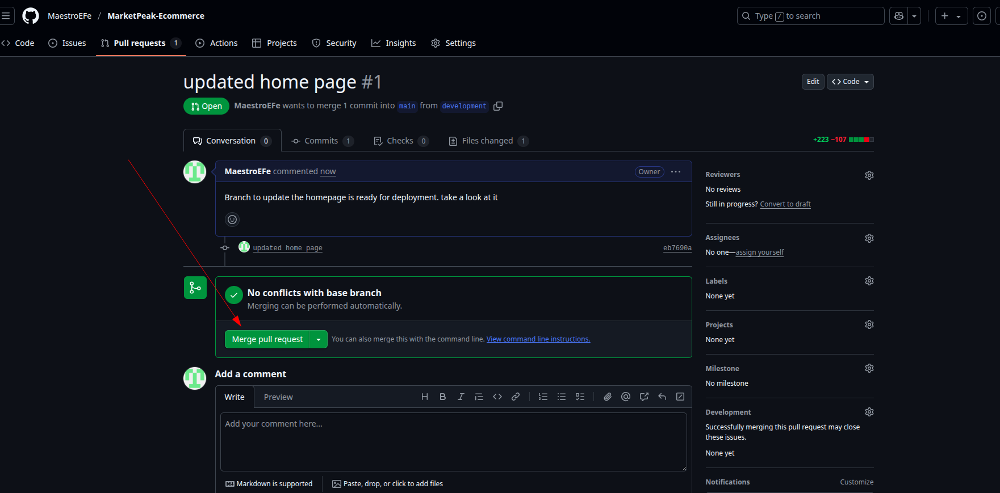

**On the local machine:**

```bash
   git checkout main
   git merge development
   git push origin main
```

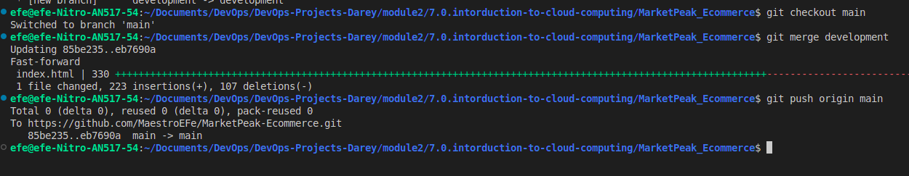

**Step 4:** Deploy Updates to the Production Environment/Server

- Pull the latest changes on the Server: SSH inot your AWS EC@ instance where the production website is hosted. Navigate to the website's directory and pull the lates changes from the main branch. clone and copy to the /var/www/html directory.

```bash
   ssh -i your-key-pair.pem ec2-user@your-ec2-instance-ip #in this case, we are already in the ec2 instance
   cd MarketPeak_Ecommerce
   git pull origin main
   sudo rm -rf /var/www/html/*
   sudo cp -r ./* /var/www/html/
```
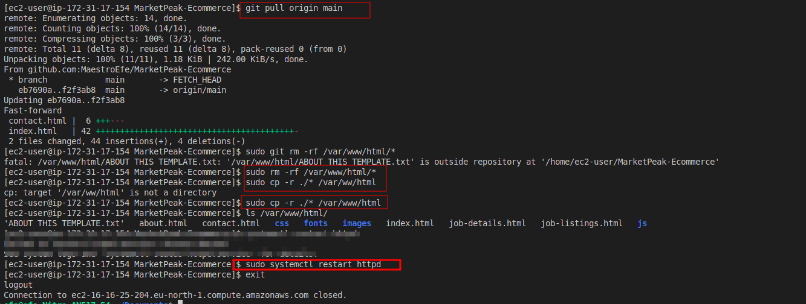

- Restart the web server (if needed) to apply the changes. This is dependent on the type of changes you made. For example, if you only updated static files (HTML, CSS, JavaScript), you might not need to restart the web server. However, if you made changes to the server-side code (PHP, Python, etc.), you will need to restart the web server.

```bash
   sudo systemctl restart httpd
```


**Step 5:** Test the deployment (Access the website from a web browser)

- With the web server restarted, you can now access the website from a web browser.

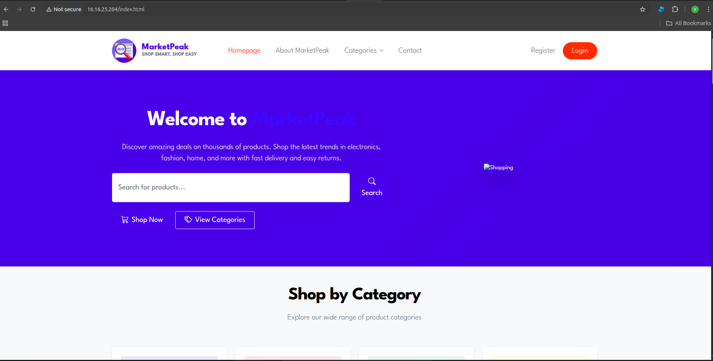

As you can see, the website now have a new look and the cicd is completed.


This workflow emphasizes best practices in software developement and deployment, ensuring that changes are tested and validated before being deployed to production.


## 4 Capstone Submission
4.1. This README.md file is a detailed rendition of the entire project. It includes all the necessary information to understand and replicate the project.

# 4.2. Sunmission is done on Dare.io platform.
