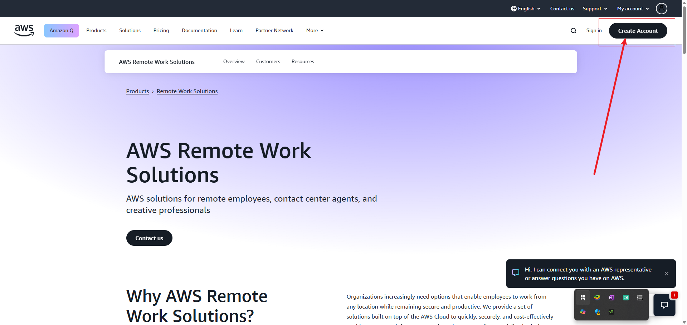
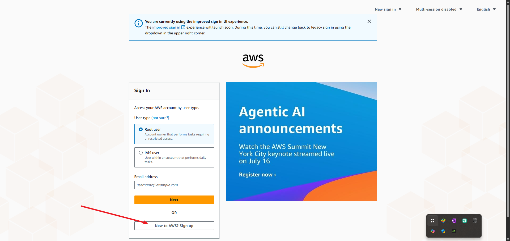
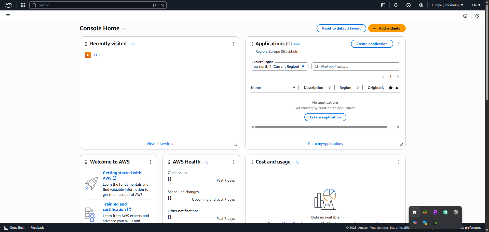

# AWS Account Creation Project

Welcome to the AWS Account Creation project! This guide will walk you through the process of creating an Amazon Web Services (AWS) account, providing clear, step-by-step instructions and valuable insights into cloud computing concepts. This project is designed to help you understand the significance of cloud computing and how to leverage AWS services effectively.

## Table of Contents
- [Understanding Cloud Computing](#understanding-cloud-computing)
- [Introduction to AWS](#introduction-to-aws)
- [AWS Account Setup](#aws-account-setup)
- [Navigating AWS Management Console](#navigating-aws-management-console)
- [Exploring AWS Free Tier](#exploring-aws-free-tier)
- [Best Practices and Security](#best-practices-and-security)
- [Project Reflection](#project-reflection)

## Understanding Cloud Computing

Cloud computing is the on-demand delivery of IT resources over the internet with pay-as-you-go pricing. Instead of buying, owning, and maintaining physical data centers and servers, you can access technology services, such as computing power, storage, and databases, on an as-needed basis from a cloud provider like AWS.

### Key Benefits of Cloud Computing:
- **Cost Efficiency**: Eliminate capital expenses of buying hardware and software
- **Global Scale**: Scale elastically with your business needs
- **Performance**: Run on a worldwide network of secure data centers
- **Speed and Agility**: Launch resources in minutes
- **Reliability**: Data backup and disaster recovery solutions

## Introduction to AWS

Amazon Web Services (AWS) is the world's most comprehensive and broadly adopted cloud platform, offering over 200 fully featured services from data centers globally. AWS powers hundreds of thousands of businesses in 190 countries around the world.

### Why Choose AWS?
- **Market Leader**: 33% market share in cloud services
- **Global Infrastructure**: 99 Availability Zones within 31 geographic regions
- **Security**: Enterprise-level security and compliance certifications
- **Innovation**: Continuous delivery of new services and features
- **Cost-Effective**: Pay only for what you use with no upfront costs

## AWS Account Setup

### Step 1: Initial Account Creation
1. Visit the [AWS homepage](https://aws.amazon.com/)
2. Click on "Create an AWS Account"
3. Enter your email address and choose "I am a new user"
4. Create a root user name and password

*Figure 1: AWS Homepage - Starting the account creation process*

### Step 2: Contact Information
1. Select account type (Professional or Personal)
2. Enter your full name, company name (if applicable), and phone number
3. Provide a valid email address for verification
4. Click "Verify email" and enter the verification code sent to your email

*Figure 2: Entering contact information for AWS account*

### Step 3: Payment Information
1. Enter your payment method (credit/debit card)
   - Note: AWS may place a temporary hold of approximately $1 for verification
   - No charges will be made unless you exceed Free Tier limits
2. Verify your identity via phone call or text message
3. Select the Basic Support Plan (Free tier)

### Step 4: Account Verification
1. Complete the identity verification process
2. Choose your support plan (select "Basic Plan - Free")
3. Click "Complete sign up"

## Navigating AWS Management Console

After successful account creation, you'll be directed to the AWS Management Console. This is your central hub for accessing all AWS services.

### Key Areas of the Console:
1. **Services Menu**: Access all AWS services organized by category
2. **Search Bar**: Quickly find specific services
3. **Account Information**: View and manage your account settings
4. **Region Selector**: Choose your preferred AWS region
5. **Resource Groups**: Organize and manage your AWS resources

*Figure 3: AWS Management Console Dashboard*

## Exploring AWS Free Tier

AWS Free Tier provides hands-on experience with AWS services at no cost. Here are some services you can explore:

### Popular Free Tier Services:
- **Amazon EC2**: 750 hours/month of t2.micro instances
- **Amazon S3**: 5GB of standard storage
- **AWS Lambda**: 1 million free requests per month
- **Amazon RDS**: 750 hours of db.t2.micro database instances
- **AWS CloudFront**: 50GB data transfer out

### How to Access Free Tier Services:
1. Log in to the AWS Management Console
2. Navigate to the desired service
3. Look for "Free Tier" in the service description
4. Follow the service-specific setup instructions

## Best Practices and Security

### Root User Security
- Enable Multi-Factor Authentication (MFA) immediately
- Use a strong, unique password
- Never share your root user credentials
- Create IAM users for daily operations

### Cost Management
- Set up billing alerts
- Use AWS Budgets to track spending
- Regularly review your AWS Cost Explorer
- Tag resources for better cost allocation

## Project Reflection

### Learning Outcomes
Through this project, I've gained a comprehensive understanding of:

1. **Cloud Computing Fundamentals**: The shift from traditional IT infrastructure to cloud-based solutions has revolutionized how businesses operate. The pay-as-you-go model provides unprecedented flexibility and cost-efficiency.

2. **AWS Account Management**: The process of creating and securing an AWS account, including the importance of proper account verification and security measures.

3. **Service Exploration**: The vast array of services available in the AWS ecosystem, from computing power to storage solutions, and how they can be leveraged for various business needs.

4. **Cost Management**: Understanding the AWS Free Tier and how to effectively manage costs while exploring different services.

### Practical Applications
This knowledge is directly applicable to:
- Launching web applications
- Storing and managing data
- Implementing scalable solutions
- Building secure cloud architectures

### Future Learning Path
To further enhance my AWS skills, I plan to:
1. Complete AWS Cloud Practitioner certification
2. Explore advanced services like AWS Lambda and ECS
3. Implement a complete serverless application
4. Learn about infrastructure as code using AWS CloudFormation

### Conclusion
Creating an AWS account is the first step toward leveraging the power of cloud computing. The AWS Free Tier provides an excellent opportunity to explore and learn about various services without incurring costs. By following best practices for security and cost management, users can effectively utilize AWS to build scalable and reliable applications.

## Additional Resources
- [AWS Free Tier Details](https://aws.amazon.com/free/)
- [AWS Documentation](https://docs.aws.amazon.com/)
- [AWS Training and Certification](https://aws.amazon.com/training/)
- [AWS Well-Architected Framework](https://aws.amazon.com/architecture/well-architected/)

---
*Last Updated: July 15, 2025*
