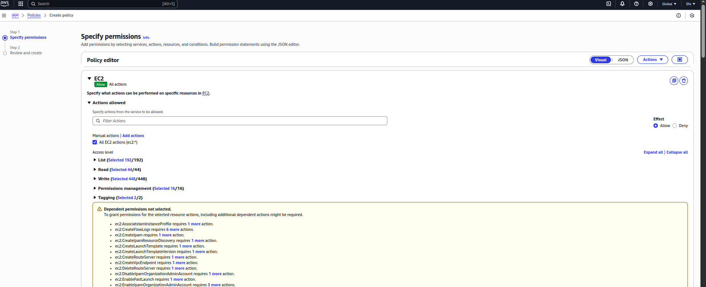
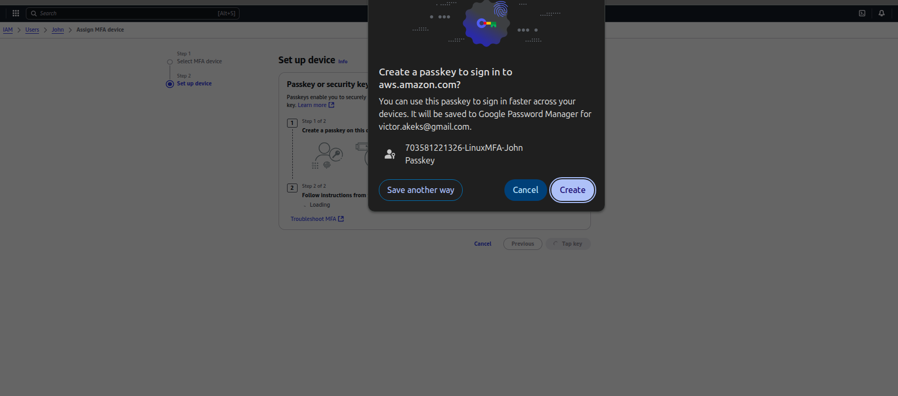

# Introduction to Cloud Computing – Security & Identity Management (IAM)


This mini project is designed to guide you through the intricacies of Amazon Web Services (AWS), specifically focusing on Identity and Access Management (IAM). Before diving into the specifics of IAM, it’s vital to establish that a basic understanding of cloud computing principles is a prerequisite for this project. If you’ve heard about “Cloud” for the first time, it would mean that you have not seen the previous projects on coud computing or seen my youtube channel that I created to explain all things DevOps related.

As a recap, it involves delivering computing services over the internet, including servers, storage, databases, networking, software, analytics, and intelligence, to offer faster innovation, flexible resources, and economies of scale.

In this project, we will be working with a hypothetical fintech startup named **Zappy-e-Bank**. This fictitious company represents a typical startup venturing into the financial technology sector, aiming to leverage the cloud’s power to innovate, scale, and deliver financial services. The scenario is set up to provide a realistic backdrop that will help you understand the application of **AWS IAM** in managing cloud resources securely and efficiently.

### The Importance of IAM for Zappy-e-Bank
For Zappy-e-Bank, like any company dealing with financial services, security and compliance are paramount. The company must ensure that its data, including sensitive customer information, is securely managed and that access to resources is tightly controlled. **AWS IAM** plays a critical role in achieving these security objectives by allowing the company to define who is authenticated (signed in) and authorized (has permissions) to use resources.

**AWS IAM will enable Zappy-e-Bank to:**

- Create and manage AWS users and groups, to control access to AWS services and resources securely.
- Use IAM roles and policies to set more granular permissions for AWS services and external users or services that need to access Zappy-e-Bank AWS resources.
- Implement strong access controls, including multi-factor authentication (MFA), to enhance security.

This project will walk you through setting up IAM for Zappy-e-Bank, creating a secure environment that reflects real-world usage and challenges. Through this hands-on experience, you will learn the fundamentals of how to manage access to AWS resources, and best practices for securing your cloud environment.Project Goals and Learning Outcomes

**Project Goals and Learning Outcomes**

By the end of this project, you will have:
1. Gained a solid understanding of AWS IAM, including users, groups, roles, and policies.
2. Learned how to apply IAM concepts to secure a fintech startup’s cloud infrastructure.
3. Developed practical skills in using the AWS Management Console to manage IAM.
4. Understood the significance of secure access management and its impact on compliance and data security in the fintech industry.

**Project Setup**

1. Log in to the AWS Management Console: Use your administrator account to log in.
2. Navigate to the IAM Dashboard: Here, you’ll manage users, groups, roles, and policies.

## Exercises:

### Creating IAM Users

An IAM user is a unique identity within an AWS account that represents a person or service, granting specific permissions to access and interact with AWS resources under controlled and customizable security.

Imagine that you have a big, secure building **(AWS account)** that you own and control. When you first get the keys to this building, you’re given a master key **(root user)** that can open every door, access every room, and make changes to the building’s structure itself.

This master key is powerful, allowing you to do anything from adding new rooms (services) to changing the locks (security settings). However, because this key can do so much, it’s also very risky to use it for daily tasks—like if you lost it, someone could do anything they want with your building.

Now, imagine you have specific tasks that need to be done in the building, like cleaning, maintenance, or security checks. You wouldn’t give out your master key to every person who needs to do those jobs. Instead, you create specific keys (IAM users) that can only open certain doors or access certain floors. These keys are less powerful but much safer to use for everyday tasks. They ensure that the people holding them can only access the parts of the building they need to do their jobs and nothing more.

Let’s set up IAM users for a backend developer, **John**, and a data analyst, **Mary**, by first determining their specific access needs.

As a backend developer, John requires access to servers (EC2) to run his code, necessitating an IAM user with policies granting EC2 access.

As a data analyst, Mary needs access to data storage (AWS S3 service), so her IAM user should have policies enabling S3 access.

Considering **Zappy-e-Bank’s** plan to expand its team with 10 more developers and 5 additional data analysts in the coming months, it’s inefficient to individually create similar policies for each new member. A more streamlined approach involves:

1. Crafting a single policy tailored to each **role’s** access requirements.
2. Associating this policy with a **group** specifically designed for that role.
3. Adding all engineers or analysts to their respective groups, simplifying the management of permissions and ensuring consistent access across the team.

# Project Solution

## Meaning of Policies

Policies are the core building blocks of AWS IAM. They define what actions are allowed or denied for specific AWS resources. Policies can be attached to users, groups, or roles, and they determine the level of access each entity has to AWS services and resources. Think of policies as rules that define what actions are allowed or denied for specific AWS resources.

## Step by step to the solution

1. Create a policy for the Development team
2. Create a group for the Development team
3. Add the policy to the group
4. Add the user to the group
5. Create a policy for the Data Analyst team
6. Create a group for the Data Analyst team
7. Add the policy to the group
8. Add the user to the group

## Create policy or role for the Development team

This policy will grant permissions necessary for backend developers like John to work with EC2. There are two ways of doing this in the management console:

1. Using JSON
2. Using the AWS Management Console

### Using JSON

**Policy Name:**
DeveloperTeamPolicy

**Policy JSON:**
```json
{
  "Version": "2012-10-17",
  "Statement": [
    {
      "Effect": "Allow",
      "Action": [
        "ec2:DescribeInstances",
        "ec2:StartInstances",
        "ec2:StopInstances",
        "ec2:RebootInstances"
      ],
      "Resource": "*"
    }
  ]
}
```

**🔧 Steps in AWS Console:**
1. Go to IAM > Policies.


2. Click Create policy.


3. Choose JSON tab and paste the policy above.


4. Click Next, then give it a name like DeveloperTeamPolicy.


5. Add a description (optional but recommended). Write; "This policy grants permissions necessary for backend developers like John to work with EC2."


6. Click Create policy.


### Using the AWS Management Console

1. In the IAM console, click on policies

2. Click on create policy
  
3. In the select a service section, search for ec2

4. For simplicity sake, select the “All EC2 actions” checkbox
   

5. Also, make sure to select “All” in the Resources section

- 

6. Click Next at the bottom right

7. Provide the name DeveloperTeamPolicy2 and description for the policy the same way as done above

8. Click on Create Policy

Notice that after creating the policy, if you search for **"DeveloperTeamPolicy"** in the search box, you will notice that a number of policies are returned. This highlights the presence of both AWS managed and customer managed policies. AWS managed policies are predefined by AWS and provide permissions for many common use cases, allowing for quick and broad access management across AWS services without the need for custom policy creation like we just did. In contrast, customer managed policies are created and fully controlled by you, allowing for more tailored, specific access controls that can be finely tuned to your organization’s requirements.

- 

## Create policy for the Data Analyst team

**Policy Name:**
DataAnalystTeamPolicy

Repeat the process above for the Data Analysts team, but instead of EC2, search for S3. Also name the policy analyst instead of developers. You can give it any description of your choice. Use the discription; "This policy grants permissions necessary for data analysts like Mary to work with S3."


## Create Group for the Development team

This group will represent all backend developers who need EC2 access.

**Group Name:**
DeveloperTeamGroup

1. In the IAM console navigation, select User group and in the top right click Create group

   

2. Add on a name for the group (DeveloperTeamGroup)

3. Attach the DeveloperTeamPolicy we created earlier to the group. This will allow any user in the Development-Team group to have access to EC2 instances alone


4. You have successfully created a group and attached a permission for any user added to the group to have access to the EC2 instance only. Recall that users in this group will be backend developers only.


## Create a group for the Data Analyst team

**Group Name:**
AnalystTeamGroup

Repeate the process above for the Data Analyst team.

i. The Group name should be AnalystsTeamGroup

ii. Intead of attching DeveloperTeamPolicy, attach DataAnalystTeamPolicy.

Recall that you only allowed S3 access to the Data Analysts. So any user in this group will have access to S3 services only. In our case, our users will be the data analysts.


## Creating IAM User for John

**User Name:**
John

1. In the IAM console navigation, select Users and in the top right click Add user
   
   

2. Add on a name for the user

   

3. Attach the DeveloperTeamPolicy we created earlier to the user. This will allow any user in the Development-Team group to have access to EC2 instances alone
   

4. Add the user to the DeveloperTeamGroup
  
  

  

5. You have successfully created a user and attached a permission for any user added to the group to have access to the EC2 instance only. Recall that users in this group will be backend developers only.


5. Download the users password and return to create Mary user account


## Creating IAM User for Mary

**User Name:**
Mary  

Repeat the process above for the Data Analyst team. Instead of DeveloperTeamPolicy, attach DataAnalystTeamPolicy.


## Testing and Validation

**Testing John Access**

Login as John: Use the credentials provided to John to log into the AWS Management Console.


 This simulates John's user experience and ensures he has the correct access.

 

Access EC2 Dashboard: Navigate to the EC2 dashboard within the AWS Management Console. John should be able to view, launch, and manage EC2 instances as his role requires access to servers for deploying and managing backend applications.


Perform EC2 Actions: Attempt to create a new EC2 instance or modify an existing one to confirm that John has the necessary permissions. If John can successfully perform these actions, it indicates the IAM user has been correctly set up with the appropriate policies for a backend developer. As seen in the image below, John can create a new EC2 instance.


**Testing permission on S3 Buckets for John**

John can't access S3 buckets as seen in the image below.


**Testing Mary Access**

Login as Mary: Use the credentials provided to Mary to log into the AWS Management Console. 


This ensures that Mary's user experience is as expected and that she has the correct access.


Access S3 Dashboard: Navigate to the S3 dashboard within the AWS Management Console. Mary should be able to view, create, and manage S3 buckets as her role requires access to data storage for analyzing and managing data.
Perform S3 Actions: Try to create a new S3 bucket or upload data to an existing bucket to verify that Mary has the necessary permissions. Successful execution of these tasks will confirm that Mary's IAM user has been properly set up with the appropriate policies for a data analyst.

As seen, mary can't create EC2 dashboard but can create S3 bucket as seen in the image below.


No access to EC2 dashboard for Mary as seen in the image below.


**Validating Group Policies**
For both users, ensure that their access is confined to their role-specific resources (EC2 for John and S3 for Mary) and that they cannot access other AWS services beyond what their group policies permit. This validation ensures adherence to the principle of least privilege, enhancing security by limiting access to only what is necessary for each user's role.

**Implement Multi-Factor Authentication (MFA)**
Now that you have created a new users. Let's create Multi-Factor Authentication for John. But before we to that, what is MFA ?
Multi-Factor Authentication (MFA) is a security feature that adds an extra layer of protection to your AWS account and resources. With MFA enabled, users are required to provide two or more forms of authentication before they can access AWS resources.
John, the backend developer, logs into the AWS Management Console to access EC2 instances for deploying and testing his code. However, to further secure his access, Zappy e-Bank requires John to use MFA in addition to his regular username and password.
When John attempts to log in, after providing his username and password, AWS prompts him to enter a one-time code generated by an MFA device.


Setting Up MFA for John

1. Click on User and then click on john. It is assumed we already created a user account for john

2. Click on enable MFA as shown in the image below


3. Enter a device name for john MFA and select authenticator app



There are multiple options to choose from. In all, you should select the one that best suits you. You can see the one i selected above.


6. By completing step 1-5, MFA will be enabled for john

**Setting Up MFA for Mary**

Repeat the same step for Mary


**Project reflection**

1. Explain the Role of IAM in AWS: Describe the purpose of Identity and Access Management (IAM) in Amazon Web Services and how it contributes to the security and efficient management of cloud resources.

2. Differentiate Between IAM Users and Groups: Discuss the differences between IAM users and IAM groups within the context of AWS. Provide examples of when you would create an IAM user versus when you would organize users into groups.

3. Describe the Process of Creating IAM Policies: Explain the steps involved in creating a custom IAM policy for a specific role within an organization. Include details on selecting permissions and attaching the policy to users or groups.

4. Explain the Significance of the Principle of Least Privilege: Describe what the principle of least privilege means in the context of IAM and AWS, and why it is important for maintaining security in cloud environments.

5. Reflect on the Scenario with John and Mary: Based on the hands-on project setup for John (backend developer) and Mary (data analyst), outline the specific IAM configurations (users, groups, policies) created for each role. Discuss how these configurations align with their job functions and the principle of least privilege.