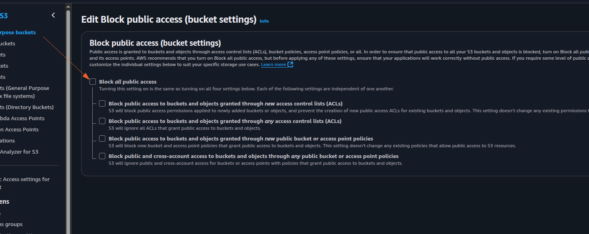

# AWS S3 Mini Project

During this session, we'll explore Amazon S3 (Simple Storage Service), a vital component of Amazon Web Services (AWS) for storing and accessing data. We'll cover key concepts like buckets, objects, versioning, and permissions, along with practical demonstrations on effectively managing your S3 resources.
But before we dive into Amazon S3 specifics, let's make sure you're familiar with cloud computing basics. If terms like "S3" or "object storage" are new to you, it's a good idea to review earlier materials to build a solid understanding of cloud concepts.

## Project Goals:
The primary goal of this project is to familiarize participants with Amazon S3 (Simple Storage Service) and its fundamental concepts. Participants will learn how to create and manage S3 buckets, upload objects, enable versioning, set permissions for public access, and implement lifecycle policies.

## Learning Outcomes:
By the end of this project, participants will have gained practical experience in working with Amazon S3 and will be able to:


- Create and configure S3 buckets using the AWS Management Console.
- Upload files and manage objects within S3 buckets.
- Understand the importance of versioning and its implications for data management.
- Configure permissions to control access to S3 objects.
- Implement lifecycle policies to automate data management tasks and optimize storage costs.

## What is Amazon S3?

Amazon S3, or Simple Storage Service, is like a big digital warehouse where you can store all kinds of data. It's part of Amazon Web Services (AWS), which is a collection of cloud computing services.
Think of S3 as a giant virtual filing cabinet in the cloud. You can put files, documents, pictures, videos, or any other digital stuff you want to keep safe and accessible.
What's cool about S3 is that it's super reliable and secure. Your data is stored across multiple servers in different locations, so even if something goes wrong with one server, your files are still safe.
Plus, S3 is really flexible. You can easily access your files from anywhere in the world using the internet, and you can control who gets to see or edit your stuff with different levels of permissions.

## S3 Benefits
Amazon S3 offers a range of benefits that make it a top choice for storing and managing data in the cloud.
- Firstly, S3 provides exceptional durability and reliability. Your data is stored across multiple servers and data centers, ensuring that even if one server fails, your files remain safe and accessible.
- Secondly, S3 offers scalability, meaning you can easily increase or decrease your storage capacity as needed. Whether you're storing a few gigabytes or petabytes of data, S3 can handle it without any hassle.
- Another key benefit of S3 is its accessibility. You can access your data from anywhere in the world using the internet, making it convenient for remote teams or distributed applications.
- Security is also a top priority with S3. You have full control over who can access your data and can encrypt your files to ensure they remain confidential and secure.
- Additionally, S3 is cost-effective. You only pay for the storage you use, with no upfront fees or long-term contracts, making it a budget-friendly option for businesses of all sizes.

## S3 Use Cases
- **Backup:** Think of it as a safe place to keep copies of important files, like your computer's backup. If anything happens to your computer, you can get your files back from S3.
- **Website Stuff:** S3 can also hold all the pieces of a website, like images and videos. So, when you visit a website, some of the stuff you see might be stored in S3.
- **Videos and Photos:** You know all those videos and photos you share online? They're often stored in S3 because it's really good at keeping them safe and making sure they load fast.
- **Apps and Games:** S3 is also used by apps and games to store things like user profiles or game levels. It helps keep everything running smoothly and makes sure your progress is saved.
- **Big Data:** Companies use S3 to store huge amounts of data for things like analyzing customer behavior or trends. It's like having a big library where you can find all sorts of useful information.
- **Emergency Backup:** Some companies use S3 to store copies of their data in case something bad happens, like a natural disaster. It's like having a backup plan to keep things going no matter what.
- **Keeping Old Stuff:** Sometimes, companies have to keep old records for legal reasons. S3 has special storage options that are really cheap, so it's a good place to keep all that old data.
- **Sending Stuff Fast:** S3 works with a service called CloudFront, which helps deliver stuff really quickly to people all over the world. So, if you're watching a video or downloading a file, S3 helps make sure it gets to you fast.

## S3 Core Concepts
- **Buckets:** Think of buckets as folders where you can store your files. Each bucket has a unique name and can hold an unlimited number of objects (files). Files are stored as objects in S3.
- **Objects:** Objects are the individual files you store in S3, like photos, videos, documents, or any other type of data. Each object has a unique *key* (file name) and can range in size from a few bytes to terabytes.


Example of an object in S3:

```
Bucket name: my-bucket
Key: images/profile-pic.jpg
Object size: 100 KB
``` 

- **Keys:** Keys are unique identifiers for objects within a bucket. They're like the file names you use on your computer. You can organize objects within a bucket using folder-like structures in their keys, called prefixes.

Example of a key in S3:

```
Key: images/profile-pic.jpg
```

**Storage Classes:** 
S3 offers different storage classes to suit various use cases and budget requirements. These include Standard, Standard-IA (Infrequent Access), One Zone-IA, Intelligent-Tiering, Glacier, and Glacier Deep Archive. Each class has different durability, availability, and cost characteristics.

**Access Control:** 
You can control who can access your objects in S3 using Access Control Lists (ACLs) and Bucket Policies. You can also use Identity and Access Management (IAM) to manage access at a user or group level.

**Durability and Availability:** 
S3 is designed for 99.999999999% (11 nines) durability, meaning your data is highly resistant to loss. It also offers high availability, ensuring that your objects are accessible whenever you need them.

**Data Transfer:** 
S3 supports both inbound (upload) and outbound (download) data transfer. You can transfer data to and from S3 using various methods, including the AWS Management Console, CLI (Command Line Interface), SDKs (Software Development Kits), or third-party tools.

**Versioning:** 
S3 Versioning allows you to keep multiple versions of an object in the same bucket. This feature helps protect against accidental deletion or overwrite, as you can restore previous versions of an object if needed.

**Note-**

**Storage class-** A storage class in Amazon S3 is like a category or type of storage option for your data. Each storage class has its own set of characteristics, such as cost, durability, and availability, that determine how your data is stored and managed in the cloud. You can choose the storage class that best fits your needs based on factors like how frequently you access your data and how much you're willing to pay for storage.

**AWS Management Console-** It's a website where you can manage all your AWS services using a point-and-click interface. You can do things like starting virtual servers, storing files, and setting up security rules, all without needing to write any code.

**CLI (Command Line Interface)-** This is a tool that lets you control AWS services using text commands typed into a terminal or command prompt. It's handy for automating tasks and scripting repetitive actions.

**SDKs (Software Development Kits)-** SDKs are packages of tools and code that help developers build applications that use AWS services. They provide ready-made functions and examples to make it easier to integrate AWS into your software projects, whether you're coding in Java, Python, JavaScript, or another language.

## What is S3 Versioning?
Imagine you're working on a big project and you accidentally delete an important file. But wait, with S3 versioning, it's like having a magic undo button.

Here's how it works: Normally, when you delete a file in S3, it's gone for good. But with versioning turned on, S3 keeps a copy of every version of your file, even if you delete it or overwrite it. So if you make a mistake, you can easily go back to a previous version and restore it, just like rewinding time.

This feature is super handy for protecting your data from accidents or malicious actions. It's like having a safety net for your files, ensuring that even if something goes wrong, you can always recover your precious data. Plus, it's easy to turn on and manage, giving you peace of mind knowing that your files are always safe and sound in Amazon S3.

Breaking it down into five parts so that it will help us understand it more clearly.

Firstly, we will create a new bucket in Amazon S3 to store our files. Following that, we will upload a file into this newly created bucket. Subsequently, we will enable versioning for the bucket, allowing us to retain multiple versions of our uploaded files for tracking changes over time. Next, we will configure the permissions for the bucket to enable public access, ensuring that the files become accessible to external users. Finally, we will implement lifecycle policies to automate the management of our files.

**Let's initiate the practical phase by setting up the creation of an Amazon S3 bucket.**

1. First, navigate to the search bar on the AWS console.
    - Search for "S3".


2. After clicking on S3 in the search results, you'll be directed to the S3 page.

    - From there, locate and click on the "Create bucket" button.


3. Let's proceed with creating a new bucket. Please provide a unique name for the bucket, ensuring it's distinct from any existing bucket names.

    - Select "ACL Disabled" for object ownership.

    - Ensure to check the "Block all public access" option.

    - Additionally, leave Bucket Versioning disabled. Disabling it will prevent the bucket from storing multiple versions of an object. This will help us avoid any unnecessary charges.

    - Proceed with the default settings.

    - Once done, click on the "Create bucket" button to finalize the creation process.
    

    

    
    

Note- ACL, or Access Control List, is like a set of rules that decides who can access your stuff in Amazon S3. You can use ACL to grant or deny access to your buckets and files for specific AWS accounts or predefined groups of users. It's a way to control who gets to see or mess with your data in the cloud.


If you encounter this error message below, consider changing the name and then proceed again


For further details on naming conventions, please refer to the documentation [Bucket name rules.](https://docs.aws.amazon.com/AmazonS3/latest/userguide/bucketnamingrules.html)

Your bucket has been successfully created, and currently, there are no objects stored within it.


**Now Let's move on to the second part, where we will upload a file into the newly created marybucket-2.**

1. First create a file on your local machine.

2. click on the upload button.
3. click on Add files and select the file created.


4. finally click on Upload.


Congratulations, you have successfully uploaded your first s3 object to the s3 bucket(folder).

**Now let's move on to the third part, where we will enable versioning for the bucket.**

1. Click on the properties tab.

In the above image, you will see that the versioning is disabled.

2. click on edit on the bucket versioning section and enable on the page that ensues then save.


3. Now if you modify the content of the original file and upload it again, you will see that a new version of the file has been created.

- By clicking on "show versioning", you can see all the versions of the file.

- Now, whenever you make a change to the file, and upload it again to the same bucket, it will continue creating new versions of the file.

**Now let's move on to the fourth part, where we will configure the permissions for the bucket to enable public access.**

1. Click on the permissions tab. You will see that the Block public access is enabled. click on edit to disable it.


click on save. and type confirm to confirm the action.


2. Now you need to create a bucket policy to enable public access. Click on edit on the bucket policy section.

- now click on policy generator.


- now select the type of policy as "S3 Bucket Policy".
- select the effect as "Allow".
- Specify the principal as "*".
- Choose the action "GetObject" and "GetObjectVersion".
- In the field of Amazon Resource Name (ARN), type the name of the bucket and add "/*" after the ARN. This will allow public access to all objects in the bucket. Then,
- Click on add statement.


- Now click on generate policy and copy the policy.

```json
{
  "Version": "2012-10-17",
  "Statement": [
    {
      "Sid": "Statement1",
      "Effect": "Allow",
      "Principal": "*",
      "Action": [
        "s3:GetObject",
        "s3:GetObjectVersion"
      ],
      "Resource": "arn:aws:s3:::marybucket-02/*"
    }
  ]
}
```
In the above policy,   
- **Version:** This is the version of the policy language used to create the policy.
- **Statement:** This is the main section of the policy that defines the permissions granted to the principal.
- **Sid:** This is a unique identifier for the statement.
- **Effect:** This is the effect of the statement, which can be either "Allow" or "Deny".
- **Principal:** This is the entity that is granted or denied access to the resource.
- **Action:** This is the action that is granted or denied access to the resource.
- **Resource:** This is the resource that is granted or denied access to the resource.

- Now paste the policy into the bucket policy section and click on save. 


To see the the fact that the policy is now working, 
- click on the objects tab and click on the show versioning toggle.

- click on the previous version of the file you uploaded and click on the object url.

- You will see that the file is now accessible to external users and shows the old version of the file.

if we click on the latest version of the file, it will show the new version of the file.


**Now let's move on to the fifth part, where we will implement lifecycle policies to automate the management of our files.**
1. For this navigate to the properties tab and 
- click on the lifecycle tab.


- Now the lifecycle policy is created successfully.


This rule is set up to automatically move files from one type of storage to another in your Amazon S3 bucket after a certain period of time. Specifically, it moves files to a storage class called "Standard-Infrequent Access" (SIA) after 30 days of being uploaded to the bucket. This helps you save money because standard-IA storage is cheaper than the default storage options. So if you have files that you don't access very often but you still want to keep, this rule helps you save cost by storing them in a cheaper storage class after a certain period of time.

For more information about storage class, you can go through the Amazon Storage Class documentation [here](https://docs.aws.amazon.com/AmazonS3/latest/userguide/storage-class-intro.html). And about storage lifecycle, you can go through the Amazon Storage Lifecycle documentation [here](https://docs.aws.amazon.com/AmazonS3/latest/userguide/object-lifecycle-mgmt.html).

## Project Reflection:
- We have gained hands-on experience with Amazon S3, a core service of AWS
- We have managed S3 buckets and objects, learning key concepts like versioning, permissions management, , and lifecycle policies.
- We have also gone through practical tasks, developed a solid understanding of S3 features.
- We have also learned to optimize storage costs and ensure data reliability and accessibility using AWS features.
- This project equipped us with valuable skills applicable to real-world scenarios, enhancing our ability to manage and optimize cloud storage resources effectively.